<!-- .slide: class="align-center" -->

<!-- .slide: data-state="no-toc-progress" --> <!-- don't show toc progress bar on this slide -->

# Digital Economy
<!-- .element: class="no-toc-progress" --> <!-- slide not in toc progress bar -->

## 9. Recommender and Reputation Systems

  

[Christoph Ihl][1] | 2020-12-04 | [Kühne Logistics University][2] | Hamburg

 <!-- .element: class="logo" -->

[1]: https://www.startupengineer.io/authors/ihl/
[2]: https://www.the-klu.org

----  ----

<!-- .slide: class="align-center" -->

# Intro

----

<!-- .slide: class="align-top" -->

## Recommender vs Reputation Systems?

* Recommender system is about taste
  * idiosyncratic preferences, using the revealed
  * preferences of many to recommend for you
  * subjective evaluation
  * horizontal differentiation (econ 101)
* Reputation system is about quality
  * objective evaluation
  * everyone would agree if they had access to the same information
  * vertical differentiation (econ 101)

----

<!-- .slide: class="align-top" -->

## Long Tail

* Chris Anderson (2004). Wired magazine.

    

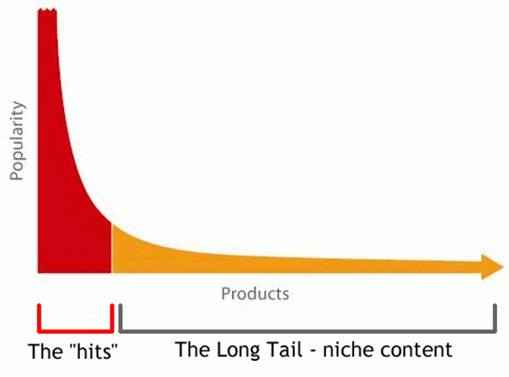

----

<!-- .slide: class="align-top" -->
## Value of Recommendations

#### Improving Decision Quality

    

> A recommender system elicits the interests of individual consumers, and by making recommendations has the potential to support and improve the quality of the decisions that consumers make while searching for and selecting products.

    

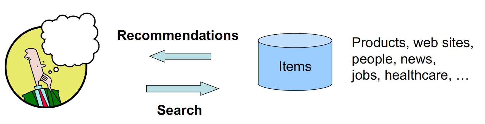

----

<!-- .slide: class="align-top" -->

## Value of Recommendations
<!-- .element: class="no-toc-progress" -->

* For Consumers
  * Better, faster decisions
  * Serendipitous discovery
  * Access to long-tail of products, services, information
  * Learn about the quality judgments of others
  * Enjoyment

* For Businesses
  * Cross-sell, up-sell; market to the long-tail
  * Develop stronger relationship with customers
  * Improve customer satisfaction, retention
  * Data as an asset!

----

<!-- .slide: class="align-top" -->

## Recommender System Examples

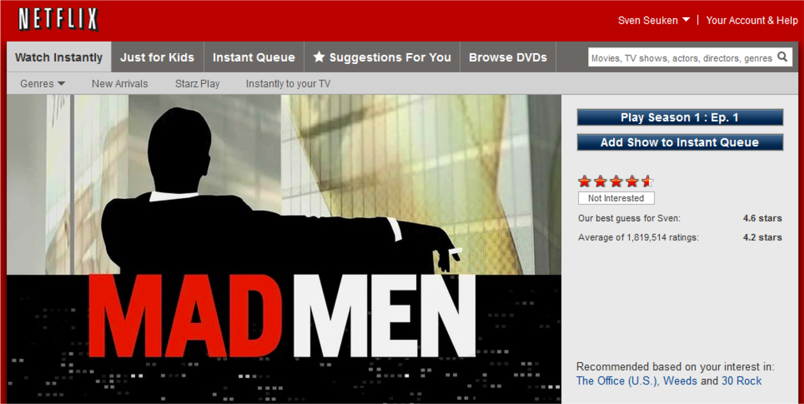

----

<!-- .slide: class="align-top" -->

## Recommender System Examples
<!-- .element: class="no-toc-progress" -->

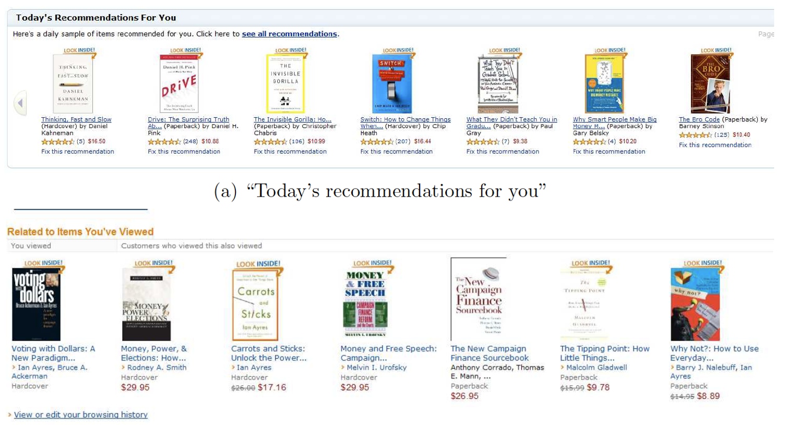

----

<!-- .slide: class="align-top" -->

## Recommender System Examples
<!-- .element: class="no-toc-progress" -->

----

<!-- .slide: class="align-top" -->

## Types of Recommender Systems

1. __Content-based Systems__: user ratings are estimated based on items that have similar __attributes__ to other items a user has liked in the past.
2. __Collaborative-Filtering Methods__: user ratings are estimated based on the collective ratings of other users, with the idea that users are collaboratively "filtering" the items that are recommended to each other.
3. __Hybrid Approaches__: ratings are estimated based both on the attributes of items (and perhaps users), as well as the feedback from all users who are using the platform.

 

* __explicit__ ratings, e.g.:
  * metric/ ordinal: five star
  * binary: thumbs up / down
* __implicit__ ratings, e.g.: 
  * purchases, views, clicks

----

<!-- .slide: class="align-top" -->

## Content-Based Recommenders
<!-- .element: class="no-toc-progress" -->

* recommendations (estimate of a user's product rating) based on product __attributes__: 
  * e.g. words mentioned in the description, genres / categories, music attributes (Music Genome Project, Pandora)
  * solves "cold start problem": recommend new products to new users (given product and user attribute profiles)
  * but trouble with new, unknown product attributes and "exploratory" recommendations to users

  

* __cosine similarity__ between product and user attribute profile

      

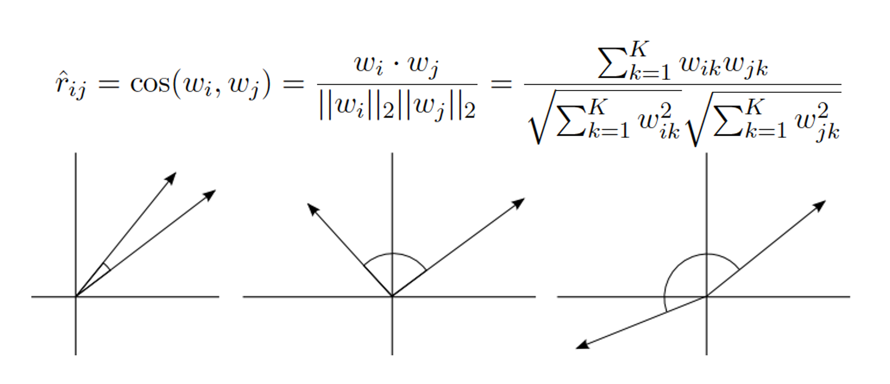

* __(machine) learn__ user's preference for certain attribute (e.g. logistic regression or Naive Bayes classification) to __predict__ item ratings (likes) based on attributes

  

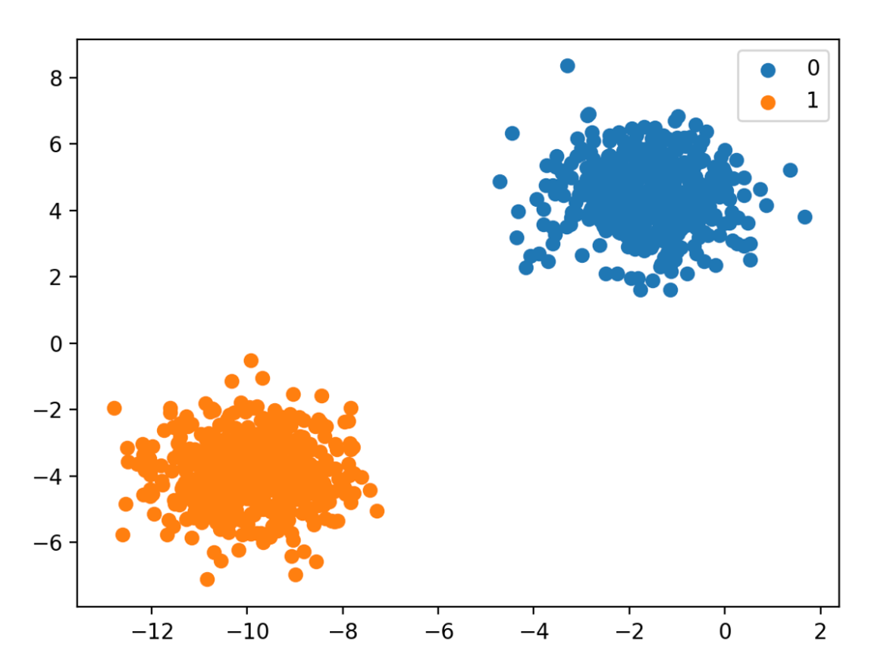

----  ----

<!-- .slide: class="align-center" -->

# Collaborative Filtering

----

<!-- .slide: class="align-top" -->

## User-User Collaborative Filtering

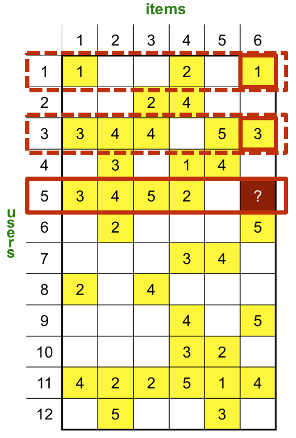

* Find the neighborhood N_i of users, which consists of the users who are (cosine-) similar to user i, and have rated item j
* Estimate user i's rating for item j as the (cosine-) similarity-weighted average rating on item j by the users in neighborhood N_i

----

<!-- .slide: class="align-top" -->

## Item-Item Collaborative Filtering

* Find the neighborhood N_j of items, which consists of the items who are (cosine-) similar to item j, and have been rated by user i
* Estimate user i's rating for item j as the (cosine-) similarity-weighted average rating by user i on the items in neighborhood N_j

----

<!-- .slide: class="align-top" -->

## Centering and Normalization of Ratings
<!-- .element: class="no-toc-progress" -->

* __Centering__: get at unusual signals for a user
  * Centered rating = actual rating - baseline rating
    * baseline rating = overall rating mean +/- item specific deviation +/- user specific deviation
  * Example: 
    * Mean (all movies) = 3.7
    * "The Sixth Sense" average rating is 4.2, 0.5 above mean
    * user i's average rating is 3.5, 0.2 below mean
    * Baseline rating = 3.7 + 0.5 - 0.2 = 4
    * user i's actual rating of 3.6 would be interpreted as a -0.4

      

* __Normalization__: cosine similarity becomes Pearson correlation coefficient and missing values can be set to zero
  * User-normalized centered rating = centered rating - mean over users of centered ratings
  * Item-normalized centered rating = centered rating - mean over items of centered ratings

----

<!-- .slide: class="align-top" -->

## Item-Item Collaborative Filtering
<!-- .element: class="no-toc-progress" -->

----

<!-- .slide: class="align-top" -->

## User-user vs. Item-item Collaborative Filtering

1. User-user cf less effective than item-item cf in large, diverse domains: users tend to be more "complex boundary spanners" that items.
2. Finding the neighborhood of similar users or items can become a computational bottleneck.
3. Challenge of rating sparsity in user-user cf: no other users is close in sparse data.
4. Both methods suffer from cold-start problems. A new item has not been rated by any users and a new user has not rated any items.

----

<!-- .slide: class="align-top" -->

## The Netflix Challenge

* As of October 2006, Netflix had 1.9B ratings, 11.7M subscribers, and 85,000 titles
* Shipping 1.5M DVDs/day

  

* Released 100M ratings, from 480,000 users, on 18,000 titles (held back 3M ratings, 1.5M for leader board, 1.5M for prize).
* $1 M prize. Improve RMSE by 10 (from 0.9514, item-item CF)

    

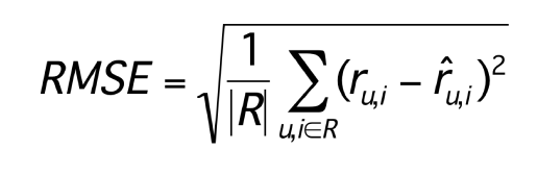

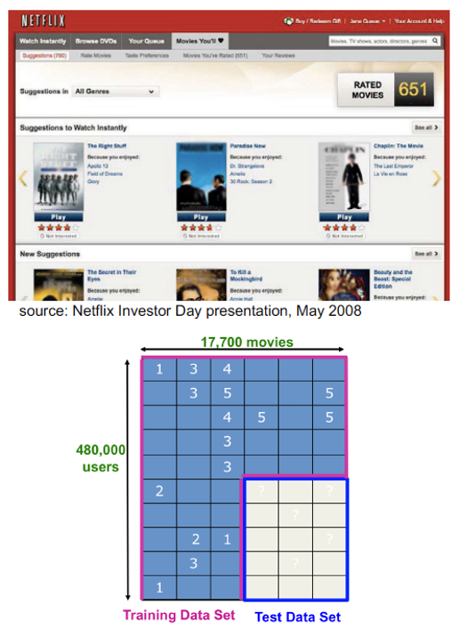

----

<!-- .slide: class="align-top" -->

## Matrix Factorization

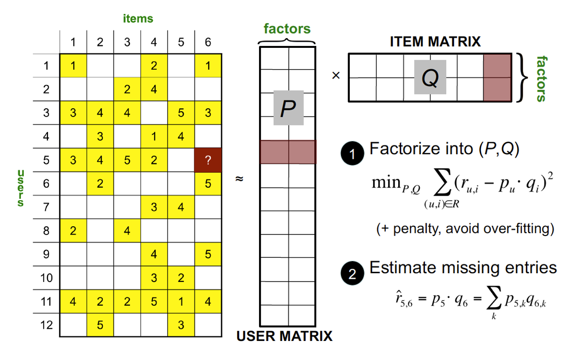

----

<!-- .slide: class="align-top" -->

## Matrix Factorization
<!-- .element: class="no-toc-progress" -->

##### __Idea__: embedding users and products into the same, f-dimensional space

----  ----

<!-- .slide: class="align-center" -->

# Other Recommender Approaches

----

<!-- .slide: class="align-top" -->

## Association-Based Recommenders

* recommendations based on a user's specific behavioral context
  * in e-commerce based on shopping basket, or products recently browsed. 
  * generete up-sell and cross-sell opportunities
  * still collaborative filtering: based on data about other users' behavior
  * “People who { } X also { } Y”

    

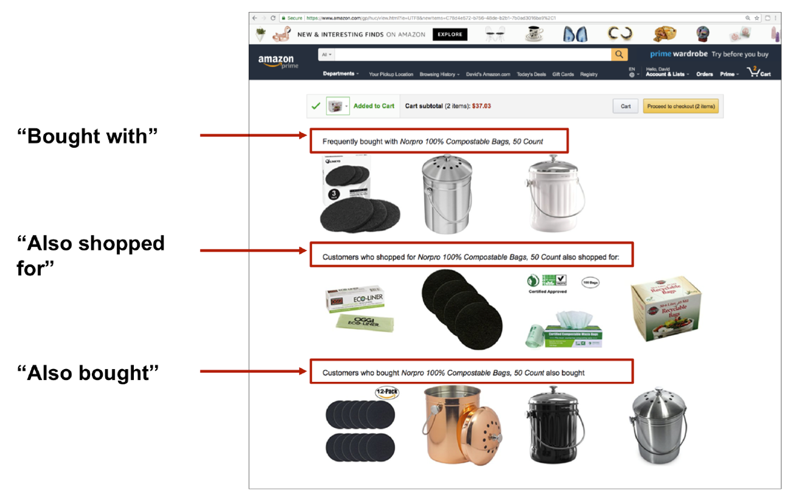

----

<!-- .slide: class="align-top" -->

## Association-Based Recommenders
<!-- .element: class="no-toc-progress" -->

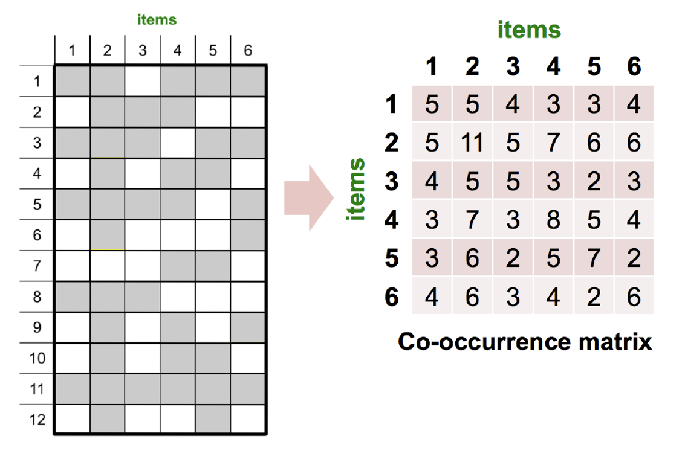

* Mapping transactions into a co-occurrence matrix to calculate measures for interestingness of association rules:
  * Support
  * Confidence
  * Lift

    

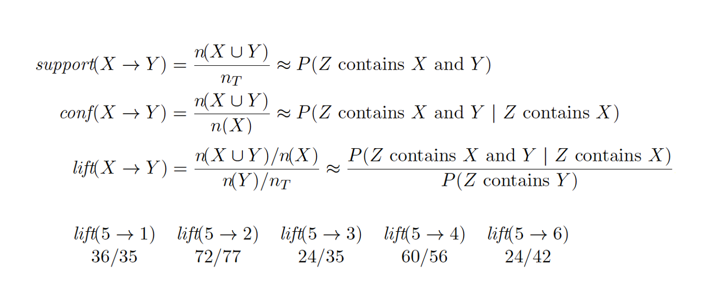

----

<!-- .slide: class="align-top" -->

## Hybrid Approaches

Four typical ways to combine content-based and collaborative-filtering methods:

  

1. Ensemble approach, by taking some kind of combination of the rating from each recommender, for example via a majority vote.
2. Introduce content-based user profiles into the calculation of user similarity (user-user collaborative filtering), or content-based item profiles into the calculation of item similarity (item-item collaborative filtering). For matrix factorization approaches, an alignment penalty can be introduced if two items with similar attributes are far away from each other in the factor space.
3. Introduce a knowledge-based component, where domain knowledge is hard-coded into the recommender system; e.g., the information that "seafood" is not "vegetarian." Of course, knowledge acquisition can be costly, and this is only feasible if the knowledge can be acquired in a sufficiently automated way.
4. Bring item attributes and user ratings together into a single, machine-learning framework, and learn to directly predict user ratings (e.g., via a deep learning approach).

----

<!-- .slide: class="align-top" -->

## Hybrid Approaches at Pinterest
<!-- .element: class="no-toc-progress" -->

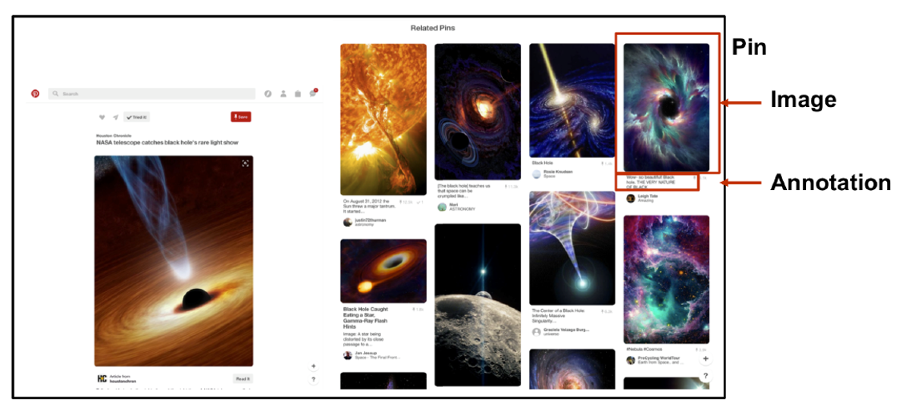

----

<!-- .slide: class="align-top" -->

## Hybrid Approaches at Pinterest
<!-- .element: class="no-toc-progress" -->

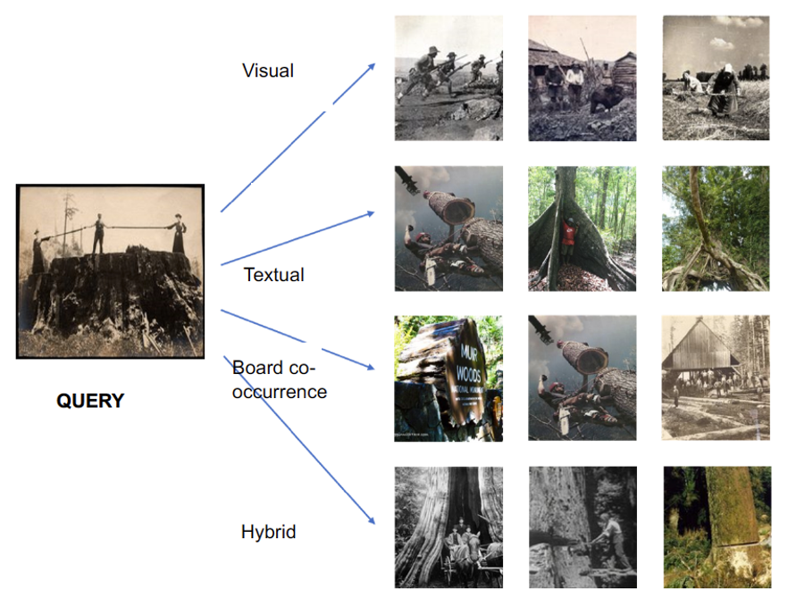

----

<!-- .slide: class="align-top" -->

## General Design Issues

* Accuracy is not enough 
  * “you liked Star Wars I and II, I predict you will like Star Wars III, IV, V, …”
  * No surprise! No improved decision making. No incremental sales.
* Incrementality: How did decisions change? How did sales change? How did long-term customer satisfaction change? 
* Optimize a “key performance indicator”; e.g., time on site, number clicks, number purchases, or profit.
  * e.g. YouTube: clicks on content vs. watch completely
* Need to think carefully about the appropriate objective.
* Popularity vs relevance
* Temporal factors (a sailing manual, vs a baby rattle)
* Diversity of recommendations
* Time directionality (book series)
* Ethical and privacy considerations

----  ----

<!-- .slide: class="align-center" -->

# Reputation Systems

----

<!-- .slide: class="align-top" -->

## Role of RS

* provides information about (product, brand or merchant) quality by collecting and aggregating "word-of-mouth" feedback from other users in an automated (digital) way in order to guide decisions about whether to engage in a transaction.
* often is specific to an online plattform and a source of competitive advantage

    

* __Adverse Selection__ Problem:
  * in situations with asymmetric information between buyrers and sellers prior to transaction
  * buyers face uncertainty in distinguishing low from high quality sellers
  * e.g. used car markets as "market of lemmons" (Akerlof)
  * a reputation system can be used to signal seller quality

    

* __Moral Hazard__ Problem:
  * one agent __can choose__ to deviate from a promised action, without bearing full (negative) consequences
  * e.g. driver has purchased car insurance, and now has the choice between driving carefully or recklessly
  * e.g. online seller has received payment, but has the choice to ship as promised or lower quality item
  * a reputation system can provide sanctioning of bad behavior, so that it has negative consequences in the future

----

<!-- .slide: class="align-top" -->

## Requirements of RS

* Useful reports from participants, providing information that correctly mirrors the quality of past transactions.
  * but there can be __selection bias__: 
    * only negative feedback (helping others); only positive feedback is left (expressing gratitude)
    * some negative information is omitted out of respect for social norms

    

* (For decentralized markets:) Participants who correctly interpret reputation information in making decisions.
  * but information might not be granular enough, or hard to interpret:
    * e.g., 98% positive feedback for a seller, but what if 90% of sellers have a better statistic than this?

    

* Sellers who change their actions (either on the platform, or in entering the platform in the first place) because of the linking between present behavior and future reputation.
  * but __whitewashing attacks__: sellers deliberately run down a good reputation, planning to re-enter the platform with a new identity

----

<!-- .slide: class="align-top" -->

## Avoiding Whitewashing Attacks

* Requiring a real identity 
  * but costly and may reduce participation. 
* initiation fee for the right to join a system
  * but costly and may reduce participation. 
* prioritize agents who have been in the system for longer
  * automatically by the system
  * Pay-your-dues (PYD) strategy of partcipants themselves
    * good reputation is earned by beeing around and following the PYD strategy:
    * (1) If both players have a good reputation, or both are new entrants, then both play C.
    * (2) If one or both players have a bad reputation, then both play D.
    * (3) A new entrant plays C against a veteran with a good reputation, and the veteran may defect with some probability. 
    * PYD calls for a player with a bad reputation to re-enter, and start as a new entrant, who veterans will sometimes defect against.

----

<!-- .slide: class="align-top" -->

## Design Space of RS

__Direction__:
    * one-way
    * two-way sequential
    * two-way simultaneous  

 

__Elicitation format__:
    * thumbs up or down
    * positive, neutral, negative
    * stars
    * text

__Who can give feedback__?
    * anyone
    * restricted to those that transacted

 

__Centralized system__:
    * yes, agregated, interpreted by plattform owner
    * no, interpreted by users

 

__Incentives__:
    * yes, no
    * nudge provided in user interface

----  ----

<!-- .slide: class="align-center" -->

# RS Examples

----

<!-- .slide: class="align-top" -->

## Amazon

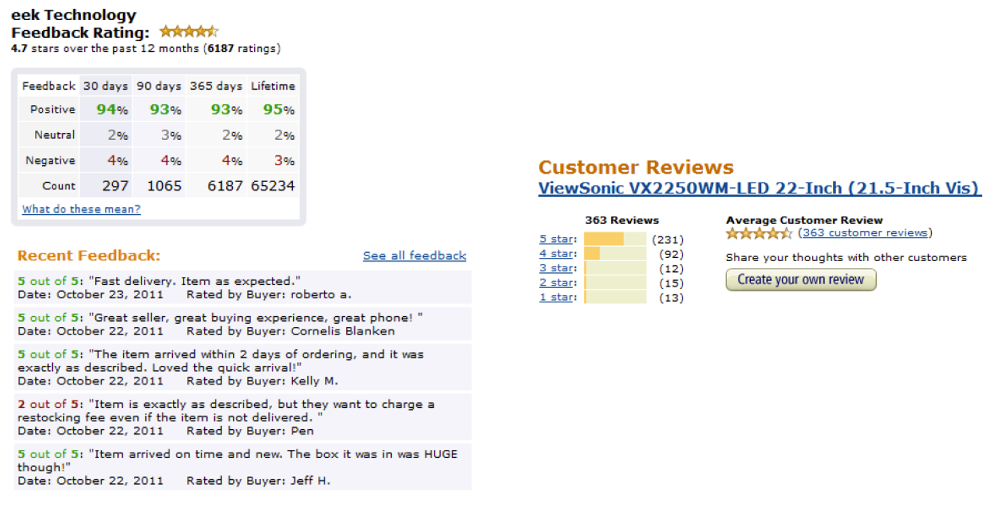

----

<!-- .slide: class="align-top" -->

## Yelp
<!-- .element: class="no-toc-progress" -->

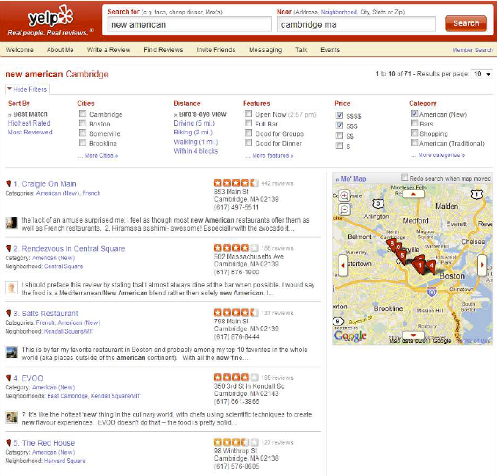

* one-star increase in the overall rating of a restaurant corresponds to an average increase in revenue of 10%.

----

<!-- .slide: class="align-top" -->

## Uber

* Two-way
  * both rider and driver can provide star ratings for the other party
* Partially sequential
  * driver can see star rating by rider before submitting own rating, while riders cannot see rating by driver
  * rider's reputation made available to driver when deciding to accept or reject a match
  * if driver accepts, driver's reputation score is also made available to rider
* Incentives:
  * nudging: showing riders the feedback page before allowing another ride to be requested
* Centralized:
  * Uber uses reputation scores to weed out bad drivers (> 4.4)

----

<!-- .slide: class="align-top" -->

## Digg
<!-- .element: class="no-toc-progress" -->

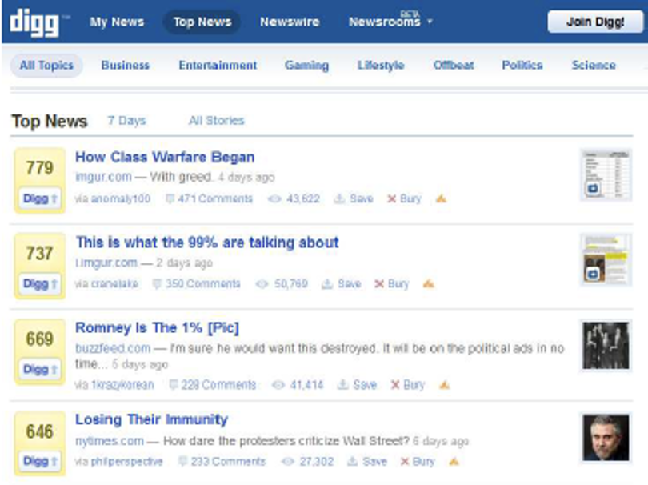

 

* Digg removed the "bury" button in August 2010, because of a U.S. conservative action group working to prevent liberal articles from reaching front page

----

<!-- .slide: class="align-top" -->

## Gogle Local Guides

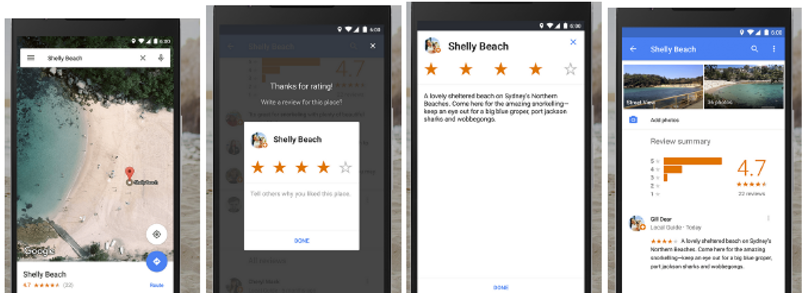

 

* Crowdsourced feedback on places with incentive points:
  * max 5 points per place
  * 200 points = free 1 TB upgrade of Drive storage woth $9.99/month
  * later reduced, then discontinued

----

<!-- .slide: class="align-top" -->

## Airbnb

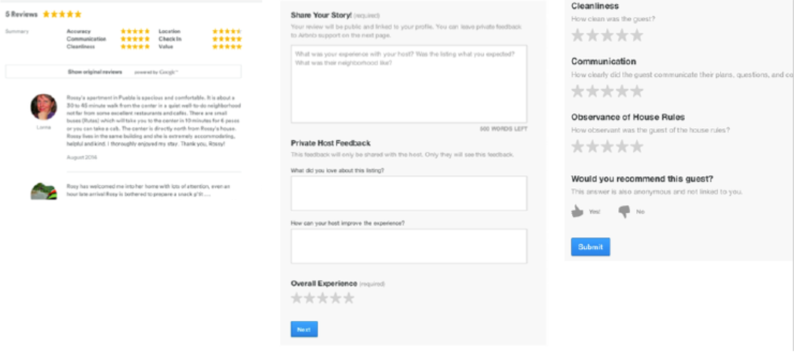

  

* Feedback is simultaneous: only made public once both have declined or given feedback after some deadline
* Hosts can decline requests based on guests' profile page that inlcudes prior qualitative feedback
* until 2014 feedback was sequential with concerns about retaliation or reciprocation problems
  * experiment revealed that simultaneous design increased feedback rate and decreased five star ratings on both sides

----

<!-- .slide: class="align-top" -->

## Ebay

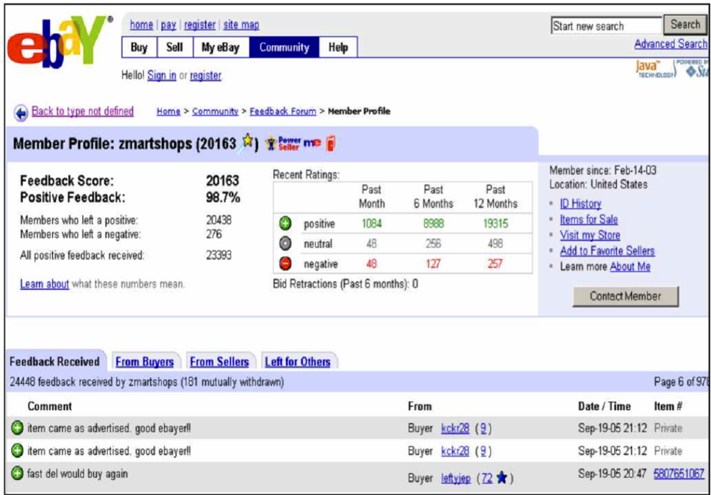

  

* Feedback was sequential until 2007

----

<!-- .slide: class="align-top" -->

## Ebay 1.0
<!-- .element: class="no-toc-progress" -->

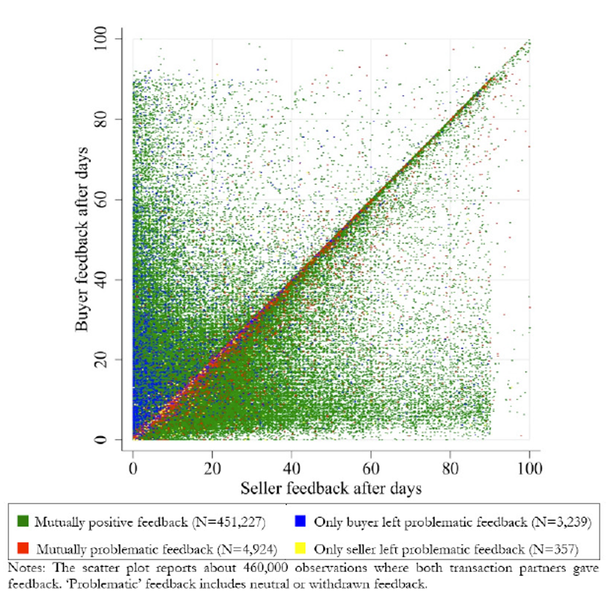

----

<!-- .slide: class="align-top" -->

## Ebay Lab Experiment
<!-- .element: class="no-toc-progress" -->

* Simultaneous reporting:
  * feedback would only be made public either after both parties had submitted their feedback, or after a deadline to provide feedback.
* Detailed seller rating (DSR):
  * conventional feedback augmented with additional feedback information, only made public after the seller had provided feedback or after a deadline for the seller to provide feedback

    

* Results:
  * both designs effective in reducing the amount of strategic behavior
  * DSRs especially promising:
    * detailed feedback correlated with seller quality
    * no reducetion in the amount of feedback, likxe in the simultaneous design

----

<!-- .slide: class="align-top" -->

## Ebay 2.0
<!-- .element: class="no-toc-progress" -->

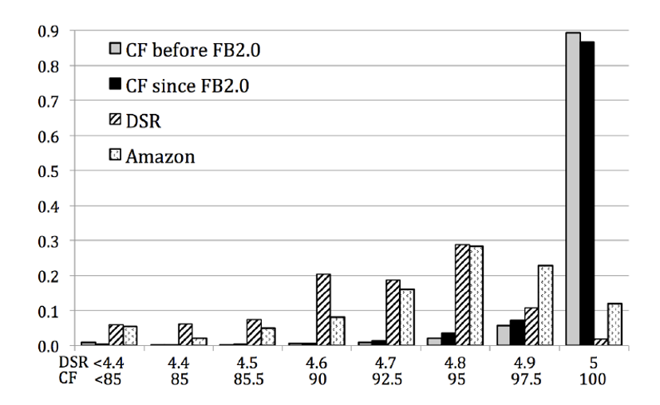

    

* DSR has better distribution, but only used by 1% of buyers
* Restricting seller feedback about buyers to be positive or neutral did not improve percentage positive (PP) score
* seller retaliation remains a concern: threatening emails and  phonecalls, even lawsuits 

----

<!-- .slide: class="align-top" -->

## Ebay 2.0
<!-- .element: class="no-toc-progress" -->

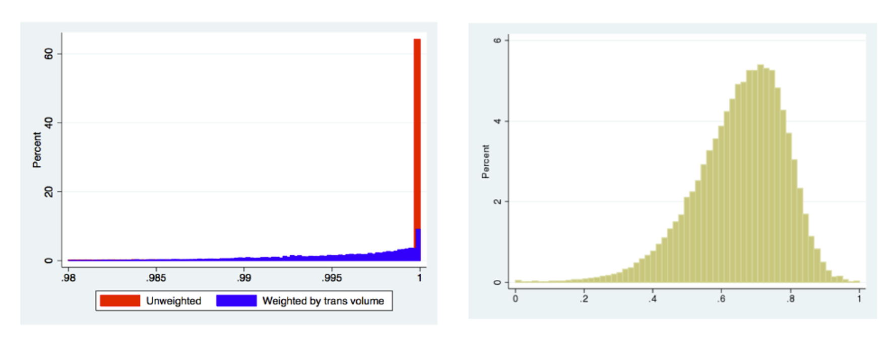

* effective percent positive score?
  * number of positive rating over all transactions completetd, not just the rated ones
  * assuming no rating is a negative feedback

----

<!-- .slide: class="align-top" -->

## Reputation System Examples: Summary
<!-- .element: class="no-toc-progress" -->

    

| Platform | Direction | Who can give feedback? | Elicitation | Centralized? | Incentives? |
|-----|-----|-----|-----|-----|-----|
|eBay (1.0) |2-way sequential |restricted| {+, o, -}, text |no |no|
|eBay (2.0)| 2-way sequential |restricted| {+, o, -}, text |no |no|
||1-way | |detailed seller rating|||
|Amazon| 1-way |anyone |stars, text |no |no|
|Yelp| 1-way |anyone |stars, text |no |no|
|Airbnb| 2-way simultaneous |restricted |stars, text |no |no|
|Uber| 2-way sequential |restricted |stars |yes |nudge|
|Digg| 1-way |anyone |vote |no |no|
|Google Local Guides| 1-way |anyone |stars, text |no |yes|

----  ----

<!-- .slide: class="align-center" -->

# Exercise
<!-- .element: class="no-toc-progress" -->

----

<!-- .slide: class="align-top" -->

## RS-E1: Your Favorite Platform
<!-- .element: class="no-toc-progress" -->

* Task:
  * Find or choose among your favorites a platform we have not yet discussed.
  * Describe its recommender system
  * Describe its reputation system:
    * potential adverse selection or moral hazard problems adressed
    * design paremeters
    * what can be improved?
  * Hint: you may also use secondary sources for your analysis (if available, please cite).

----  ----

<!-- .slide: class="align-center" -->

<!-- .slide: data-state="no-toc-progress" --> <!-- don't show toc progress bar on this slide -->

# *Thank You for Your attention!*
<!-- .element: class="no-toc-progress" -->

## *Let's keep in touch!*

  <ul class=network-icon aria-hidden=true>
    <li>
         <a href=https://www.startupengineer.io/authors/ihl/>
              <i class="fas fa-home big-icon" class="accent">: https://www.startupengineer.io/authors/ihl</i>
         </a>
    </li>
    <li>
         <a href=mailto:christoph.ihl@tuhh.de>
              <i class="fas fa-envelope big-icon" class="accent">: christoph.ihl@tuhh.de</i>
         </a>
    </li>
    <li>
        <a href=https://twitter.com/Ihluminate target=_blank rel=noopener>
              <i class="fab fa-twitter big-icon"class="accent">: @IHLuminate</i>
        </a>
    </li>
    <li>
        <a href=https://www.linkedin.com/in/christoph-ihl/ target=_blank rel=noopener>
              <i class="fab fa-linkedin big-icon" class="accent">: https://www.linkedin.com/in/christoph-ihl</i>
        </a>
    </li>
  </ul>

 <!-- .element: class="logo" -->

