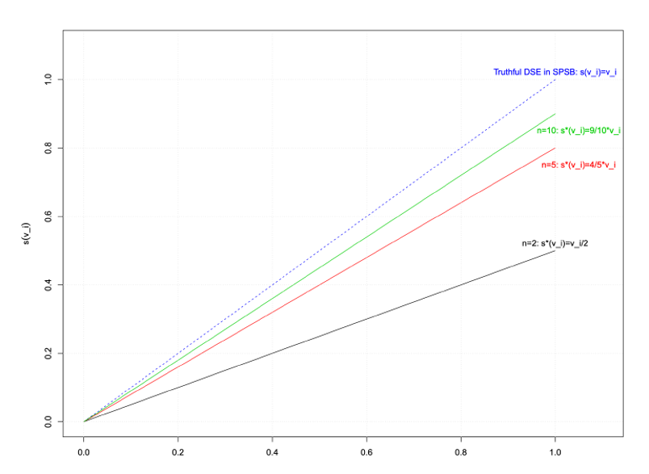

<!-- .slide: class="align-center" -->

<!-- .slide: data-state="no-toc-progress" --> <!-- don't show toc progress bar on this slide -->

# Digital Economy
<!-- .element: class="no-toc-progress" --> <!-- slide not in toc progress bar -->

## 4. Auction Theory and Practice

  

[Christoph Ihl][1] | 2020-11-13 | [Kühne Logistics University][2] | Hamburg

 <!-- .element: class="logo" -->

[1]: https://www.startupengineer.io/authors/ihl/
[2]: https://www.the-klu.org

----  ----

<!-- .slide: class="align-center" -->

## Quick Recap: P2P File Sharing
<!-- .element: class="no-toc-progress" -->

* Problem of earlier systems: Free riding
* BitTorrent → Repeated game for each swarm
* Strategic manipulation
* BitThief Exploit optimistic unchoking
* Strategic piece revelation Hide pieces to remain interesting to others
* BitTyrant Maximize “bang (download speed) for buck (upload speed)”
  * Threshold shaped reciprocation probability dependent on upload rate

----  ----

<!-- .slide: class="align-center" -->

# Defining Auctions

----

<!-- .slide: class="align-top" -->

## What is an Auction?

* Procedure to determine how to assign goods to agents
* Elicits information about agents’ willingness to pay in the form of bids
* Has well defined rules for who wins and at what price

----

<!-- .slide: class="align-top" -->

## Auctions: More Formally
<!-- .element: class="no-toc-progress" -->

>Definition (Forward Auction). A forward auction is a procedure to determine how a single item will be exchanged between __1 seller__ (auctioneer) and __`$ N = \{ 1, ..., n \} $` potential buyers__ (bidders).

   

>Definition (Sealed-Bid Auction). Given a bid profile `$ b $` of `$ N $` __simultaneous__ bids, a sealed-bid auction is defined in terms of:  
>* An allocation rule `$ x(b) \in \{0,1\}^n $`, where `$ x_i(b) $` for `$ i \in N $` picks out the `$ i $`th entry, and indicates whether or not >bidder `$ i $` is allocated the item.
>* A payment rule `$ t(b) \in \mathbb{R} $`, where payment `$ t_i(b) $` for `$ i \in N $` picks out the ith entry, and is the payment made by bidder `$ i $`.

----

<!-- .slide: class="align-top" -->

## Auctions: More Formally
<!-- .element: class="no-toc-progress" -->

>Definition (Sealed-Bid Auction) explained:
>* private (.i.e. independent of values of others) __values__ of bidders `$ v := ( v_1 , ... , v_n ) \in \mathbb{R}_{+}^n $` 
>* __bid profile__ `$ b := ( b_1 , ... , b_n ) \in \mathbb{R}_{+}^n $`
>* __allocation__ `$ x(b) := ( x_1(b) , ... , x_n(b) ) \in \{0,1\}^n $`
>* __payment__ `$ t(b) := ( t_1(b) , ... , t_n(b) ) \in \mathbb{R}^n $`
>* __utility function__ `$ u(b) := ( u_1(b) , ... , u_n(b) ) \in \mathbb{R}_{+}^n \rightarrow \mathbb{R}^n $`

----

<!-- .slide: class="align-top" -->

## First and Second Price Auctions

>Definition (First-Price Sealed-Bid (FPSB) Auction): 
> Assume bids are ordered in decreasing order, with `$ b_1 \geq b_2 \geq ... b_n$`. The first-price sealed-bid auction allocates the item to bidder `$ 1 $` and collects as payment `$ b_1 $` from this bidder, with 0 payment from others.  
> `$ x(b) = ( 1 , 0, ... , 0 ) $`  
> `$ t(b) = ( b_1 , 0, ... , 0 ) $`

   

>Definition (Second-Price Sealed-Bid (SPSB) Auction): 
> Assume bids are ordered in decreasing order, with `$ b_1 \geq b_2 \geq ... b_n$`. The second-price sealed-bid auction (or Vickrey auction) allocates the item to bidder `$ 1 $` and collects as payment `$ b_2 $` from this bidder (or 0 if there is only one bidder), with 0 payment from others.  
> `$ x(b) = ( 1 , 0, ... , 0 ) $`  
> `$ t(b) = ( \mathbf{b_2} , 0, ... , 0 ) $`

----

<!-- .slide: class="align-top" -->

## Quasi-Linear Utility Function

>Definition (Quasi-Linear Utility): 
> Given bid profile `$ b $`, the utility of bidder `$ i $` for the allocation `$ x_i(b) \in \{0,1\} $` and payment `$ t_i(b) $` is:  

> `$ u_i(b) = x_i(b) \cdot v_i - t_i(b) $`.

  

* 	_Quasi-linear?_
	* utility depends linearly (and negatively) on payment 
	* only on payment and independent of value (which in turn may depend non-linearly on the number of items received e.g. in combinatorial auctions)
	* increase in price from $8,000 to $9,000 has same effect as increase from $28,000 to $29,000, irrespective of whether the bidder's value is $30,000 or $70,000.
	* no budget effects: value reflects willingness-to-pay

----

<!-- .slide: class="align-top" -->

## Bidder Value Models

* __Private Values__ (our focus): bidders know their own value, but it is independent of knowledge about other bidders' value
	* <!-- .element: class="fragment" --> e.g. shoes on ebay.
* __Common Values__: all bidders would have the same value given the same information, so they seek to infer information from the other bidders' value to reduce their uncertainty
	* <!-- .element: class="fragment" --> e.g. right to drill in an oil field.
* __Interdependent Values__: bot private and common component
	* <!-- .element: class="fragment" --> e.g. painting, art.

----

<!-- .slide: class="align-top" -->

## Design Goals

* __Allocative efficiency:__ 
	* Allocate the item to the bidder with the highest value. 
	* This is the efficient allocation, and auctions with this property are referred to as _efficient auctions  
* __Revenue maximization:__ 
	* Maximize the expected revenue to the seller.
	* Auctions with this property are referred to as _optimal auctions_
* __Trade-off:__ cannot be simultaneously optimized in general
 
  

* Design incentives so that predicted equilibria can achieve these goals

----  ----

<!-- .slide: class="align-center" -->

# Dominant Strategy Equilibria

----

<!-- .slide: class="align-top" -->

## Auction Strategies

* Auctions are games of _incomplete information_
	* bidders do not know each others' values and thus payoffs
	* strategies must specify a bid for every possible value a bidder might have
* Strategies are now functions that relate values to bids (not actions anymore!)
* We focus on pure strategies!
 
 

>Definition (Strategy): A strategy for bidder `$ i $` , `$ s_i(v_i) : [0, v_{max}] \rightarrow \mathbb{R}_{+} $`, defines a bid for every possible value of the bidder.  
>`$ s_i(v_i) $` represents the bid of bidder `$ i $` when her value is `$ v_i $`

----

<!-- .slide: class="align-top" -->

## Auction Strategies
<!-- .element: class="no-toc-progress" -->

> * Strategy profile:  
> `$ s(v) := ( s_1(v_1) , ... , s_n(v_n) ) $`

> * Strategy profile without `$ i $`:   
> `$ s_{-i}(v_{-i}) := ( s_1(v_1) , ... , s_{i-1}(v_{i-1}), s_{i+1}(v_{i+1}), ... , s_n(v_n) ) $`

  

> * Bid vector:  
> `$ b := ( b_1 , ... , b_n ) $`

> * Bid vector without `$ i $`:   
> `$ b_{-i} := ( b_1 , ... , b_{i-1}, b_{i+1}, ... , b_n ) $`

----

<!-- .slide: class="align-top" -->

## Dominant Strategy Equilibrium

>Definition (Dominant-Strategy Equilibrium). Strategy profile `$ s^* = ( s_1^* , ... , s_n^*)  $` is a dominant-strategy equilibrium (DSE) if, for all bidders `$ i $`,   
> `$ u_i( s_i^*(v_i), s_{-i}(v_{-i}) \geq u_i( b_i, s_{-i}(v_{-i})) $`   
> for all `$ v_i $`, all `$ b_i $`, all `$ v_{-i} $`, all `$ s_{-i} $`.

 

* optimal strategy maximizes bidder's utility, whatever the value and whatever the bids of others. 
* bidder does not need to reason about the values of others, or even believe that other bidders are rational.
* special case:

 
 

>Definition (Strategy-proof): A strategy-proof auction is one in which truthful bidding, `$ s_i^*(v_i) = b_i = v_i $`, is a dominant-strategy equilibrium.

----

<!-- .slide: class="align-top" -->

## DSE in 2nd Price Auction

>Theorem: The SPSB auction is strategy-proof and efficient.

* Proof:
  * Let's focus on bidder 1 out of m, with any value `$ v_1 $` (same can be done for any bidder)
  * let `$ b^\prime = max_{j\neq1} (b_j) = max_{j\neq1} (s_j(v_j)) $` denote the maximum bid from another bidder for any `$ s_{-i}(v_{-i})) $`
    * Case 1: `$ v_1 > b^\prime$`:
      * <!-- .element: class="fragment" --> Best response is to bid anything larger than $ b^\prime$ to win because this generates utility $ v_1 - b^\prime > 0$
    * Case 2: $ v_1 = b^\prime$:
      * <!-- .element: class="fragment" --> Indifferent, will lose and make zero payment or win and pay an amount equal to their value.
    * Case 3: $ v_1 < b^\prime$:
      * <!-- .element: class="fragment" --> Best response is to bid anything smaller than $ b^\prime$ to lose and generate utility 0. Bidding more than $ b^\prime$ to win and pay $ b^\prime > v_1$ generates negative utility.

----  ----

<!-- .slide: class="align-center" -->

# Bayes-Nash Equilibria

----

<!-- .slide: class="align-top" -->

## First-Price Sealed-Bid Auction
<!-- .element: class="no-toc-progress" -->

* No DSE and truthful bidding not a best response in a FPSB auction
  * Example: two bidders, bid from bidder two is `$ b_2 = 0 $`. Now, bidder 1 with value `$ v_1 = 1 $` should bid just above 0.

----

<!-- .slide: class="align-top" -->

## Relationship of Equilibria

* DSE ⊆ ex-post NE ⊆ __ex-interim BNE__ ⊆ ex-ante BNE

* DSE: 
  * <!-- .element: class="fragment" -->optomal strategy/ bids regardless of the others' values and bids
* ex-post NE: 
  * <!-- .element: class="fragment" -->optimal strategy/ bids depends on knowing others' values 
* ex-interim BNE:
  * <!-- .element: class="fragment" -->bidders know their own value, but do not know other bidders’ values
  * <!-- .element: class="fragment" -->only probability distributions over every other bidder’s value
    * <!-- .element: class="fragment" -->independently sampled: independent private value (IPV)
    * <!-- .element: class="fragment" -->special case: identical distributions for all other bidders (IID)
    * <!-- .element: class="fragment" -->strategy = function: value → bid
    * <!-- .element: class="fragment" -->bidders make assumption about other bidders’ strategies (like in ex-post NE)
* ex-ante BNE:
  * <!-- .element: class="fragment" -->bidders do not even know their own value strategy = bid

----

<!-- .slide: class="align-top" -->

## A Model of Bidders' Value

* CDF (cumulative distribution function):  `$ G(x) = P(X \leq x) $`
* PDF (probability density function): `$ g(x) = \frac{d}{dx} G(x) = G^\prime(x) $`
* `$ G(x) = \int_{-\infty}^{x} g(t) \,dt $`
* Independent private value (IPV): Each bidder’s value `$ v_i \sim G_i $` sampled independently
* Independent and identivally distributed (IID): `$ G_1 = G_2 = ... = G_n $`
* We assume:
  * `$ v_i \in [ 0, v_{max} ] $`
  * `$ g(v_i) > 0 $`
  * `$ G_i $` common knowledge
  * Bidders risk neutral

----

<!-- .slide: class="align-top" -->

## Bayes-Nash Equilibrium

>Definition (Bayes-Nash Equilibrium). Strategy profile `$ s^* = ( s_1^* , ... , s_n^*)  $` is a Bayes-Nash equilibrium (BNE) in a sealed-bid auction if, for all bidders `$ i $`,   
> `$ \mathop{\mathbb{E}}_{v_{-i}}(u_i( s_i^*(v_i), s_{-i}(v_{-i})) \geq \mathop{\mathbb{E}}_{v_{-i}}(u_i( b_i, s_{-i}(v_{-i}))) $`   
> for all `$ v_i $`, all `$ b_i $`.

----

<!-- .slide: class="align-top" -->

## Equilibrium of First Price Auctions

> Theorem: For bidders with IID values, uniform on [0, 1], the BNE in the FPSB has strategy
> `$ s^*(v_i) = (\frac{n-1}{n}) \cdot v_i $`.   
> The FPSB is efficient in this equilibrium.

----

<!-- .slide: class="align-top" -->

## Visualization of Equilibrium Strategies
<!-- .element: class="no-toc-progress" -->

----

<!-- .slide: class="align-top" -->

## Equilibrium of First Price Auctions (more general)
<!-- .element: class="no-toc-progress" -->

> Theorem: For bidders with IID values, uniform on [a, b], the BNE in the FPSB has strategy
> `$ s^*(v_i) = (\frac{n-1}{n}) \cdot v_i + \frac{a}{n}$`.   
> The FPSB is efficient in this equilibrium.

----  ----

<!-- .slide: class="align-center" -->

# Auction Revenue

----

<!-- .slide: class="align-top" -->

## Revenue Maximization

* Auction designer has certain goals:
  * Design auction so that bidders’ strategies can be predicted
  * Derive values from observed bids (by inverting `$ s^* $`) 
* Efficiency
* Revenue maximization
  * Revenue will be determined by the equilibrium

----

<!-- .slide: class="align-top" -->

## Revenue Order Statistics

> Draw `$ n \text{ independent samples from a uniform distribution } G = U(0,1)$` denoted by `$ \{ Z_1, ... , Z_n \} $`.
  
> First-order statistic (maximum value := `$ Z_1 $` 
> k-th-order statistic (k-th highest value) := `$ Z_k $` 
>   
> `$ \mathop{\mathbb{E}}[Z_{(k)} | n \text{ samples IID} \sim U(0,1) ] = (\frac{n-(k-1)}{n+1}) $`.   

 

----

<!-- .slide: class="align-top" -->

## Comparing Auction Revenue

* Example: compare ...
  * SPSB: equilibrium is DSE with truthful bids `$ s^*(v_i) = b_i = v_i $`.
  * FPSB: equilibrium is BNE with `$ s^*(v_i) = (\frac{n-1}{n}) \cdot v_i $`.
  * assuming uniform IID values 

  

> `$ \mathop{\mathbb{E}[ \text{ SPSB revenue } ] = \mathbb{E}}[ \text{ 2nd highest value } ] = (\frac{n-1)}{n+1}) $`   

  

> `$ \mathop{\mathbb{E}[ \text{ FPSB revenue } ] = \mathbb{E}}[ \text{ highest value } ] = (\frac{n-1)}{n}) \cdot (\frac{n}{n + 1}) = (\frac{n-1)}{n+1})$`

----

<!-- .slide: class="align-top" -->

## Revenue Equivalence

>Theorem (Revenue equivalence). Any two normalized auctions that have the same interim allocation, for every bidder, and every value of the bidder, have the same expected revenue in equilibrium.

 
 

* normalized auction: 
  * bidders who have bid of zero have value zero
* in words:
  * if there is an auction outcome that is efficient but does not maximize revenue, then there is no other efficient auction (outcome) that maximizes revenue

----

<!-- .slide: class="align-top" -->

## Revenue Maximization Actions

* Auction designers can still do something:

 
 

* bidding fee: fixed vs. relative to your bid
* hidden dummy bidder
* hidden reserve price
* open reserve price
* => decreases efficiency

----  ----

<!-- .slide: class="align-center" -->

# Auction Excercises

----

<!-- .slide: class="align-top" -->

## E1: Find BNE in FPSB Auction

* An auction with two players.  
* Their values are distributed uniformely: `$ v_i \sim U[1,3]  $`.  
* Player 2 plays the following strategy: `$ s_2(v_2) := \frac{v_2+1}{2} $` 
* How should player 1 respond optimally? 
* Is this a BNE?

----

<!-- .slide: class="align-top" -->

## E2: Calculate SPSB Auction Revenue I

* Only one bidder, value $10 with probability 50% and $22 otherwise.
* Which reserve price maximizes expected revenue?

----

<!-- .slide: class="align-top" -->

## E3: Calculate SPSB Auction Revenue II

* Given IPV environment, the value of two bidders come from two different distributions:
  * Bidder 1 has value $2 with probability 30% and $5 otherwise
  * Bidder 2 has value $3 with probability 40% and $4 otherwise.
* What is the Expected revenue for the auctioneer?
* Can one increase expected revenue by a reserve price? How high should it be?

----  ----

<!-- .slide: class="align-center" -->

# GT Excercises
<!-- .element: class="no-toc-progress" -->

----

<!-- .slide: class="align-top" -->

## E1: Simultaneous-Move Games
<!-- .element: class="no-toc-progress" -->

<mark>Exercise:</mark>  
Two prisoners who committed a crime are each interrogated in separate rooms. If they cooperate and tell a common story they can not be fully believe, but at least none will get accused of the entire crime, so they each get 4 years. If one of them defects, then he/she can go home and the other one will get 10 years for committing the crime alone. If both defect, then they get accused and they get a sentence of 8 years each.

  

<mark>Questions:</mark>  
a)  Write this game formally, as a simultaneous move game. Find its normal form representation.  
b)  Find the Nash equilibria and Pareto optima for this game.  
c)  Draw the best response graph.  

----

<!-- .slide: class="align-top" -->

## E2: Mixed Nash Equilibria
<!-- .element: class="no-toc-progress" -->

<mark>Exercise:</mark>  
Alice and Bob would like to spend time together. If they both go to a football match, then Bob gets a utility of 3 while Alice gets utility of 1. If they both go to the opera, then Alice gets a utility of 3, while Bob gets only 1. If Bob goes to the match while Alice goes to the opera, both get a utility of 1. Vice versa, both get 0. Assume that they need to act simultaneously.

  

<mark>Questions:</mark>  
a)  Write this game formally, as a simultaneous move game. Find its normal form representation.  
b)  Find the Nash equilibria and Pareto optima for this game.  
c)  Draw the best response graph.  

----

<!-- .slide: class="align-top" -->

## E3: Games with Multiple Actions
<!-- .element: class="no-toc-progress" -->

<mark>Exercise:</mark>  

  

<mark>Questions:</mark>  
a)  Write this game formally, as a simultaneous move game. Find its normal form representation.  
b)  Show that it is a zero-sum game.   
c)  Find the Nash equilibria for this game.  

----

<!-- .slide: class="align-top" -->

## E4: Repeated (Prisoners' Dilemma) Games
<!-- .element: class="no-toc-progress" -->

<mark>Exercise:</mark>  
Play the prisoners’ dilemma game multiple times. Assume that the players discount their payoff (or utility) from future rounds by `$ \delta^n $`; where `$ \delta $` can be interpreted has probability of stopping the game because of impatience, or the lower value that players assign to payoffs obtainable further in the future; and `$ n $` is the number of rounds played in the future.

  

<mark>Questions:</mark>  
a)  If the game is repeated `$ m $` finite times, show that *Grim Trigger* strategy is not an NE for any `$ \delta $`.  

(The Grim Trigger strategy implies that players cooperate until the other player defects for the first time. Then the player defects in all following rounds.)<!-- .element: class="small" -->

b)  Prove that it is an NE for some `$ \delta $` in the infinitely repeated game. For which δ?  
c)  Is the *Tit-for-Tat* strategy a NE in the finite and infinite case?  

(The Tit-for-Tat strategy implies that players always play what the other one has played in the previous round.)<!-- .element: class="small" -->

----  ----

<!-- .slide: class="align-center" -->

<!-- .slide: data-state="no-toc-progress" --> <!-- don't show toc progress bar on this slide -->

# *Thank You for Your attention!*
<!-- .element: class="no-toc-progress" -->

## *Let's keep in touch!*

  <ul class=network-icon aria-hidden=true>
    <li>
         <a href=https://www.startupengineer.io/authors/ihl/>
              <i class="fas fa-home big-icon" class="accent">: https://www.startupengineer.io/authors/ihl</i>
         </a>
    </li>
    <li>
         <a href=mailto:christoph.ihl@tuhh.de>
              <i class="fas fa-envelope big-icon" class="accent">: christoph.ihl@tuhh.de</i>
         </a>
    </li>
    <li>
        <a href=https://twitter.com/Ihluminate target=_blank rel=noopener>
              <i class="fab fa-twitter big-icon"class="accent">: @IHLuminate</i>
        </a>
    </li>
    <li>
        <a href=https://www.linkedin.com/in/christoph-ihl/ target=_blank rel=noopener>
              <i class="fab fa-linkedin big-icon" class="accent">: https://www.linkedin.com/in/christoph-ihl</i>
        </a>
    </li>
  </ul>

 <!-- .element: class="logo" -->

