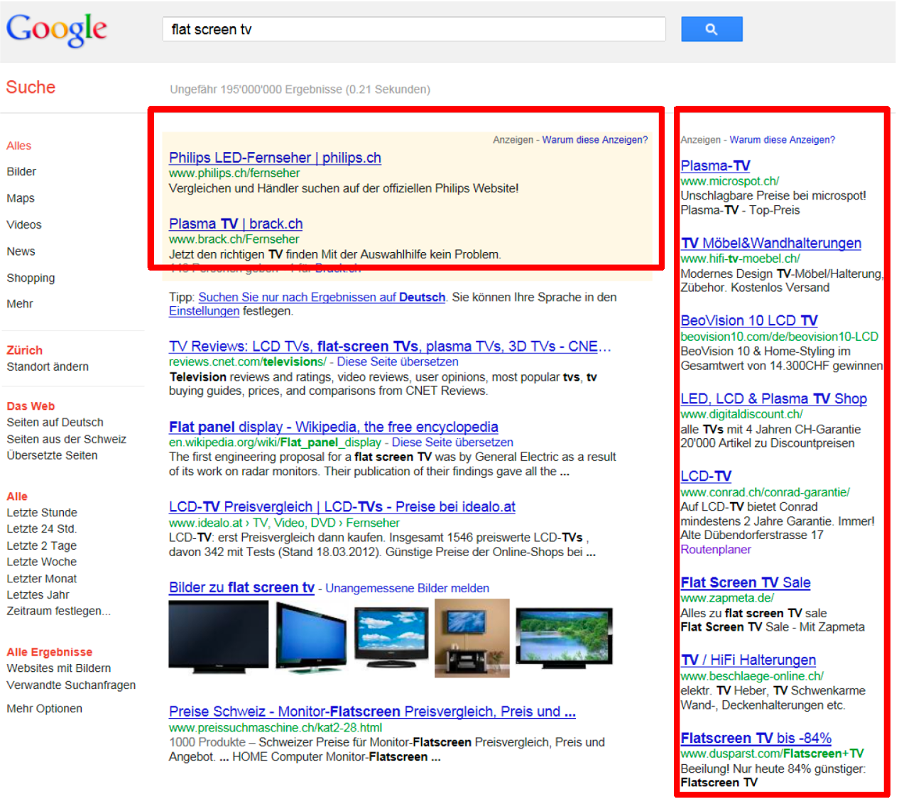
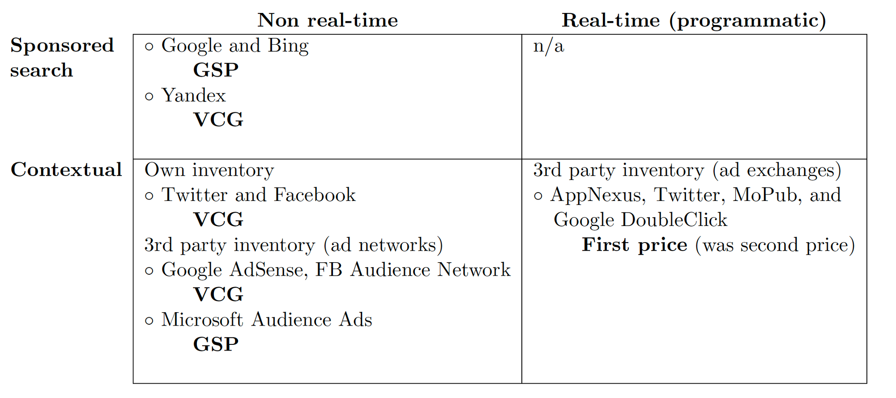
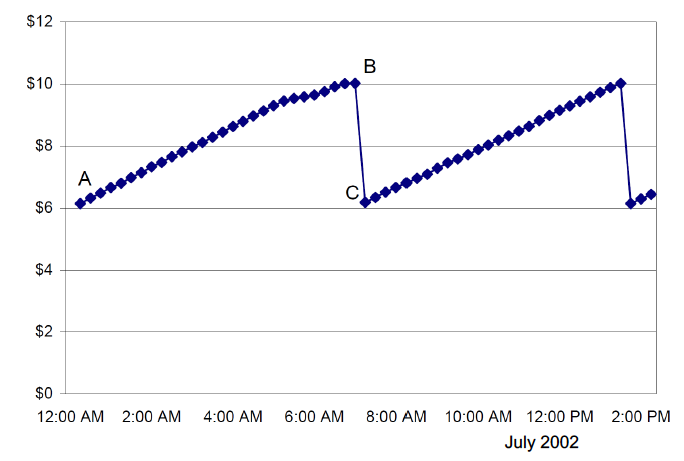
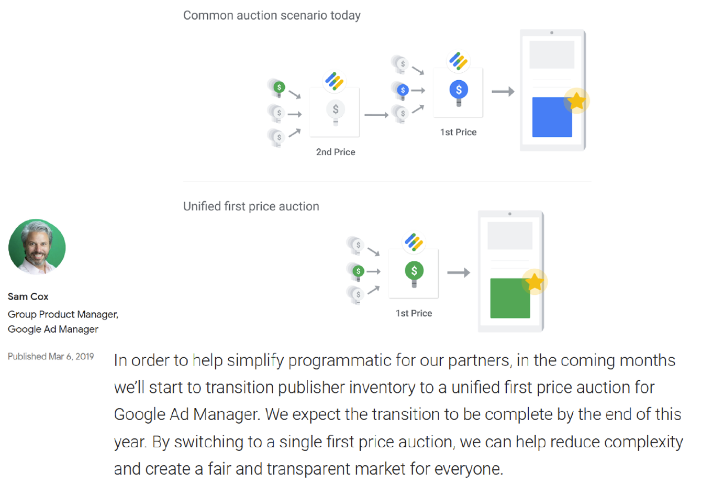
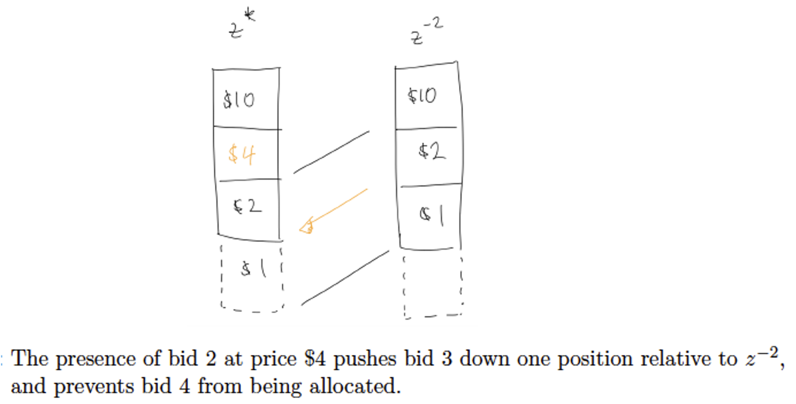
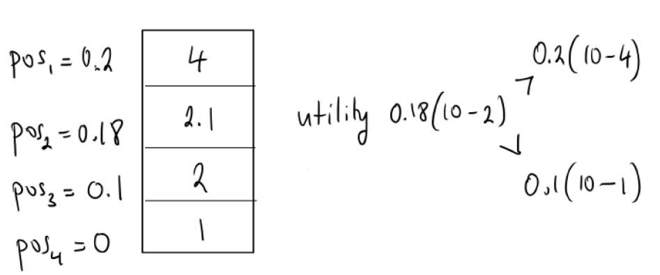
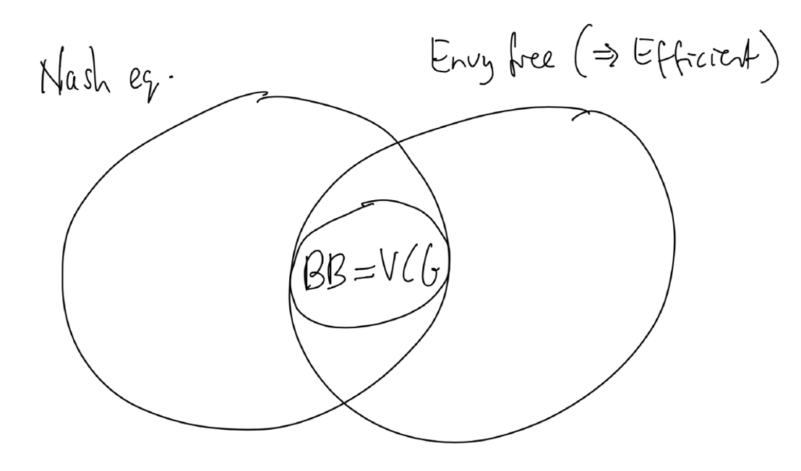

<!-- .slide: class="align-center" -->

<!-- .slide: data-state="no-toc-progress" --> <!-- don't show toc progress bar on this slide -->

# Digital Economy
<!-- .element: class="no-toc-progress" --> <!-- slide not in toc progress bar -->

## 7. Online Advertising Auctions

  

[Christoph Ihl][1] | 2020-11-26 | [Kühne Logistics University][2] | Hamburg

 <!-- .element: class="logo" -->

[1]: https://www.startupengineer.io/authors/ihl/
[2]: https://www.the-klu.org

----  ----

<!-- .slide: class="align-center" -->

# Introduction

----

<!-- .slide: class="align-top" -->

## Display Advertising

##### Static 

----

<!-- .slide: class="align-top" -->

## Contextual Advertising

----

<!-- .slide: class="align-top" -->

## Contextual Advertising
<!-- .element: class="no-toc-progress" -->

* Targeted and personalized advertising based on collected information:
  * about users
    * Demographics
    * Interests
    * Location
  * about context
    * Time of day
    * Recent online activity (e.g., products viewed, sites visited)
* Collected by: 
  * market-makers (e.g., Google and Facebook)
  * publishers and e-commerce sites (e.g., The New York Times)
  * data aggregators (e.g., Acxiom)

----

<!-- .slide: class="align-top" -->

## Sponsored Search

----

<!-- .slide: class="align-top" -->

## Advertising Auctions

* Bidding on clicks (versus impressions, add-to-carts, purchases (conversions), app installs, or writing reviews)
  * Real-time exchanges typically operate with per-impression rather than per-click payments, in order to avoid the need for complicated infrastructure to track
clicks and collect payments.
* Sponsored search: also bidding on position and keywords
* Publishers sell ad space (supply side) 
* Advertisers buy ad space (demand side)
* Ad exchanges are a market places
* Ad networks aggregate inventory from publishers and the sell those to advertisers (via ad exchanges)
* Real time (programmatic) bidding (vs. standing bids) on ad exchanges allow retargeting and ad personalization
* Consider bids and clear auctions in hundreds of milliseconds (w/o disrupting user experience)

----

<!-- .slide: class="align-top" -->

## Advertising Auctions
<!-- .element: class="no-toc-progress" -->

* Different design:
  * Generalized second-price (GSP) auction:
    * Google and Bing
  * VCG auctions: 
    * Facebook and Google (on behalf of publishers in Google's ad network.) for selling contextual ads
    * Other search engines swithed from GSP to VCG (e.g., Yandex, in 2015). 
  * First-price sealed-bid auction: revival

----

<!-- .slide: class="align-top" -->

## Advertising Auctions
<!-- .element: class="no-toc-progress" -->

----

<!-- .slide: class="align-top" -->

## Design Tradeoffs

* Reasons for GSP (to exist and still be around):
  * By accident!  
    * Google in fact wanted VCG
  * Easy to explain
  * Short-term revenue loss
    * even if longer-term effect expected to be neutral (Theorem).
  * Re-engineering cost
    * Switching to VCG would cause disruption to the various algorithmic systems used to optimize ad campaigns.

----

<!-- .slide: class="align-top" -->

## Design Tradeoffs
<!-- .element: class="no-toc-progress" -->

* Reasons in favor of VCG:
  * Strategy-proofness:
    * advertisers can use same bid across multiple (VCG-based) ad systems
    * easier to estimate advertiser values (useful for testing new designs and reserve prices)
  * Flexibility:
    * optimize the placement of ads simultaneously with other content (posts from friends, news stories) as one big optimization problem
    * accommodate different kinds of bids (e.g. for a click from a rich ad vs a simple ad)
    * accommodate different kinds of ads (e.g. highly relevant ads may be "resized" and shown in place of other less relevant ads)

----

<!-- .slide: class="align-top" -->

## Early Auctions: First Price
<!-- .element: class="no-toc-progress" -->

* Ranked ads by bid-per-click, and used first-price, auctions.
* Problems:
  * low quality ads, unlikely to receive clicks, could win high positions on a page by placing high bids
    * low payments and annoying ads
  * bidding wars

  

----

<!-- .slide: class="align-top" -->

## Advertising Auctions: First Price Revival
<!-- .element: class="no-toc-progress" -->

----

<!-- .slide: class="align-top" -->

## Design Tradeoffs
<!-- .element: class="no-toc-progress" -->

* Reasons in favor of First Price:
  * Transparency:
    * e.g. Google is both bidder and seller on real-time exchanges, leading to concerns about whether they are preferencing some bidders over others.
  * Composability:
    * Bidders (Demand Side Plattforms - DSPs) in ad exchanges are themselves often run an internal auction between their clients
    * DSPs then send a single bid, representing the winner, holding back other bids in order to keep prices lower. 
    * Because of this bid censoring, the exchange does not see the true second-price when running a SPSB. 
  * Analytics:
    * Bid censoring in second-price auctions has also made analytics tools difficult to develop.

----  ----

<!-- .slide: class="align-center" -->

# Position Auctions

----

<!-- .slide: class="align-top" -->

## Notation

> * Agents: `$ N = \{ 1, ..., n \} $`
> * Positions (Slots): `$ M = \{ 1, ..., m. \} $`
>   * ordered from top to bottom, with position 1 being the best, m the worst
>   * m < n 
> * Value-per-click: `$ v_i \geq 0 $`
>   * willingness-to-pay independent of the position from which the click originates
> * Bid-per-click: `$ b_i \geq 0 $`
>   * perhaps `$ b_i \neq v_i $`

----

<!-- .slide: class="align-top" -->

## Modeling Click-Through Rates
<!-- .element: class="no-toc-progress" -->

* Improved prediction capability with machine learning (esp. deep learning via neural networks) of:
  * ad quality on the basis of relevant features (e.g., user demographic, search term, landing page quality (to avoid click bait), the ad creative)
  * click-through rates on different ad qualities in different positions on a page.

* Click-through rate on an ad as __separable__ function of the ad's quality and the position effect:
  * bidders vary wrt. value-per-click and ad quality
  * but have __same__ relatise position effect (i.e. value for positions) 
  * independent of what other ads are shown in other positions

----

<!-- .slide: class="align-top" -->

## Modeling Click-Through Rates

> * Click-through rate for the ad from bidder i in position j:
>   * `$ \text{CTR}_{ij} = \text{pos}_j \cdot Q_i  $`

> * Normalized ad quality: `$ Q_i \in [0.1] $`
>   * `$ Q_i = 1 $` for ads with the highest possible quality.
>   * determines the relative click-through rate for different ads
>   * may depend, e.g., on the relevance of the ad to a user, and brand strength, landing page quality

> * Position effect: `$ \text{pos}_j \in [0.1] $`
>   * weakly decreasing with position: `$ \text{pos}_1 \geq \text{pos}_2 \geq ... \geq \text{pos}_m $`
>   * `$ \text{pos}_{m + 1} = 0$`
>   * probability that an ad with quality `$ Q_i = 1 $` will receive one click in position j.

----

<!-- .slide: class="align-top" -->

## Modeling Click-Through Rates
<!-- .element: class="no-toc-progress" -->

> * Expected value of bidder i for position `$ j \in M $`: 
>   * `$ v_{ij} = \text{CTR}_{ij} \cdot v_i = \text{pos}_j \cdot Q_i \cdot v_i $`
> * Based on estimated ad quality, a per-click bid, `$ b_i $`, translates into an __effective bid__ `$ b_{ij} $` for each position j:
>   * `$ b_{ij} =  \text{pos}_j \cdot Q_i \cdot b_i $`

----

<!-- .slide: class="align-top" -->

## Rank-by-Expected-Value

* Assignment of bids to positions: `$ z = (z_1, ... , z_n) $` such that `$ z_i \in M $`
* Instead of ranking by bid-per-click: `$ b_1 \geq b_2  \geq ... \geq b_n  $`
* Ranking by expected bid value: `$ Q_1 \cdot b_1 \geq Q_2 \cdot b_2  \geq ... \geq Q_n \cdot b_n  $`
  * advertisers compete on ad quality (rather than value per click)
  * better user experience (less irrelevant ads)
  * finds an efficient allocation (assuming separable click-through rate model)
    * maximizes `$ \sum\limits_{i \in N} v_{i}(z) $`

----  ----

<!-- .slide: class="align-center" -->

# VCG Position Auction

----

<!-- .slide: class="align-top" -->

## Definition

* reported valuation function of bidder i for assignment z, given bid-per-click `$ b_i $`:
> `$ \hat{v_i}(z) = \begin{cases} \text{pos}_j \cdot Q_i \cdot b_i \text{     if } j = z_i, j \neq \emptyset \\ 0 \text{      otherwise.} \end{cases} $`  

 

> <mark>Definition (VCG Position Auction)</mark>: Given bids-per-click `$ b = ( b_1, ..., b_n ) $`, ordered `$ Q_1 \cdot b_1 \geq Q_2 \cdot b_2  \geq ... \geq Q_n \cdot b_n  $`:
>* The allocation rule `$ x_{vcg} $` uses rank-by-expected-value, selecting assignment `$ z^{*} $` that assigns ad 1 to position 1, ad 2 to position 2, and so forth.
>* The payment rule `$ t_{vcg} $` charges bidder i `$ (i \leq m) $` the amount  
> `$ t_{vcg,i}(b) = \sum\limits_{k \neq i} \hat{v}_{k}(z^{-i}) - \sum\limits_{k \neq i} \hat{v}_{k}(z^{*}) = \sum\limits_{k = i + 1}^{m + 1} (pos_{k-1} - pos_k) \cdot Q_k \cdot b_k$`  
>where `$ z^{-1} $` is the assignment that would be made without bidder i. An unallocated bidder is charged zero.

----

<!-- .slide: class="align-top" -->

## Intuition

----

<!-- .slide: class="align-top" -->

## Price-per-Click

* The VCG position auction is strategy-proof and allocatively efficient (standard properties of VCG).
  * dominant strategy to bid an amount per-click equal to the value per-click
* Payment can also be expressed as an equivalent price-per-click: `$ t_{vcg,i}(b) = pos_i \cdot Q_k \cdot p_{vcg,i}(b)$`  

* VCG price-per-click:
> `$$ p_{vcg,i}(b) = \frac{t_{vcg,i}(b)}{Q_i \cdot pos_i } = \frac{1}{Q_i \cdot pos_i } \sum\limits_{k = i + 1}^{m + 1} (pos_{k-1} - pos_k) \cdot Q_k \cdot b_k $$` 

----

<!-- .slide: class="align-top" -->

## Expected Utility

* VCG expected utility:

  

> `$ u_{vcg,i}(b) =  \text{CTR}_{ij} \cdot v_i - t_{vcg,i}(b) = \text{pos}_j \cdot Q_i \cdot v_i - t_{vcg,i}(b) $`    
> `$ u_{vcg,i}(b) =  \text{CTR}_{ij} \cdot (v_i - p_{vcg,i}(b)) = \text{pos}_j \cdot Q_i \cdot (v_i - p_{vcg,i}(b))$` 

----

<!-- .slide: class="align-top" -->

## Example

* Assume `$ Q_i = 1 $` for all bidders
* 3 slots: `$ pos_1 = 0.2 $`; `$ pos_2 = 0.18 $`; `$ pos_3 = 0.1 $`
* 4 bidders: `$ v_1 = 10 $`; `$ v_2 = 4 $`; `$ v_3 = 2 $`; `$ v_4 = 1 $`
* Assume truthful bidding!
* Calculate the VCG payments, VCG prices-per-click and the expected utilities!

 

| Agent | `$ v_i$`  | `$ pos_i $` |  `$ b_i$`  |`$ t_{vcg,i} $`   | `$ p_{vcg,i} $`   | `$ u_{vcg,i} $`   | 
|-------|-----|-----|-----|-----|-----|-----|
| 1     | 10 | 0.2  | 10 |(0.2 - 0.18) \* 4 + (0.18 - 0.1) \* 2 + (0.1 - 0) \* 1 = 0.34 |  0.34/0.2 = 17/10 | 10 \* 0.2 - 0.34 = 1.66| 
| 2     | 4  | 0.18 |4 | (0.18 - 0.1) \* 2 + (0.1 - 0) \* 1 = 0.26 | 0.26/0.18 = 13/9 | 4 \* 0.18 - 0.26 = 0.46 | 
| 3     | 2 | 0.1 | 2 |(0.1 - 0) \* 1 = 0.1 |  0.1/0.1 = 1 | 2 \* 0.1 - 0.1 = 0.1 | 
| 4     | 1  | 0  | 1 | 0 | 0 | 0 | 

----  ----

<!-- .slide: class="align-center" -->

# Generalized Second Price (GSP) Auction

----

<!-- .slide: class="align-top" -->

## Definition

* Introduced by Google as response to bidding wars

 

> <mark>Definition (GSP Auction)</mark>: Given bids-per-click `$ b = ( b_1, ..., b_n ) $`, ordered `$ Q_1 \cdot b_1 \geq Q_2 \cdot b_2  \geq ... \geq Q_n \cdot b_n  $`:
>* The allocation rule `$ x_{vcg} $` uses rank-by-expected-value, selecting assignment `$ z^{*} $` that assigns ad 1 to position 1, ad 2 to position 2, and so forth.
>* The payment rule defines the price-per-click collected from a bidder, and charges a bidder i in one of the first m positions  
> `$$ p_{gsp,i}(b) =  \frac{Q_{i+1} \cdot b_{i+1}}{Q_i}  $$`  
> per click, and charges zero to other bid.

----

<!-- .slide: class="align-top" -->

## Expected payment

> `$$ t_{gsp,i}(b) =  pos_i \cdot Q_i \cdot p_{gsp,i}(b) = pos_i \cdot Q_{i+1} \cdot b_{i+1} $$`  

----

<!-- .slide: class="align-top" -->

## Example

* Assume truthful bidding and `$ Q_i = 1 $` for all bidders
* 3 slots: `$ pos_1 = 0.2 $`; `$ pos_2 = 0.18 $`; `$ pos_3 = 0.1 $`
* 4 bidders: `$ v_1 = 10 $`; `$ v_2 = 4 $`; `$ v_3 = 2 $`; `$ v_4 = 1 $`
* Calculate the GSP payments, GSP prices-per-click and the expected utilities!

 

| Agent | `$ v_i$`  | `$ pos_i $` |  `$ b_i$`  |`$ t_{vcg,i} $`   | `$ p_{vcg,i} $`   | `$ u_{vcg,i} $`   | `$ p_{gsp,i} $`   | `$ t_{gsp,i} $`   | `$ u_{gsp,i} $`   |
|-------|-----|-----|-----|-----|-----|-----|-----|-----|-----|
| 1     | 10 | 0.2  | 10 | 0.34 |  17/10 | 1.66| `$ b_2 = $` 4 | `$ pos_1 * b_2 = $` = 0.8 | 0.2 * (10 - 4) = 1.2 |
| 2     | 4  | 0.18 |4 | 0.26 | 13/9 | 0.46 | 2 | 0.18 * 2 = 0.36| 0.18 * (4 - 2) = 0.36 |
| 3     | 2 | 0.1 | 2 |0.1 |  1 | 0.1 | 1 | 0.1 * 1 = 0.1 | 0.1 * (2 - 1) = 0.1|
| 4     | 1  | 0  | 1 | 0 | 0 | 0 | 0 | 0 | `$ pos_i * (v_i - p_{gsp,i}) = $` 0 |

 

* if agent 1 bids 3 (instead of 10) => 2nd slot => utility = 0.18 * (10 - 2) = 1.44 > 1.2
  * __GSP is not truthful!__ (agent 2 gets first slot: 0.2 * (4 - 3) = 0.2)

----  ----

<!-- .slide: class="align-center" -->

# GSP Nash Equilibrium

----

<!-- .slide: class="align-top" -->

## Definition

* GSP not strategy-proof, but what is an equilibrium?
* Instead of Bayes Nash equilibrium (BNE), we can use NE
  * simplifying assumption: bidders know (learn about) each other's value through their past bidding behavior (esp. for high volume keywords)
  * expected utility to bidder i given bid profile b:

 

> `$ u_{gsp,i}(b) = \begin{cases} \text{pos}_j \cdot Q_i \cdot (v_i - \frac{Q_{i+1} \cdot b_{i+1}}{Q_i}) \text{ if } j = z_i, j \neq \emptyset \\ 0 \text{ otherwise.} \end{cases} $`  

 

> <mark>Definition (GSP Nash Equilibrium)</mark>:  
> `$ u_{gsp,i}(b^{*}_{i}, b^{*}_{-i}) \geq u_{gsp,i}(b^{\prime}_{i}, b^{*}_{-i}) $` for all bids `$b^{\prime}_{i} \neq b^{*}_{i}) $`, all bidders i.

----

<!-- .slide: class="align-top" -->

## Example
<!-- .element: class="no-toc-progress" -->

| Position  | `$ pos_i $` |  `$ v_i = b_{i,truth}$` |  `$ b_{i,NE}$`  | `$ p_{gsp,i} $`   | 
|-------|-----|-----|-----|-----|
| 1      | 0.2  | 4 | 4 | 2.1 |
| 2      | 0.18 | 10 | 2.1 | 2 |
| 3      | 0.1 | 2 | 2 | 1 |
| -      | 0  | 1 | 1 | 0 | 0 |

 

----

<!-- .slide: class="align-top" -->

## Envy-freeness

* But is this the most likely NE to occur?
  * there are actually more
  * select one where each bidder ends up in a slot that she prefers more than the slots of another bidder at the price that the other bidder pays ("no “envy”)
  * Assumption: bidders “learn/figure out” the prices the other bidders pay for their slots.

 

----

<!-- .slide: class="align-top" -->

## Envy-freeness: Example 
<!-- .element: class="no-toc-progress" -->

| Position  | `$ pos_i $` |  `$ v_i = b_{i,truth}$` |  `$ b_{i,NE}$`  | `$ p_{gsp,i} $`   | 
|-------|-----|-----|-----|-----|
| 1      | 0.2  | 4 | 4 | 2.1 |
| 2      | 0.18 | 10 | 2.1 | 2 |
| 3      | 0.1 | 2 | 2 | 1 |
| -      | 0  | 1 | 1 | 0 | 0 |

 

* Suppose agents receive feedback about prices $2.1, $2, and $1, for positions 1, 2, and 3, respectively. 
  * bidder with value $10 would envy bidder in position 1 at price $2.1
  * his position 2 at price $2 provides lower utility: 0.18(10 - 2) = 1.44 < 0.2(10 - 2.1) = 1.58

----

<!-- .slide: class="align-top" -->

## Envy-freeness: Definition 
<!-- .element: class="no-toc-progress" -->

> <mark>Definition (GSP Envy-free Outcome)</mark>: The outcome in the GSP auction is envy-free if no bidder prefers the position and expected payment of any other bidder to the bidder's own position and expected payment. For bidder i in position j not to have envy, we need  
`$$ pos_j \cdot Q_i \cdot v_i - t_j \geq pos_k \cdot Q_i \cdot v_i - t_k  $$` `$$ \Leftrightarrow  pos_j \cdot Q_i \cdot (v_i - b_{k}) \geq pos_k \cdot Q_i \cdot (v_i - b_{k+1})  $$`  all bidders i and all positions k.

 

> <mark>Definition (GSP Envy-free Nash Equilibrium)</mark>: An envy-free Nash equilibrium in the GSP auction is a bid profile that is a Nash equilibrium, and generates an envy-free outcome.

----

<!-- .slide: class="align-top" -->

## Envy-freeness: Example 
<!-- .element: class="no-toc-progress" -->

| Position  | `$ pos_i $` |  `$ v_i $` |  `$ b_{i,EFNE}$`  | `$ p_{gsp,i} $`   | 
|-------|-----|-----|-----|-----|
| 1      | 0.2  | 10 | `$ b^{*}_1 $` = 10 | 17/10 |
| 2      | 0.18 | 4 | `$ b^{*}_2 $` = 17/10 | 13/9 |
| 3      | 0.1 | 2 | `$ b^{*}_3 $` = 13/9 | 1 |
| -      | 0  | 1 | `$ b^{*}_4 $` =  1 | 0 | 0 |

  

* Envy-free, e.g.:
  * bidder 2 does not envy bidder 1 because 0.18(4 - 13/9) = 0.46 is actually equal to 0.2(4 - 17/10) = 0.46 
* Nash equilibrium, e.g.;
  * bidder 2 also does not have a useful deviation to a bid between 1 and 13/9 to take position 3, because   0.18(4 - 13/9) = 0.46 > 0.1(4 - 1) = 0.3.
* Surprise:
  * GSP outcomes at envy-free Nash equilibrium = VCG outcomes in truthful equilibrium (in this special case !)

----

<!-- .slide: class="align-top" -->

## Balanced Bidding 

| Position  | `$ pos_i $` |  `$ v_i $` |  `$ b_{i,EFNE}$`  | `$ p_{gsp,i} $`   | 
|-------|-----|-----|-----|-----|
| 1      | 0.2  | 10 | `$ b^{*}_1 $` = 10 | 17/10 |
| 2      | 0.18 | 4 | `$ b^{*}_2 $` = 17/10 | 13/9 |
| 3      | 0.1 | 2 | `$ b^{*}_3 $` = 13/9 | 1 |
| -      | 0  | 1 | `$ b^{*}_4 $` =  1 | 0 | 0 |

  

* Consider bidder 2: 
  * Any bid between 13/9 and 10 is best response. How to select a bid in this range? 
  * why not bid $9.99 to increase price for bidder 1 
  * but bidder 1 could retaliate, and bid $9.98, leaving bidder 2 to pay this amount

----

<!-- .slide: class="align-top" -->

## Balanced Bidding: Definition 
<!-- .element: class="no-toc-progress" -->

> <mark>Definition (Balanced bidding)</mark>. A bid profile satisfies the balanced bidding requirement if:  
> * All bidder i in positions `$ 2 \leq i \leq m $` bid such that  
> `$$ \underbrace{pos_i \cdot Q_i \cdot (v_i - b_{i + 1})}_{\text{utility for current position}} = \underbrace{pos_{i-1} \cdot Q_i \cdot (v_i - b_{i})}_{\text{utility in case of retaliation}}   $$`
> * Any unassigned bidder bids true value. There is no requirement on the bid for the bidder in position 1.

----

<!-- .slide: class="align-top" -->

## Balanced Bidding: Example 
<!-- .element: class="no-toc-progress" -->

| Position  | `$ pos_i $` |  `$ v_i $` |  `$ b_{i,EFNE}$`  | `$ p_{gsp,i} $`   | 
|-------|-----|-----|-----|-----|
| 1      | 0.2  | 10 | `$ b^{*}_1 $` = 10 | 17/10 |
| 2      | 0.18 | 4 | `$ b^{*}_2 $` = 17/10 | 13/9 |
| 3      | 0.1 | 2 | `$ b^{*}_3 $` = 13/9 | 1 |
| -      | 0  | 1 | `$ b^{*}_4 $` =  1 | 0 | 0 |

  

* bidder 4: b4 = v4 = 1
* bidder 3: make indifferent between position 3 at $1 and position 2 at b3
  * we want 0.1(2 - 1) = 0.1 = 0.18(2 - b3) => b3 = 13/9
* bidder 2: make indifferent between position 2 at $13/9 and position 1 at b2
  * we want 0.18(4 - 13/9) = 0.2(4 - b2) => b2 = 17/10
* bidder 1: we can choose any bid larger than 17/10, e.g. truthful b1 = v1 = 10

----  ----

<!-- .slide: class="align-center" -->

# Exercises
<!-- .element: class="no-toc-progress" -->

----

<!-- .slide: class="align-top" -->

## Ad-E1: VCG Position Auction
<!-- .element: class="no-toc-progress" -->

* Assume `$ Q_i = 1 $` for all bidders
* 3 slots: `$ pos_1 = 0.5 $`; `$ pos_2 = 0.4 $`, `$ pos_3 = 0.2 $`
* 4 bidders: `$ v_1 = 10 $`; `$ v_2 = 5 $`; `$ v_3 = 4 $`; `$ v_4 = 2 $`
* Calculate the VCG payments, VCG prices-per-click and the expected utilities!
* Show that it is not useful for bidder 1 to deviate from her truthful bid!

----

<!-- .slide: class="align-top" -->

## Ad-E2: GSP Auction
<!-- .element: class="no-toc-progress" -->

* Assume `$ Q_i = 1 $` for all bidders
* 3 slots: `$ pos_1 = 0.5 $`; `$ pos_2 = 0.4 $`, `$ pos_3 = 0.2 $`
* 4 bidders: `$ v_1 = 10 $`; `$ v_2 = 5 $`; `$ v_3 = 4 $`; `$ v_4 = 2 $`
* Calculate the GSP payments, GSP prices-per-click and the expected utilities!
* Show that it is useful for bidder 1 to deviate from her truthful bid!

----

<!-- .slide: class="align-top" -->

## Ad-E3: Balanced Bidding
<!-- .element: class="no-toc-progress" -->

* Assume `$ Q_i = 1 $` for all bidders
* 3 slots: `$ pos_1 = 0.5 $`; `$ pos_2 = 0.4 $`, `$ pos_3 = 0.2 $`
* 4 bidders: `$ v_1 = 10 $`; `$ v_2 = 5 $`; `$ v_3 = 4 $`; `$ v_4 = 2 $`
* What is the balanced bidding outcome in this example?
* What are expected utilities?
* Check that this bidding profile is an envy-free Nash equilibrium!

----  ----

<!-- .slide: class="align-center" -->

<!-- .slide: data-state="no-toc-progress" --> <!-- don't show toc progress bar on this slide -->

# *Thank You for Your attention!*
<!-- .element: class="no-toc-progress" -->

## *Let's keep in touch!*

  <ul class=network-icon aria-hidden=true>
    <li>
         <a href=https://www.startupengineer.io/authors/ihl/>
              <i class="fas fa-home big-icon" class="accent">: https://www.startupengineer.io/authors/ihl</i>
         </a>
    </li>
    <li>
         <a href=mailto:christoph.ihl@tuhh.de>
              <i class="fas fa-envelope big-icon" class="accent">: christoph.ihl@tuhh.de</i>
         </a>
    </li>
    <li>
        <a href=https://twitter.com/Ihluminate target=_blank rel=noopener>
              <i class="fab fa-twitter big-icon"class="accent">: @IHLuminate</i>
        </a>
    </li>
    <li>
        <a href=https://www.linkedin.com/in/christoph-ihl/ target=_blank rel=noopener>
              <i class="fab fa-linkedin big-icon" class="accent">: https://www.linkedin.com/in/christoph-ihl</i>
        </a>
    </li>
  </ul>

 <!-- .element: class="logo" -->

