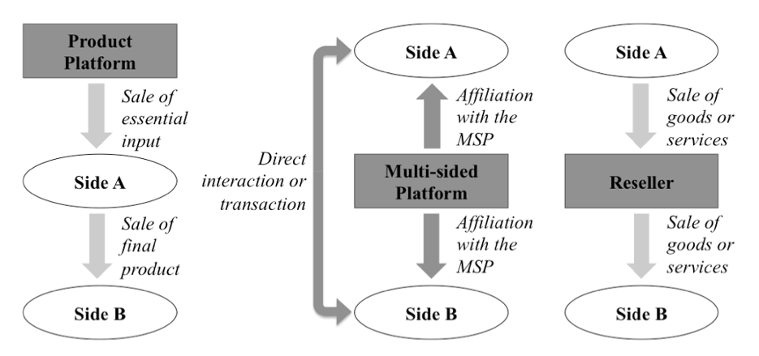
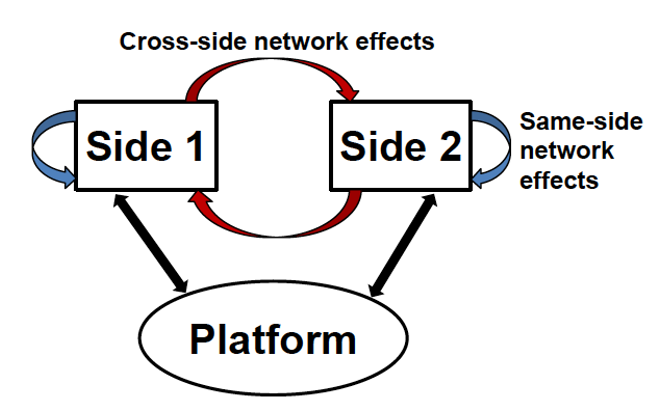
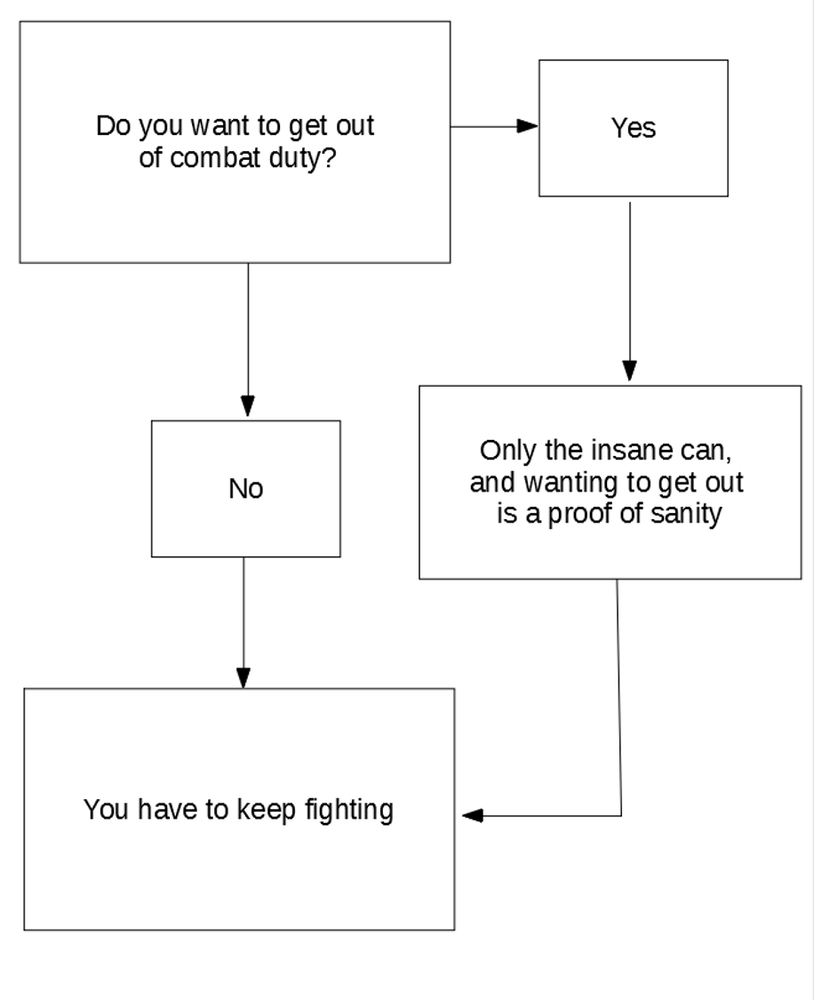

<!-- .slide: class="align-center" -->

<!-- .slide: data-state="no-toc-progress" --> <!-- don't show toc progress bar on this slide -->

# Digital Economy
<!-- .element: class="no-toc-progress" --> <!-- slide not in toc progress bar -->

## 8. Online Plattforms with Network Effects

  

[Christoph Ihl][1] | 2020-12-01 | [Kühne Logistics University][2] | Hamburg

 <!-- .element: class="logo" -->

[1]: https://www.startupengineer.io/authors/ihl/
[2]: https://www.the-klu.org

----  ----

<!-- .slide: class="align-center" -->

# Platform-Mediated Networks

----

<!-- .slide: class="align-top" -->

## Examples

#### Starting a Wine Website

    

* Idea: website that connects wine enthusiasts with wineries. 
  * wine enthusiasts can search for wineries and local wine tastings
  * wineries van keep track of which consumers are interested and contact them via targeted advertising

    

* Questions:
  * how to attract your first customers on both sides: chicken-egg problem
  * how tp make money? 
    * charging wine enthusiasts, wineries, or both
    * sign-up fee; charging a per-transaction fee; revenue from targeted advertising.

----

<!-- .slide: class="align-top" -->

## Hypothetical Example
<!-- .element: class="no-toc-progress" -->

#### RingMe Competing with Skope

    

* RingMe, largest VoIP (voice-over-IP) networks in U.S. 
* Recently, a new competitor called Skope to offer slightly better voice quality
  * gained significant traction in Asia, but unknown in Europe and the US

    

* Questions:
  * If you were running RingMe, would you make it compatible with Skope?
  * Will opening up cause users to switch or help you grow?
  * How can you best defend against inferior quality?

----

<!-- .slide: class="align-top" -->

## Example
<!-- .element: class="no-toc-progress" -->

#### Mobile Payment Technology

    

* Idea: smart phone payment technology
  * users can link their smart phones to their bank accounts, and pay at suitable payment stations. 
  * cost close to zero and hence better than Visa or American Express

    

* Questions:
  * How do you solve this chicken-egg problem? 
    * users don't install app because there are only very few stores that have payment stations
    * store owners are reluctant to buy the payment stations because nobody uses the app
  * How will you make money with your system?
    * fixed or percentage fee per transaction; app installation fee; monthly fee to retailers.

----

<!-- .slide: class="align-top" -->

## Definition

> <mark>Definition (Platform-Mediated Network)</mark>. A platform-mediated network consists of network users and a platform that mediates the interactions between those users. The platform itself consists of common components (hardware, software, and services) that all users need to be able to interact with each other, as well as a set of rules that specify how the network users are supposed to interact with each other.

----

<!-- .slide: class="align-top" -->

## Components and Rules

* __Common components__:
  * __software__: website, app
  * __hardware__: payment stations

    

* __Rules__ for access and interactions among users to balance quantity vs. quality and avoid market failure (“Market of Lemons”):
  * __standards__: ensuring technical compatibility between the components of the platform (e.g., app and game developer platforms)
  * __protocols__: specifying how information exchange happens on the platform (e.g., authentication procedures, screening questionnaires, rating systems on dating platforms to achieve social standards),
  * __policies__: specifying which actions are allowed and which are forbidden (e.g., must all interactions happen on the platform or may some happen off the platform?)
  * __contracts__: specifying the rights and responsibilities of the users, as well as providing a legal framework for the terms of exchange.

----

<!-- .slide: class="align-top" -->

## Types of Networks

#### Number of distinct user groups

 

1. __One-sided networks__: one homogeneous group of users that all perform similar functions. E.g. VoIP network.  

 

2. __Two-sided networks__: Two distinct groups of users, where members in each group perform a function that is not performed by other group. Each group forms one of the sides of the network. E.g. wine website.  

 

3. __Three-sided networks__: Three distinct groups of users, where the members in each group performs a function that is not performed by users in the other group. E.g. YouTube, connecting viewers, with content contributors as well as advertisers; Google Android (vs Apple iOS).  

 

* Maybe even more sides: 
  * e.g. LinkedIn: individuals, recruiters, advertisers, corporates, app developers

----

<!-- .slide: class="align-top" -->

## Networks vs. Plattforms

* Multisided network platforms: e.g. eBay, Airbnb, facebook, Apple‘s App Store, Sony Playstation, PayPal, trade fairs, Eventim
* Product patforms: e.g. Amazon Web Service
* Reseller Platforms: e.g. Apple iTunes

 

----  ----

<!-- .slide: class="align-center" -->

# Network Effects

----

<!-- .slide: class="align-top" -->

## Network Effects

* Demand-side economies of scale (vs. cost-side ec. of scale): users have a preference regarding the number of other users in the network.
* Cross-side vs. same-side
* Positive vs. negative
* Direct vs indirect

 

----

<!-- .slide: class="align-top" -->

## Strength of Network Effects

* Metcalfe's law: `$ O(n^2) $` ("get-big-fast") vs. diminishng returns to networks size ("S"-shaped)
* Hard to measure: market research
* Contexts in which networks are expected to be strong:

  * __Matching Network__: 
    * e.g. matching house buyers and house sellers, or a dating platform for men and women. 
    * if users on each side have highly diverse preferences, then large numbers of users on both sides is beneficial.

  * __Mobility Networks__: 
    * e.g., a credit card network; network of charging stations for electric vehicles. 
    * large number of nodes on the other side enable mobility: number of stores, distance to next station

  * __High Demand for Novelty__:
    * if users on the demand side have a persistent demand for novelty (e.g., always new movies, games, music), then a large number of supplers is beneficial.

  * __Unpredictable Interactions__: 
    * when users do not have a fixed set of interaction partners, unpredictable interactions between network users
    * e.g. VoIP network, if you don’t know yet who to call next month, then having a large user network is important

----

<!-- .slide: class="align-top" -->

## Users’ Willingness-to-Pay

* __WTP for a Wine Platform__: 
  * wine enthusiast’s WTP for access to the wine website will weakly increase with each additional winery
  * an individual winery’s WTP with each additional winery because this means increased competition

* __WTP for a Gaming Console__: 
  * Microsoft's Xbox facing two strong incumbents Playstation and Nintendo
  * game developers, however, based their WTP on __expected__ future customer numbers

* __WTP for a VoIP service__: 
  * non-monetary costs for joining a new VoIP service:
    * time required for installing the software
    * time required to become familiar with new software
    * adding friends to the contact list
    * maintaining multiple contact lists over time 
  * start-up or __switching costs__ may inhibit a new network to grow if perceived to be larger than WTP (given current vs expected network size)

----

<!-- .slide: class="align-top" -->

## Winner-Take-All Markets

Generally a very small number, and perhaps just one platform, survives if:

1. __Strong Positive Network Effects__: 
  * e.g. social networks, Facebook won over rivals Myspace and Friendster once Facebook reached a certain size

2. __High Multi-homing Costs__: 
  * costly for users to be active in multiple networks. 
  * e.g. credit cards: Visa, MasterCard and American Express.
  * new entrant: Discover Card (US) with higher limits, no annual fees, high cashback bonuses, lower retailer fee

3. __Limited Demand for Differentiated Features__: 
  * e.g. VoIP software users just want to make (video) calls, message each other, and perhaps once in a while do a group call
  * e.g. Google+ introduced new features such as Circles and Hangouts to compete with Facebook.

4. __Natural Monopoly__: 
  * platforms can be natural monopolies: average cost per user declines as the number of users grows
  * e.g. social networks: high development cost, but low (to none) marginal cost per additional user
  * e.g. wine platform where owner needs to maintain costly personal relationships with each winery

----  ----

<!-- .slide: class="align-center" -->

# Platform Mobilization Strategies

----

<!-- .slide: class="align-top" -->

## Platform Mobilization

    

* Trying to get a new network platform off the ground, i.e., growing the initial user base
  * chicken-and-egg problem
  * “Catch-22” based on a satirical novel by Joseph Heller.

    

* Strategies:
  * Providing Value to Small Numbers of Users
  * Pricing Mechanisms
  * Staging Strategies

----

<!-- .slide: class="align-top" -->

## Providing Value to Small Numbers of Users

Increase user value even when the network is still small:

1. __Create Stand-alone Value__: 
  * implementing features that make the platform useful even without other users 
  * e.g. tools for wine enthusiasts to catalog their wine collection; detailed references about different wines, or links to wine review magazines

2. __Attract Influencers and Marquee Users__: 
  * presence of particularly famous users such as marquee firms, influencers, or stars. 
  * Microsoft bought Bungie Software in 2000 to make the game Halo Xbox-exclusive

3. __Harvesting One Side of the Network__: 
  * it may be possible to “harvest” the supply side of the network from other sources
  * e.g. job website: (legally) scrape job listing of employers or other job listing websites

4. __Backwards Compatibility__: 
  * reduce users’ costs for upgrading by making  software or hardware backwards compatible so that users can still interact with users using earlier version. 
  * e.g. Microsoft: Windows 95 programs still worked under Windows XP

----

<!-- .slide: class="align-top" -->

## Pricing Mechanisms

1. __Subsidies for Early Adopters__: 
  * early dating platform subscribers may get six months for free
  * pay a game developer above market price to develop games for a new platform. 
  * VoIP accounts of early adopters could be pre-loaded with a certain number of minutes to call non-VoIP telephones

2. __Permanent Subsidies for one Side__: 
  * Rules of thumbs: 
    * subsidize the more price-sensitive side of the users, 
    * charge the side of the network that offer services or products for sale (leads to selection on quality)

3. __Pay-as-you-go Pricing__: 
  * it may be possible to “harvest” the supply side of the network from other sources
  * e.g. job website: (legally) scrape job listing of employers or other job listing websites

----

<!-- .slide: class="align-top" -->

## Staging Strategies

1. __Vendor to Platform__: 
  * hardware manufacturers (e.g., Apple or Dell) produce and sell consumer electronics such as MP3 players or laptops
  * vendor can develop into a two-sided platform by inviting additional hardware manufacturers to also advertise their products
  on the vendor’s website

2. __Merchant to Platform__: 
  * merchants such as Amazon buys, stocks and sells goods from many different vendors
  * merchants can invite vendors to directly advertise and sell products on their website, without stocking risk

3. __Expand from a Niche__: 
  * costs of serving a niche may be low of users have very specific and similar need as well as cohesive interactions
  * e.g. car rental networks start out in a big city; Facebook starting out at Harvard, then Ivy League, then all US universities, ...

----  ----

<!-- .slide: class="align-center" -->

# Platform Control and Evolution

----

<!-- .slide: class="align-top" -->

## Platform Control

* How to handle competitors?
  * “Compete” or “cooperate” 
  * Cooperating: sharing a platform with a competitor
  * E.g. battle about Compact Disk (CD) standards: 
    * Philipps and Sony ultimately formed an alliance to develop CD standards together

----

<!-- .slide: class="align-top" -->

## Platform Evolution

Responses to changing competitive landscapes, as well as customer needs:

1. __Interoperability__: 
  * open protocols to allow for compatibility with other platforms
  * depends on relative market shares
    * opening up makes sense among even rivals
    * e.g. Yahoo! and MSN linked their instant messaging services 

2. __Pricing__: 
  * “free-to-pay” transition after subsidizing is often very difficult, esp. if there are still free alternatives
  * also price shifts within a service bundle; e.g. Netflix's shift from DVD-by-mail to on-demand streaming

----

<!-- .slide: class="align-top" -->

## Platform Evolution
<!-- .element: class="no-toc-progress" -->

Responses to changing competitive landscapes, as well as customer needs:

3. __Growth beyond a certain size__: 
  * use intermediaries or affiliate with other companies in order to keep growing
  * e.g. bundle two different software products such as Java and the Ask Toolbar

4. __Maintaining trust__: 
  * e.g. in an online dating market, make users sure of their privacy 
  * e.g. Amazon not unfairly promoting its own products oder other vendors' products
  * e.g. shifts from free to price as in the case of Netflix
  * e.g. bidders on eBay need to trust that the auction rules

----  ----

<!-- .slide: class="align-center" -->

# Case Study

----

<!-- .slide: class="align-top" -->

## Keyreus
<!-- .element: class="no-toc-progress" -->

__Questions__:
  * What are the value propositions to members and partners?
  * Why are user numbers so low and why is there almost no activity on the platform?
  * Are there inherent problems with the Keyreus concept that hinder its success?
  * Can some of the problems be alleviate or solved by changing the platform’s design and/or the pricing mechanism?
  * What are suitable mobilization strategies to increase user numbers?

----  ----

<!-- .slide: class="align-center" -->

# Exercise
<!-- .element: class="no-toc-progress" -->

----

<!-- .slide: class="align-top" -->

## OP-E1: MoviePass Case
<!-- .element: class="no-toc-progress" -->

* Questions:
  * What is the value proposition for cinemas and movie goers? Argue also based on the underlying network effects.
  * What are MoviePass' revenue models with respect to cinemas and movie goers?
  * Are movie goers subsidized? Calculate the average gross margin per user (AGMPU)!
  * What are the critical assumptions you would want to test in this business model? How?
  * What are possible (alternative) approaches to platform mobilization and evolution?

----  ----

<!-- .slide: class="align-center" -->

<!-- .slide: data-state="no-toc-progress" --> <!-- don't show toc progress bar on this slide -->

# *Thank You for Your attention!*
<!-- .element: class="no-toc-progress" -->

## *Let's keep in touch!*

  <ul class=network-icon aria-hidden=true>
    <li>
         <a href=https://www.startupengineer.io/authors/ihl/>
              <i class="fas fa-home big-icon" class="accent">: https://www.startupengineer.io/authors/ihl</i>
         </a>
    </li>
    <li>
         <a href=mailto:christoph.ihl@tuhh.de>
              <i class="fas fa-envelope big-icon" class="accent">: christoph.ihl@tuhh.de</i>
         </a>
    </li>
    <li>
        <a href=https://twitter.com/Ihluminate target=_blank rel=noopener>
              <i class="fab fa-twitter big-icon"class="accent">: @IHLuminate</i>
        </a>
    </li>
    <li>
        <a href=https://www.linkedin.com/in/christoph-ihl/ target=_blank rel=noopener>
              <i class="fab fa-linkedin big-icon" class="accent">: https://www.linkedin.com/in/christoph-ihl</i>
        </a>
    </li>
  </ul>

 <!-- .element: class="logo" -->

