<!-- .slide: class="align-center" -->

<!-- .slide: data-state="no-toc-progress" --> <!-- don't show toc progress bar on this slide -->

# Digital Economy
<!-- .element: class="no-toc-progress" --> <!-- slide not in toc progress bar -->

## 10. Crowdsourcing

  

[Christoph Ihl][1] | 2020-12-10 | [Kühne Logistics University][2] | Hamburg

 <!-- .element: class="logo" -->

[1]: https://www.startupengineer.io/authors/ihl/
[2]: https://www.the-klu.org

----  ----

<!-- .slide: class="align-center" -->

# Overview and Examples

----

<!-- .slide: class="align-top" -->

## Why?
<!-- .element: class="no-toc-progress" -->

* Computers better than humans at many tasks
	* mathematical operations
	* sort and filter large amounts of strcutured data

* Limits when it comes to tasks that involve perception, intuition, creativity; e.g.
	* finding objects in an image
	* determining the mood of music
	* understanding and answering questions
	* summarizing knowledge

* Social and human computation systems bring together these strenghths
	* task design
	* incentives
	* quality control

----

<!-- .slide: class="align-top" -->

## Q&A Websites: Stackoverflow

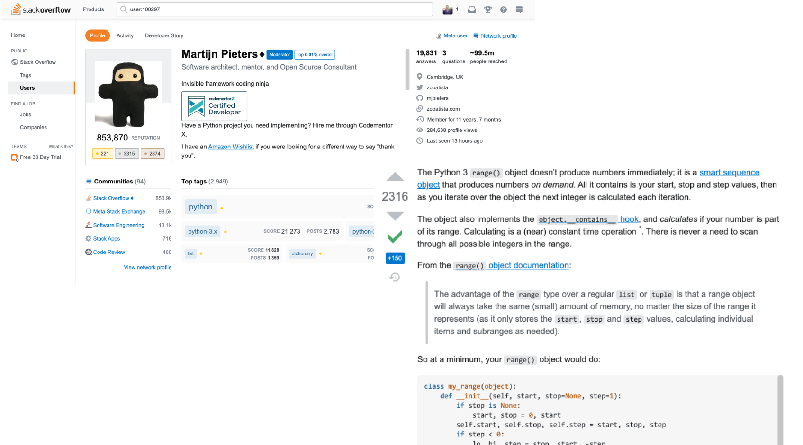

----

<!-- .slide: class="align-top" -->

## Image Labeling: ESP Game

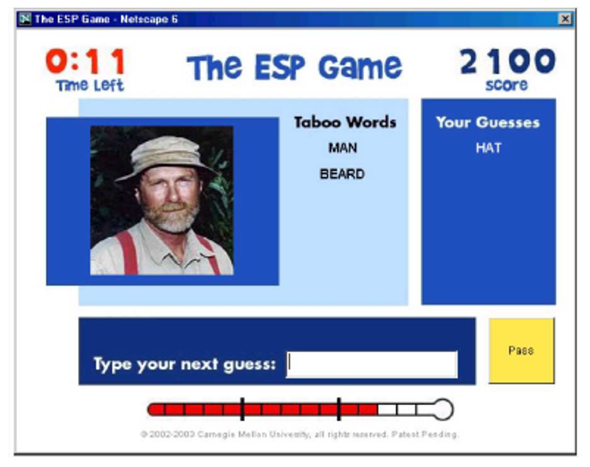

----

<!-- .slide: class="align-top" -->

## Digitize Books: reCAPTCHA

#### Completely Automated Public Turing Test to Tell Computers and Humans Apart

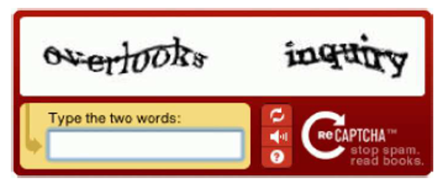

----

<!-- .slide: class="align-top" -->

## Real-time Answers to Visual Questions: VizWiz
<!-- .element: class="no-toc-progress" -->

#### Paid Crowdsourcing via Mechanical Turk

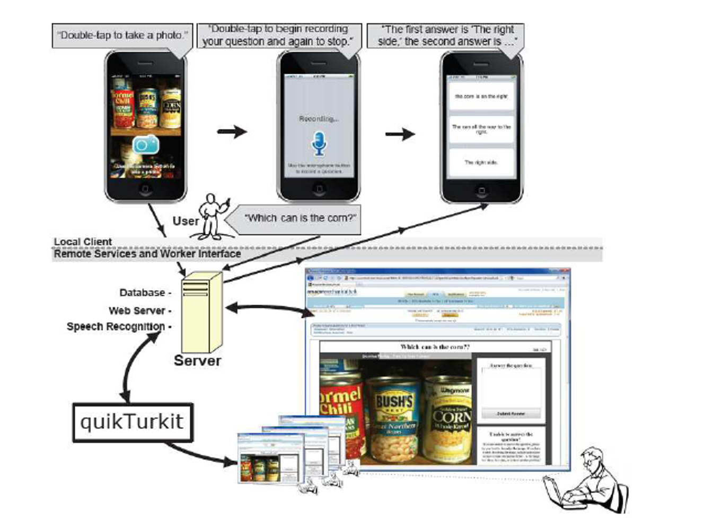

----

<!-- .slide: class="align-top" -->

## Online Encyclopedia: Wikipedia

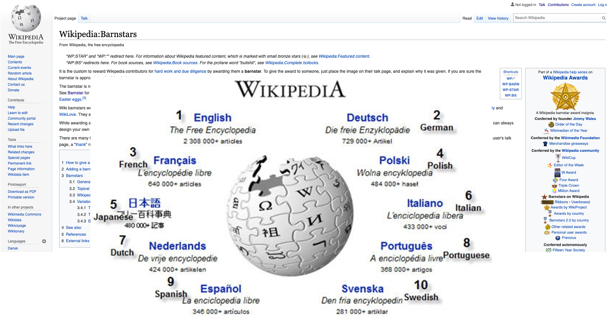

----

<!-- .slide: class="align-top" -->

## Terminology and Taxonomy

* <mark>Crowdsourcing</mark>: recruiting workers from a large, undefined group of people through open call to partcipate in following systems

   

* <mark>Social Computing</mark>: e.g. Stackoverflow
	* value creation through social interactions among many users
	* online platforms that make use of the wisdom of the crowds and/ or enable user-generated content
	* voting systems, reputation systems, recommender systems, prediction markets)

   
 

* <mark>Human Computation</mark>: e.g. reCAPTCHA
	* humans are used as building block to solve a computational problem
	* individual tasks are typically small, but situated within the context of a larger computational system
	* human computation algorithm coordinates order of tasks and has control over work flow. 

   
 

* <mark>Peer Production</mark>: e.g. Wikipedia, Linux
	* decentralized collaborations among multiple people that result in successful large-scale projects
	* without the use of monetary incentives or managerial hierarchies to organize the group of contributors

----  ----

<!-- .slide: class="align-center" -->

# Incentives & Task Design

----

<!-- .slide: class="align-top" -->

## Public Goods Game

> <mark> Definition (Public Goods Game)</mark>

> * The game has N players.
> * Each player i has an endowment of money `$ e_i $`.
> * All players must simultaneously choose their contribution `$ g_i $` to the public good, with `$ g_i \in [0, e_i]$`; the players keep the remainder, i.e., `$ e_i - g_i $`.
> * The value of the public good is `$ G = m \cdot \sum_{i} g_i $`, with `$ m > 0 $`; all players get access to it.
> * Thus, the payoff for each player is: `$ \pi_i = e_i - g_i + m \cdot \sum_{i} g_i $`

   
 

* m is called the marginal per capital return (MPCR): how much value an individual contribution creates for society
* if 1/N < m < 1, then public goods game: player gets back marginally less than he invested; free rinding is NE
* Example: game with N = 4 players, each endowed with $100 and m = 0.5
	* if `$ g_i = 0 $` for all players, then `$ \pi_i = \$100 $`
	* if `$ g_i = \$100 $` for all players, then `$ \pi_i = 100 − 100 + 0.5 · 400 = 200 $`
	* If only the fourth player contributes nothing, then `$ \pi_4 = 100 − 0 + 0.5 · 300 = 250 $`

----

<!-- .slide: class="align-top" -->

## Types of Rewards

 

1. <mark>Monetary rewards</mark> are experienced by a user when he receives actual money in return
for exerting effort (e.g., by a worker who receives a payment on MTurk; open source Linux coders who receive future employment contracts).

* __Pro__: easy to implment and scale
* __Con__: crowding out intrinsic motivation and quality, cheating

   
 

2. <mark>Intrinsic (hedonic) rewards</mark> describe the intrinsic joy a user experiences from taking
an action (e.g., from editing an article on Wikipedia which the user is passionate about).

* __Pro__: no cost, effective if task can be gamified, meaningful, purposeful
* __Con__: limited applicability, less scalable and quality

   
 

3. <mark>Social-psychological rewards</mark> are experienced by a user as a result of interactions with
the rest of society (e.g., when a user on Stack Overflow is ranked high on its leaderboard).

* __Pro__: no cost, effective if task can be gamified, meaningful, purposeful and contributions visible
* __Con__: limited applicability, less scalable and quality (but better compared to intrinsic rewards)

----

<!-- .slide: class="align-top" -->

## Organization via Task Design

* __division of labor__
	* <mark>task division:</mark>  mapping goals of an organization into tasks and sub-tasks
	* <mark>task allocation:</mark>  mapping tasks obtained through task division to individual agents and groups of agents
* __integration of effort__
	* <mark>motivational/ incentive problem:</mark>  
		* whether the task will be done, who will do the task, how well it will be done
		* tradional: employment contracts, work contracts, market prices
	* <mark>coordination problem:</mark> 
		* formalized delegation, monitoring and reporting structures
		* tradional: hierarchical structure with managers delegating to workers

----

<!-- .slide: class="align-top" -->

## Crowdsourcing via Task Design

* Hierarchical structure not present in crowdsourcing
* Three design criteria:
	* <mark>High Modularity:</mark> 
		* overall task should be divisible into subtasks that are independent from each other
		* thousands of users, possibly with varying capabilities and interests, can do many tasks in parallel
	* <mark>Low Granularity:</mark> 
		* subtasks should be fine-grained sp that little incentive is needed
		* heterogeneity of subtasks allow better fit with individual users' interests and capabilities
	* <mark>Low-cost Integration:</mark> 
		* low-cost quality assurance: e.g., review process, filtering process, sufficient redundancy
		* low-cost integration process, for combining subtasks into final product 
* conflicting goals! Uploading images on Instragram vs. reconciling conflict pver an Wikipedia article

----

<!-- .slide: class="align-top" -->

## Advantages of Non-Hierarchical Systems

* <mark>Information gains:</mark>:
	* task assignment based on self-selection
		* users know best their fit of motvations and skills with the task
		* managers cannot know all that private information about motvations and skills

* <mark>Allocation gains:</mark>  
	* due to information gains a __larger, more diverse pool of people__ with diverse resources and skills can be handled 
	* by selecting from a larger pool of users, better matches between user skills and subtasks can be realized

----  ----

<!-- .slide: class="align-center" -->

# Human Computation Systems

----

<!-- .slide: class="align-top" -->

## Human Computation Algorithms

* 5 properties of an algorithm:
	* Input: e.g. images
	* Output_ e.g. labels of images
	* Finiteness: output reached after finite iterations (e.g. may not be true fro Wikipedia articles)
	* Effectiveness: each operation is small enough to be completed within time
	* Definiteness: precisely defined algorithm leads to same output each time
* last three properties can only be achieved to a certai degree with humans involved

----

<!-- .slide: class="align-top" -->

## Control Structures

* Sequence (or Iteration): order in which operations are executed
* Selection (or Choice): operation to be executed if conditions (if-then-else) satisfied
* Repetition (or Looping): operation to be executed repeatedly until termination condition met
* Parallel: set of operations that shall be executed simultaneously

----

<!-- .slide: class="align-top" -->

## Problem Decomposition, Correctness, and Effciency

* Instead of rigid control structure, let users decompose the task and choose which operation to perform next
	* harder to guarantee finiteness, effectiveness and definiteness, but also upside potential
* Correctness: 
	* does the algorithm lead to a correct solution in a finite number of steps?
	* only absolute guarantees, but probabilities
* Efficiency: 
	* How many resources does the algorithm require to produce an output, relative to the input size?
	* e.g., time to completion, number of queries sent, or money paid.

----

<!-- .slide: class="align-top" -->

## Reasons for Noisy Data

* Lack of expertise
* Suboptimal physical/psychological condition: e.g. tired
* No incentives for high quality work
* Malicious workers
* Individual differences in perception/interpretation

----

<!-- .slide: class="align-top" -->

## Quality Control and Output Aggregation

* __Voting-Based Quality Control__
	* __Simple Majority Voting__
	* __Model-based Voting:__
		* learn abilities of workers and weigh accordingly
		* Ballot Model: probability of correct answer based on worker ability and task difficulty
* __Intelligent Game Design__
	*	__Output agreement:__ 
		* e.g. ESP game to label images
	*	__Input agreement:__ 
		* output agremment difficult for music tagging
		* given tags of others, decide whether song is the same
	* __Problem inversion__

----

<!-- .slide: class="align-top" -->

## Input agreement and Problem inversion
<!-- .element: class="no-toc-progress" -->

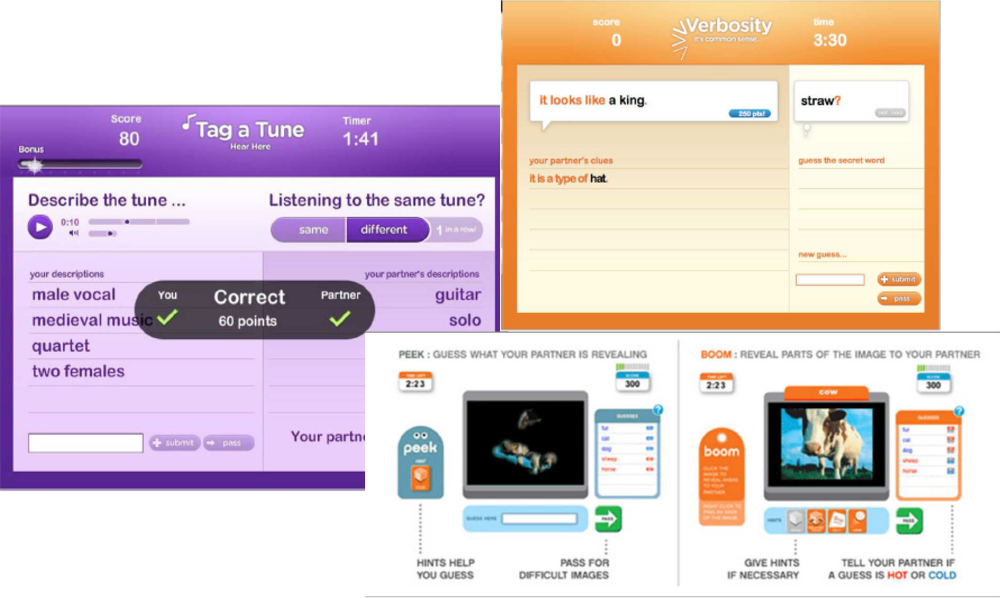

----  ----

<!-- .slide: class="align-center" -->

# Social Computing System: Badge Design

----

<!-- .slide: class="align-top" -->

## Functions & Machanisms of Badges

 

1. <mark>Goal Setting:</mark> sets a goal for the users to motivate them to complete those tasks (faster).
2. <mark>Instruction:</mark> overview of the most common/desired actions in the system.
3. <mark>Reputation:</mark> device to signal a user’s reputation, experience, or credibility.
4. <mark>Status/Affirmation:</mark> status symbols, signaling to other users that they have achieved significant success.
5. <mark>Group Identification:</mark> Users with same badge share experiences and a sense of group identity.

   

1. <mark>Relative Standards Mechanism:</mark> badges are awarded to top contributors among all users. Induces competition.
2. <mark>Absolute Standards Mechanism:</mark> badges are awarded to users for meeting some absolute level of contribution/effort.

----

<!-- .slide: class="align-top" -->

## Formal Model of Badge Design

* recursive definition of the user’s utility of choosing probablity distribution of actions given current state
	* `$ a $` = current state, i.e. vector of counts of how many times action i out of n was taken in the past
		* e.g. actions on Stackoverflow: post a question, answer a question, vote a question, vote an answer
		* `$ a + e_i $` = new action vector after taking action i
	* `$ x_a $` = probablity of taking actions i given state a
		* `$ x^{i}_a $` = probablity distribution of actions to do next given state a
	* `$ I_b(a) $` = beeing assigned badge b at current state a
		* `$ v_b $` = value from badge b
	* `$ \delta $` = discount factor of future utility; or probability of staying on site
	* `$ c(x_a , p ) $` = cost to user of deviating from an ideal action distribution of actions when no badges are available

  

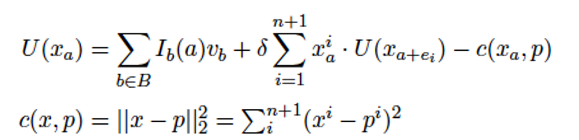

----

<!-- .slide: class="align-top" -->

## Formal Model of Badge Design
<!-- .element: class="no-toc-progress" -->

* Model simulation and empirical observations on Stackoverflow

  

----

<!-- .slide: class="align-top" -->

## Formal Model of Badge Design
<!-- .element: class="no-toc-progress" -->

* Threshold badge: optimal badge boundary?
	* too low: incentive washes out early
	* too high: incentive effect never kicks in
* Maximize yield: total fraction of the targeted action over a user’s lifetime
	* Compare to intrinsic yield given `$ \delta = 0.99 $`: `$  \sum_{t=0}^{\infty} 0.99^t \cdot 0.05 = 5 $`

  

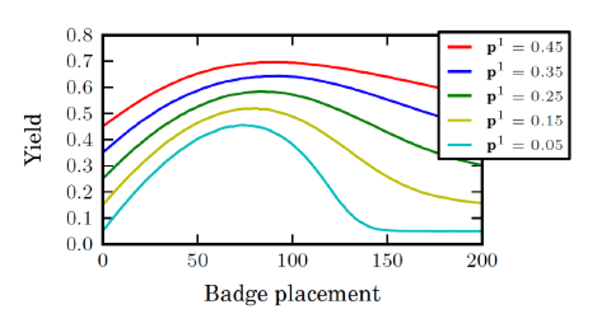

----  ----

<!-- .slide: class="align-center" -->

# Wisdom of the Crowd

----

<!-- .slide: class="align-top" -->

## Traditional Information Elicitation

* Opinion Poll
	* Sampling
	* No incentive to be truthful
	* Equally weighted information
	* Hard to be real time
* Ask Experts
	* Identfying experts is hard
	* Incentives
	* Combining opinions can be difficult

----

<!-- .slide: class="align-top" -->

## Prediction Markets

* A market designed for information aggregation and prediction
* Trade contracts (or security), with payoff associated with an observed outcome in future
	* Monetary incentives 
	* Monetary-weighted information
	* Real-time
	* Self-organizing

----

<!-- .slide: class="align-top" -->

## Verification

* __Information elicitation with verification, e.g:__
	* Will it start raining before noon in the middle of town?
	* Will a new restaurant open before Christmas? 
	* Will the global average temperature next year be the warmest on record?
	* What will Ford F-150 sales be next week?
	* Will Facebook’s Libra currency launch in 2020?
	* Which party will win the next U.S. presidential election?
	* What will the inflation rate be in the Eurozone three years from now?
	* When will the first academic staff move into a new engineering building?
* __Asking for information that is not easily verifiable, and perhaps even subjective. e.g.:__
	* Whether a restaurant is good for groups
	* Whether a plumber did a good job, 
	* Whether a movie was funny

----

<!-- .slide: class="align-top" -->

## Example
<!-- .element: class="no-toc-progress" -->

* contract that pays amount $10 if global temperature in 2011 is the warmest on record, and $0 otherwise.
* continuous double auction (CDA):
	* anyone can post offer to buy (a bid) or  offer to sell (an ask) providing a quantity and price
	* trades whenever an offer to sell is below highest bid or an offer to buy above lowest ask

  

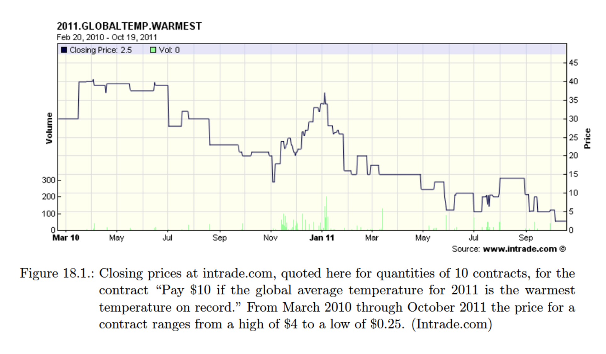

----

<!-- .slide: class="align-top" -->

## Types of Contracts

* Binary (e.g. "Biden" or “Trump”).
	* winner-take all contract ($10 if Biden)
* Multi-valued (e.g. "Biden" or "Trump" or "Independent")
	* multiple binary contracts
	* $10 if Biden, $10 if Trump, $10 if Independent.
* Continuous (e.g. popular vote share)
	* index contract (pay $1 for each percentage point)

----

<!-- .slide: class="align-top" -->

## Types pf Prediction Markets

* __Real-money prediction markets__:
	* Iowa Electronic Markets (IEM) for science questions
	* PredictIt for elections
	* regulated similar to commodity future markets and gambling
	* Intrade.com shut down (followed by Augur.net: decentralized prediction market based on Ethereum blockchain?)
* __Play-money prediction markets__:
	* Hollywood Stock Exchange (HSX)
	* Foresight Exchange: various applications
	* CrowdMed market: help with the diagnosis of difficult medical conditions
	* fun, altruism, status (leaderboards, private leagues)
* __Private prediction markets, including corporate markets__:
	* forecast sales, product quality ratings, drug success etc.
	* Intel, Ford, Google, Microsoft, Eli Lilly
	* service providers: e.g. Consensus Point, CultivateLabs, Hypermind, 
	* fun, status, prizes

----

<!-- .slide: class="align-top" -->

## Accuracy of Prediction Markets

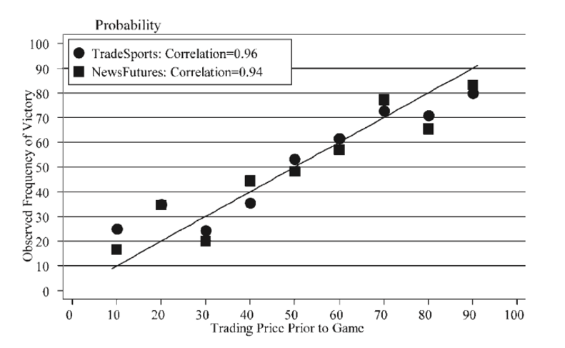

----

<!-- .slide: class="align-top" -->

## Accuracy of Prediction Markets
<!-- .element: class="no-toc-progress" -->

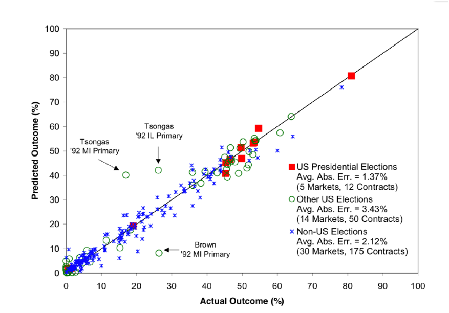

----

<!-- .slide: class="align-top" -->

## Accuracy of Prediction Markets
<!-- .element: class="no-toc-progress" -->

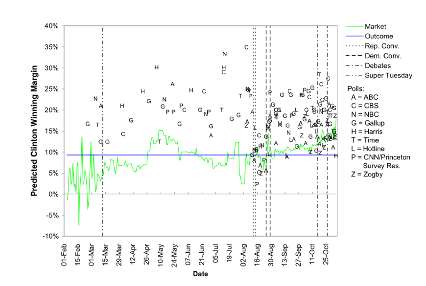

----

<!-- .slide: class="align-top" -->

## Accuracy of Prediction Markets
<!-- .element: class="no-toc-progress" -->

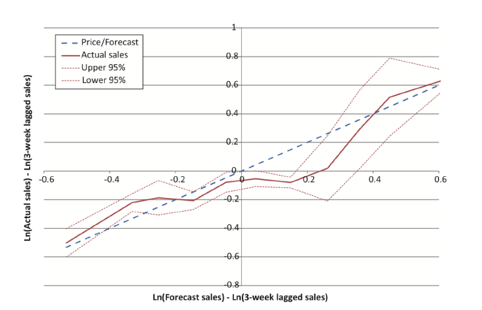

----

<!-- .slide: class="align-top" -->

## Market Designs

* Call Markets
	* ??

* Continuous Double Auction (CDA)
	* Hollywood Stock exchange
	* Hypermind
	* Iowa Electronic Markets (IEM)
	* PredictIt

* Automated Market Maker (LMSR)
	* CultivateLabs
	* ConsensusPoint
	* CrowdMed

----

<!-- .slide: class="align-top" -->

## Call Markets

* bids and asks cleared in batches with same clearing price chosen at a given moment to maximize number of trades
* maximizes liquidity, but slower to aggregate new information in real time

 

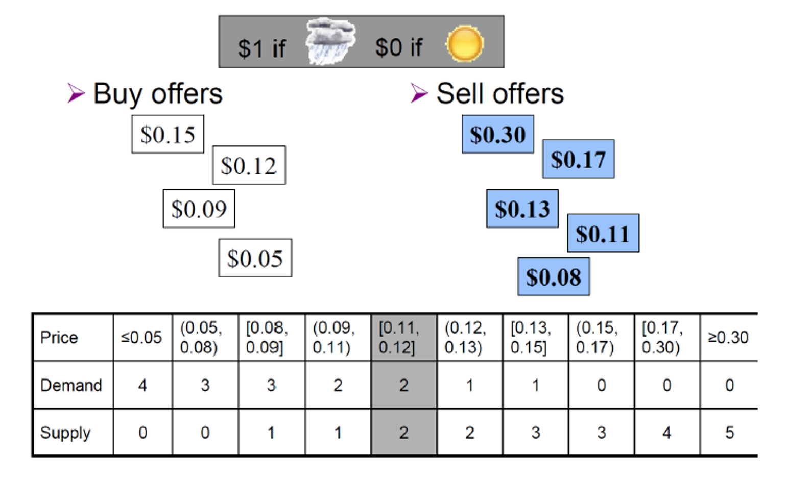

----

<!-- .slide: class="align-top" -->

## Continuous Double Auction

* used in stock markets as well
* example order book:
	* Buyer Bids: 33, 32, 30,…
	* Seller Asks: 36, 38, 40,…
	* new bid arrives at 35: added to order book
	* new bid arrives at 38, trades with ask for 36 (and bid and ask removed)
* trade at price of first order in the book

----

<!-- .slide: class="align-top" -->

## Continuous Double Auction
<!-- .element: class="no-toc-progress" -->

* Example: Intrade.com
	* bid-ask spread = $0.30
* Price-time prioritization:
	* asks with lower price are preferred
	* bids with higher price are preferred
	* earlier-time priority in the case of ties for both bids and asks
* Partial matching:
	* bid at $0.57 for 35 shares would match with first two asks
		* at $0.50 for 10; at $0.55 for 20; leaving bid at $0.57 for 5 on the order book

 

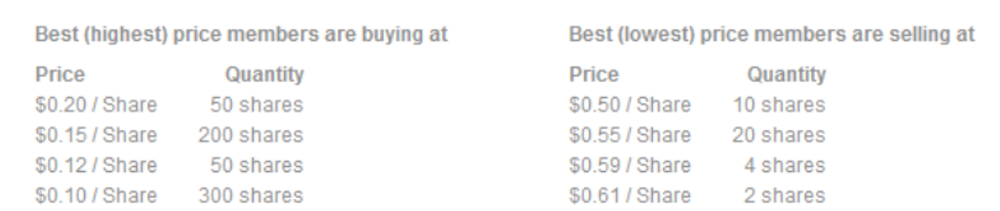

----

<!-- .slide: class="align-top" -->

## Continuous Double Auction
<!-- .element: class="no-toc-progress" -->

* Example: Intrade.com
* Short-selling:
	* seller thinks price is currently too high 
	* seller borrows some contracts she does not have, with a commitment to eventually buy them

 

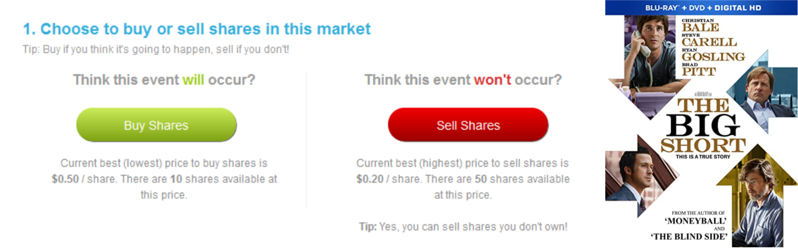

----

<!-- .slide: class="align-top" -->

## Continuous Double Auction
<!-- .element: class="no-toc-progress" -->

* Short-selling example

 

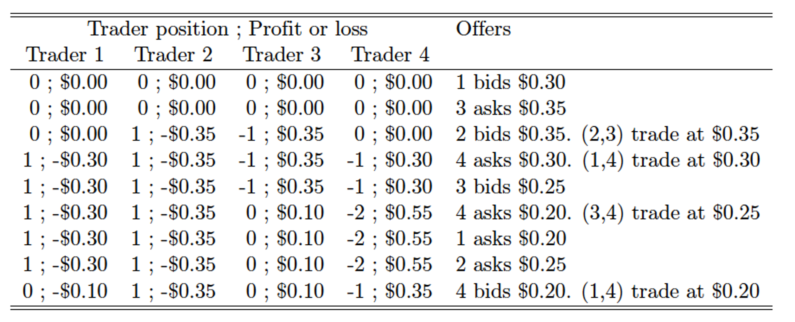

----

<!-- .slide: class="align-top" -->

## Continuous Double Auction
<!-- .element: class="no-toc-progress" -->

* can suffer from low market liquidity
* signs of market liquidity
	* small bid-ask spread
	* prices do not vary (much) for different quantities

 

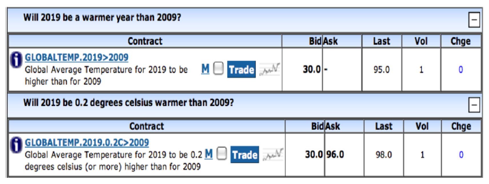

----

<!-- .slide: class="align-top" -->

## Automated Market Maker

* Goal: improve liquidity, and thus information aggregation
* Assumption: 
	* contract for each possible outcome
	* automated Market maker can quote a price to buy or sell any quantity
* Example:
	* first contract "2021" that pays $1 when (temp 2021 > temp 2009)
	* second contract "2009" that pays $1 when (temp 2021 < temp 2009)
	* AMM always willing to sell and buy any (fractional) number of units of a contract
	* AMM can quote the payment required to “buy 9.7 units on the 2021 contract,” or the negative payment required to “sell 4.2 units on the 2009 contract.”

----

<!-- .slide: class="align-top" -->

## Automated Market Maker
<!-- .element: class="no-toc-progress" -->

* m outcomes to predict
* Current market state x:
	* vector of positive quantities sold of each contract
	* initial state (0 , ... , 0)
	* `$ x_k $`: quantitiy sold of contract k in current state, with `$ k = 0,1,..., m-1 $` 
* `$ Q_k $`: quantitity of contract k bought (positive) or sold (negative) in next trade
* Cost-function-based market maker defines the payment made for bext trade `$ Q_k $` in market state x:

 

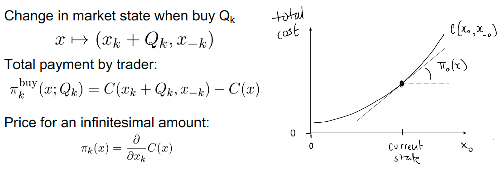

----

<!-- .slide: class="align-top" -->

## Automated Market Maker
<!-- .element: class="no-toc-progress" -->

* Example:
	* first contract "2021" that pays $1 when (temp 2021 > temp 2009)
	* second contract "2009" that pays $1 when (temp 2021 < temp 2009)
		* Buy 10 "2021": Trader pays C(10,0) – C(0,0)
		* Buy 5 "2009": Trader pays C(10,5) – C(10,0)
		* Sell 2 "2021": Trader pays C(8,5) – C(10,5) (-> negative!)
		* Buy 3 "2021": Trader pays C(11,5) – C(8,5).
* Total payment to AMM: `$ C(x) - C(0, ... , 0) = C(11,5) – C(0,0) $`
* Loss to AMM: `$ max(x_j) - C(x) - C(0, ... , 0) $`

----

<!-- .slide: class="align-top" -->

## LMSR Market Maker

* __Logarithmic market scoring rule__ market maker
	* widely used in practive
	* makes use of a specific cost function with nice properties

 

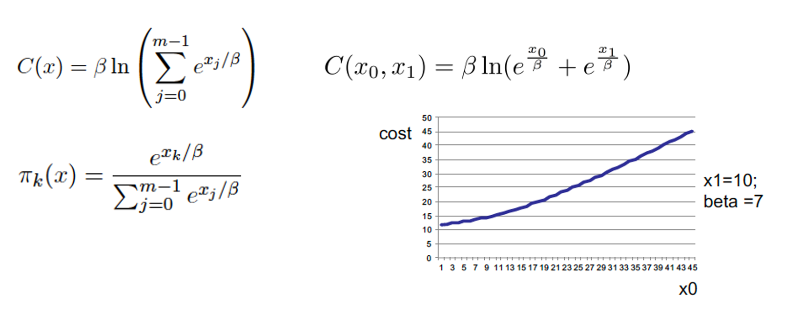

----

<!-- .slide: class="align-top" -->

## Desirable Properties

LMSR Market Maker has desirable properties:
* No round-trip arbitrage
* Prices strictly positive, sum to one
* Responsiveness (if buy then price increases, if sell then price decreases)
* Liquidity (trade any quantity, don’t move price very much).
* Myopic incentives (e.g., buy until buy price equal belief)
* Bounded loss to the market-maker

----  ----

<!-- .slide: class="align-center" -->

# Exercises
<!-- .element: class="no-toc-progress" -->

----

<!-- .slide: class="align-top" -->

## CS-E1: CDA and Call markets
<!-- .element: class="no-toc-progress" -->

* Consider a prediction market where contracts can be bought and sold that will pay out $1 if Hamburg Alster will be frozen in Winter 20/21. 
* Bids and asks are placed in the market in the following sequence (B = buy, A = ask):

  

| B1 | A2 | A3 | B4 | A5 | B6 | B7 | B8 | A9 | A10 | A11| 
|--|--|--|--|--|--|--|--|--|--|--|
| 0.1 | 0.8 | 0.65 | 0.7 | 0.25 | 0.3 | 0.75 | 0.5 | 0.6 | 0.45 | 0.4 | 

* What trades take place in a CDA, with the market clearing based on price-time prioritization and trades priced at the price of the earlier of two matched orders?
* What trades take place in a call market that waits for all offers before clearing the market (assume that trades take place at a mid-point price)?
* Describe two qualitative differences between the outcomes in the two designs.

----

<!-- .slide: class="align-top" -->

## CS-E2: LMSR automated market maker
<!-- .element: class="no-toc-progress" -->

* Three agents take turns trading with the LMSR automated market maker, with `$ \beta = 1 $` so that the cost function in market state `$ x = (x_0, x_1) $` is  
`$ C(x_0, x_1) = ln(e^{x_0} + e^{x_1}) $`,  
where contract 0 pays $1 when Hamburg Alster freezes and contract 1 pays $1 when Hamburg Alster does not freeze in Winter 20/21. Suppose the market starts at market state `$ (x_0, x_1) = (0, 0) $`.

* (a) Describe how the agents trade, assuming that agent 1, 2, 3 make their trades in that order, and that each agent buys until the price is such that this is no longer profitable.
* (b) Compute the profit to agent 1 in the event that Hamburg Alster does not freeze, considering both the payment made to the market maker and payments received (if any) when the outcome is realized.
* (c) Compute the total payments received by the market maker in the event that Hamburg Alster freezes (consider payments made in settling contracts as well as payments received in selling contracts).
* (d) Compare the results of part (c) with those in part (b). What do you notice? Suggest a simple explanation for why the LMSR has a bounded loss, even if it was to sell an unbounded quantity of contract 0, and even in the event that the record is broken and contract 0 pays out.

----  ----

<!-- .slide: class="align-center" -->

<!-- .slide: data-state="no-toc-progress" --> <!-- don't show toc progress bar on this slide -->

# *Thank You for Your attention!*
<!-- .element: class="no-toc-progress" -->

## *Let's keep in touch!*

  <ul class=network-icon aria-hidden=true>
    <li>
         <a href=https://www.startupengineer.io/authors/ihl/>
              <i class="fas fa-home big-icon" class="accent">: https://www.startupengineer.io/authors/ihl</i>
         </a>
    </li>
    <li>
         <a href=mailto:christoph.ihl@tuhh.de>
              <i class="fas fa-envelope big-icon" class="accent">: christoph.ihl@tuhh.de</i>
         </a>
    </li>
    <li>
        <a href=https://twitter.com/Ihluminate target=_blank rel=noopener>
              <i class="fab fa-twitter big-icon"class="accent">: @IHLuminate</i>
        </a>
    </li>
    <li>
        <a href=https://www.linkedin.com/in/christoph-ihl/ target=_blank rel=noopener>
              <i class="fab fa-linkedin big-icon" class="accent">: https://www.linkedin.com/in/christoph-ihl</i>
        </a>
    </li>
  </ul>

 <!-- .element: class="logo" -->

