<!-- .slide: class="align-center" -->

<!-- .slide: data-state="no-toc-progress" --> <!-- don't show toc progress bar on this slide -->

# Digital Economy
<!-- .element: class="no-toc-progress" --> <!-- slide not in toc progress bar -->

## 3. Peer-to-Peer File Sharing

  

[Christoph Ihl][1] | 2020-11-11 | [Kühne Logistics University][2] | Hamburg

 <!-- .element: class="logo" -->

[1]: https://www.startupengineer.io/authors/ihl/
[2]: https://www.the-klu.org

----  ----

<!-- .slide: class="align-center" -->

# GT: Recap and Problems

----

<!-- .slide: class="align-top" -->

## GT Recap

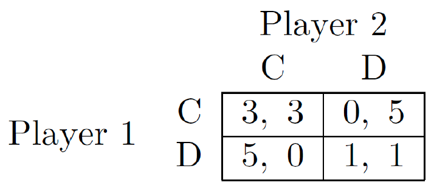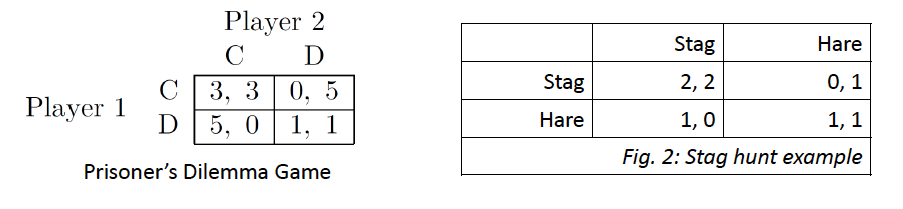
 

1.  Players
2.  Actions
3.  Payoffs/Values/Utilities
4.  Pareto optimality
5.  Dominant strategy Equilibrium (DSE)
6.  Nash Equilibrium
  * Pure Strategy Nash Equilibrium (PSNE)
  * Mixed Strategy Nash Equilibrium (MSNE)

----

<!-- .slide: class="align-top" -->

## Some Problems with Game Theory?

Note:
- Real life is very complex ... dynamic games
- Actors (in real life) may not be rational
- We have to model many aspects of the “game”
- Many real life situations are not “simultaneous move games”
- Social preferences, other regarding preferences  extension is possible
- Utilities are not clearly defined
- Interpersonal differences regarding how much utility people have for certain outcomes
- a mixed strategy seems very artificial
- punishment happens often in real life (repeated games)
- information asymmetry amongst players
- variance and randomness in human behavior

----

<!-- .slide: class="align-top" -->

## Rationality Assumption
#### Individual Rationality as a Useful Approximation

 

>"… it does not seem helpful just to say that all models are wrong. The very word model implies simplification and idealization. The idea that complex physical, biological or sociological systems can be exactly described by a few formulae is patently absurd. The construction of idealized representations that capture important stable aspects of such systems is, however, a vital part of general scientific analysis …" (David Cox)

----

<!-- .slide: class="align-top" -->

#### Individual Rationality as a Useful Approximation
<!-- .element: class="no-toc-progress" -->

* Rational models as useful approximations (Alvin Roth)
  * At some level of detail => “All models are wrong, but some are useful” (George Box)
  * But they serve as good approximations for human behavior => good predictions

* Different models:
  * Risk neutral; expected utility maximizing; almost rational; psychological; neuro biological

* The potential for non-rational models in economics (importance of the “non-rational” actions?)
  * Extensions to utility function
  * Adaptation, learning
  * Complexity vs. prediction accuracy?

----

<!-- .slide: class="align-top" -->

## Hyper-Rationality
<!-- .element: class="no-toc-progress" -->

 

Hal Varian (1995, Economics Professor and Google’s Chief Economist):

  

>"… hyper-rationality may actually be [an] appropriate model for software agents …The whole framework of game theory and mechanism design may well find its most exciting and practical application with computerized agents rather than human agents"

----  ----

<!-- .slide: class="align-center" -->

# GT: Excercises

----

<!-- .slide: class="align-top" -->

## E1: Simultaneous-Move Games

<mark>Exercise:</mark>  
Two prisoners who committed a crime are each interrogated in separate rooms. If they cooperate and tell a common story they can not be fully believe, but at least none will get accused of the entire crime, so they each get 4 years. If one of them defects, then he/she can go home and the other one will get 10 years for committing the crime alone. If both defect, then they get accused and they get a sentence of 8 years each.

  

<mark>Questions:</mark>  
a)  Write this game formally, as a simultaneous move game. Find its normal form representation.  
b)  Find the Nash equilibria and Pareto optima for this game.  
c)  Draw the best response graph.  

----

<!-- .slide: class="align-top" -->

## E2: Mixed Nash Equilibria

<mark>Exercise:</mark>  
Alice and Bob would like to spend time together. If they both go to a football match, then Bob gets a utility of 3 while Alice gets utility of 1. If they both go to the opera, then Alice gets a utility of 3, while Bob gets only 1. If Bob goes to the match while Alice goes to the opera, both get a utility of 1. Vice versa, both get 0. Assume that they need to act simultaneously.

  

<mark>Questions:</mark>  
a)  Write this game formally, as a simultaneous move game. Find its normal form representation.  
b)  Find the Nash equilibria and Pareto optima for this game.  
c)  Draw the best response graph.  

----

<!-- .slide: class="align-top" -->

## E3: Games with Multiple Actions

<mark>Exercise:</mark>  

  

<mark>Questions:</mark>  
a)  Write this game formally, as a simultaneous move game. Find its normal form representation.  
b)  Show that it is a zero-sum game.   
c)  Find the Nash equilibria for this game.  

----

<!-- .slide: class="align-top" -->

## E4: Repeated (Prisoners' Dilemma) Games

<mark>Exercise:</mark>  
Play the prisoners’ dilemma game multiple times. Assume that the players discount their payoff (or utility) from future rounds by `$ \delta^n $`; where `$ \delta $` can be interpreted has probability of stopping the game because of impatience, or the lower value that players assign to payoffs obtainable further in the future; and `$ n $` is the number of rounds played in the future.

  

<mark>Questions:</mark>  
a)  If the game is repeated `$ m $` finite times, show that *Grim Trigger* strategy is not an NE for any `$ \delta $`.  

(The Grim Trigger strategy implies that players cooperate until the other player defects for the first time. Then the player defects in all following rounds.)<!-- .element: class="small" -->

b)  Prove that it is an NE for some `$ \delta $` in the infinitely repeated game. For which δ?  
c)  Is the *Tit-for-Tat* strategy a NE in the finite and infinite case?  

(The Tit-for-Tat strategy implies that players always play what the other one has played in the previous round.)<!-- .element: class="small" -->

----  ----

<!-- .slide: class="align-center" -->

# Peer-to-Peer File Sharing

----

<!-- .slide: class="align-top" -->

## What is P2P File Sharing?
#### Client Server Architecture

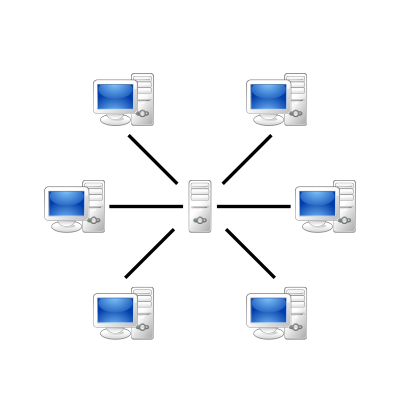

----

<!-- .slide: class="align-top" -->

## What is P2P File Sharing?
<!-- .element: class="no-toc-progress" -->

#### Peer-to-Peer Architecture

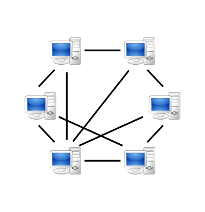

----

<!-- .slide: class="align-top" -->

## Advantages of P2P File Sharing
<!-- .element: class="no-toc-progress" -->

* no costs of running and maintaining a central server
* no single bottleneck => increased robistness
* no / less worries about whether content is legal
* download rate non-decreasing / increasing with users

  

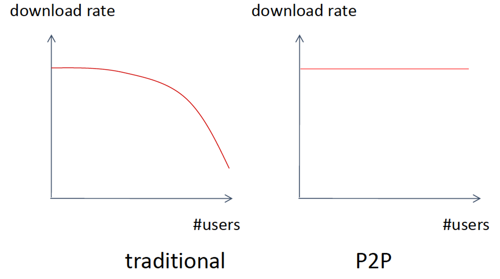

----

<!-- .slide: class="align-top" -->

### P2P in the Language of Game Theory
<!-- .element: class="no-toc-progress" -->

* <mark>Protocol:</mark> 
  *  <!-- .element: class="fragment" --> rules of the game defining actions available to players
* <mark>Clients</mark> - software application installed on peer computer:
  * <mark>Reference clients:</mark> 
    *  <!-- .element: class="fragment" --> default strategy recommended by the protocol
  * <mark>Other compatible clients:</mark>
    *  <!-- .element: class="fragment" --> deviations from / manipulations of default strategy

* <mark>Design Goals:</mark> 
  * <mark>Social Welfare:</mark> 
    * <!-- .element: class="fragment" -->total download rate
  * <mark>Incentive Properties:</mark> 
    * <!-- .element: class="fragment" -->upload rate
  * <mark>Fairness Properties:</mark> 
    * <!-- .element: class="fragment" -->ratio of download / upload rate

  

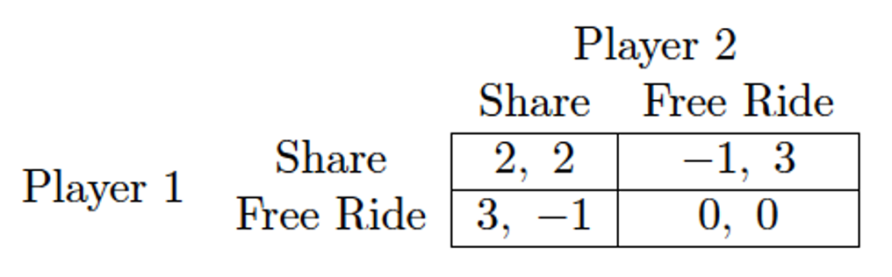

----

<!-- .slide: class="align-top" -->

## BitTorrent

* <mark>Gnutella</mark> suffered from free-riding
  * simultaneeous move game: cooperation between two users based on different (whole) files 
  * you rarely meet twice and have files of each others interest
  * new clients to enforce cooperation not adopted if the old ones are still avaiable

* <mark>BitTorrent</mark> made theory of repeated games applicable
  * cooperation based on a single file among multiple users (swarm)
  * files broken down in many pieces
  * to download you need to upload

----

<!-- .slide: class="align-top" -->

## BitTorrent
<!-- .element: class="no-toc-progress" -->

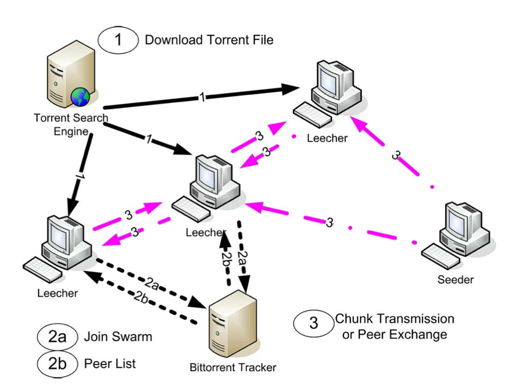

  

<a href="http://mg8.org/processing/bt.html" >BitTorrent Simulation</a>

----

<!-- .slide: class="align-top" -->

## BitTorrent Protocol
<!-- .element: class="no-toc-progress" -->

1.  Find content:
  * Go to websites that maintain searchable directory of torrents
2.  Download a <mark>.torrent</mark> file, which includes:
  * 160-bit SHA-1 digital fingerprint of data-blocks
  * URL to <mark>tracker</mark> (i.e. server responsible for coordinating peers)
3.  Announce yourself to tracker
  * Re-announce periodically
  * Announce when leaving
  * Receive random (50) peers in swarm

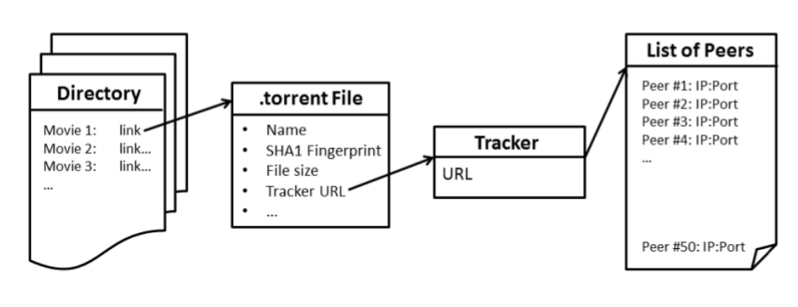

----

<!-- .slide: class="align-top" -->

## BitTorrent Protocol
<!-- .element: class="no-toc-progress" -->

4. Connect with peers:
  * Either by initiate or respond
  * Create <mark>local neighborhoods</mark> (peer + neighbors)
  * Exchange <mark>bitfield</mark> (send have messages to peers)
5. Ask for pieces:
  * Rarest-first
6. Unchoke peers:
  * Via <mark>optimistic unchoking</mark>
  * Take out peer giving content at lowest rate
  * Unchoke randomly one peer
  * See this as Tit-for-Tat or bidding for slots

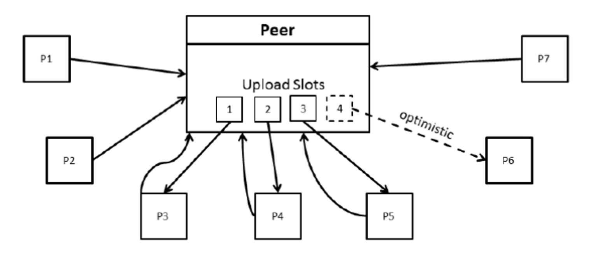

----

<!-- .slide: class="align-top" -->

## Strategic Behaviors (Attacks) on BitTorrent
<!-- .element: class="no-toc-progress" -->

The design of a BitTorrent client involves making the following decisions:
1. How often to contact the tracker to receive a list of peers?
2. Which pieces to reveal to which peers?
3. How many upload slots to use?
4. Which peers to unchoke, how much upload speed to give to each unchoked peer, and how often to make this decision?
5. What pieces to allow an unchoked peer to download?
6. What pieces to try to download?

----

<!-- .slide: class="align-top" -->

## BitThief

* Exploit optimistic unchoking: 
  * Increase chances of being optimistically unchoked
* Differences to reference client:
  * Ask tracker for more peers (200)
  * Re-announce to tracker more frequently
  * => increase awareness that you are there
* Results:
  * Achieving downloads while saving own upload time
  * 2-4 times longer download time in general
  * Slightly faster for small files b/c of advantage in early phase

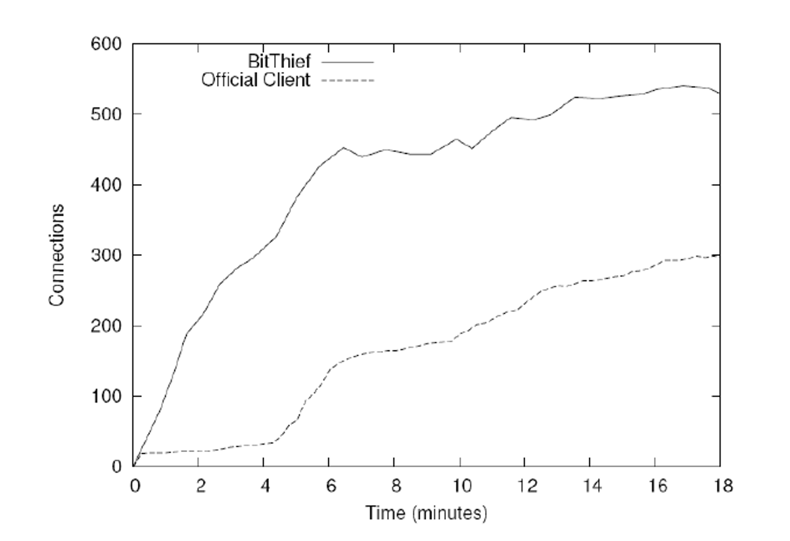

----

<!-- .slide: class="align-top" -->

## Strategic Piece Revelation

* Remain as interesting as possible
* Do not show everybody what you have
* You want as man connections as possible
  * But with peers that are not connected themselves

  

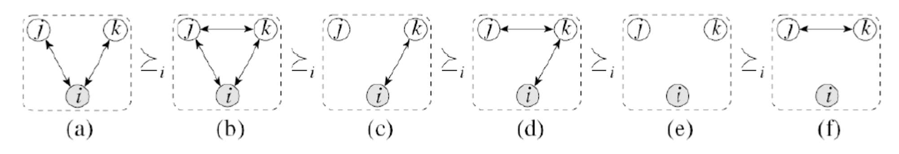

----

<!-- .slide: class="align-top" -->

## Strategic Piece Revelation
<!-- .element: class="no-toc-progress" -->

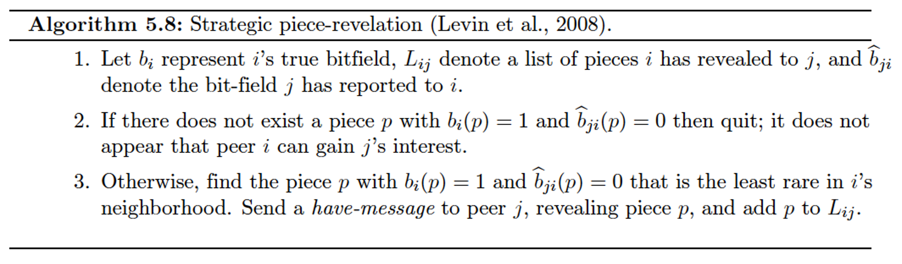

----

<!-- .slide: class="align-top" -->

## Effects of Strategic Piece Revelation
<!-- .element: class="no-toc-progress" -->

* Find more interested peers faster
  * 30% reduction in download time

  

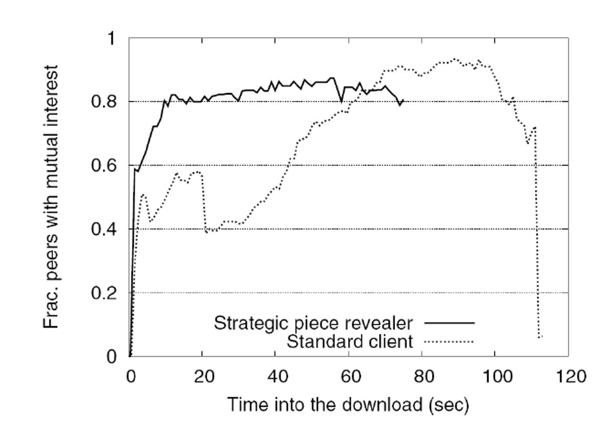

----

<!-- .slide: class="align-top" -->

## BitTyrant

__Most sophisticated client - main ideas:__
  * Maximize "bang (download speed) for the buck (upload speed)"  
  * Threshold shaped reciprocation probability dependent on upload rate ("give just enough")

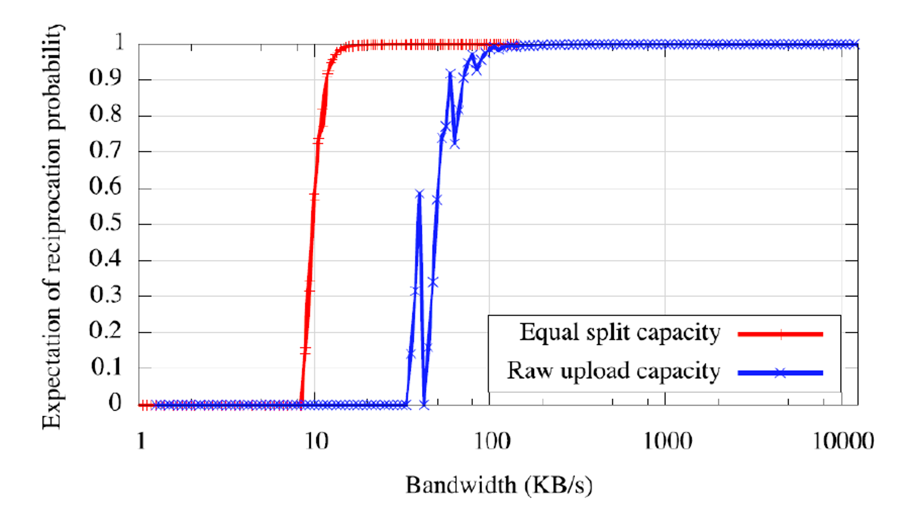

 

 

__Main differences to reference client:__
  * Variable number of upload slots (not fixed to 4)  
  * Allocate upload slots based on return = down/up ratio (instead of unchoking those peers from whom we get the fastest download speed)   
  * Adjust upload speed dynamically: no equal split policy; instead, upload as much as necessary (i.e., the minimum necessary) 

----

<!-- .slide: class="align-top" -->

## BitTyrant
<!-- .element: class="no-toc-progress" -->

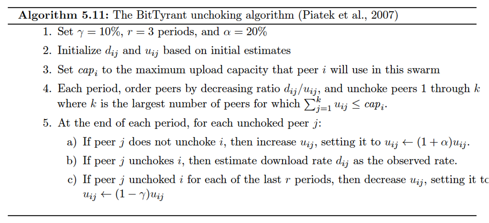

----

<!-- .slide: class="align-top" -->

## BitTyrant
<!-- .element: class="no-toc-progress" -->

#### Insitializing `$ d_{ij} $` and `$ u_{ij} $`

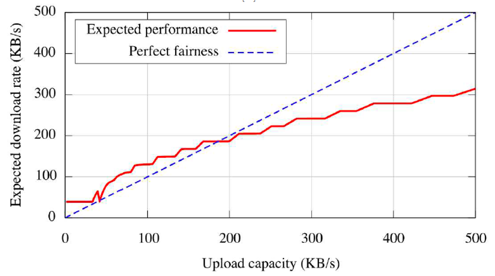

 

----

<!-- .slide: class="align-top" -->

## BitTyrant - anaything wrong?
<!-- .element: class="no-toc-progress" -->

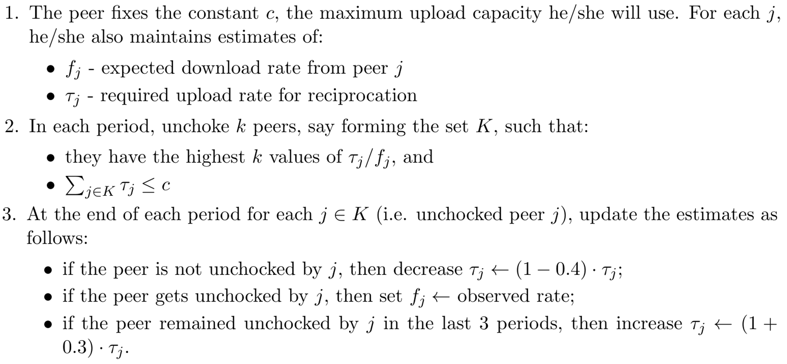

----

<!-- .slide: class="align-top" -->

## BitTyrant - Results
<!-- .element: class="no-toc-progress" -->

#### Performance

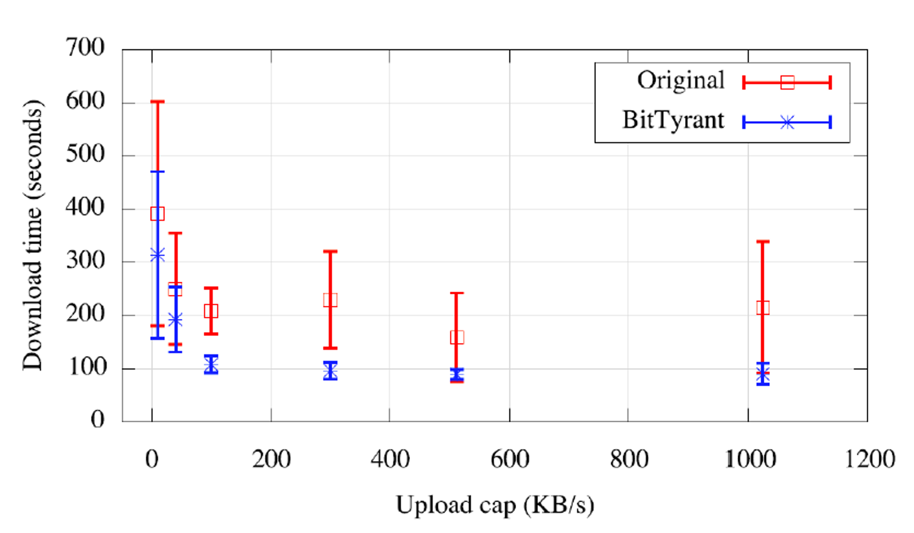

#### Social Welfare

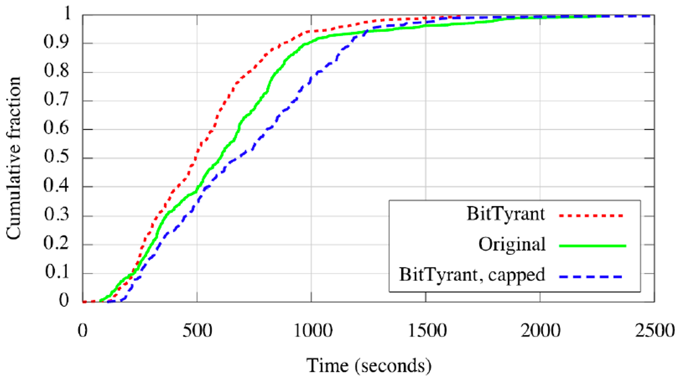

 

----  ----

<!-- .slide: class="align-center" -->

<!-- .slide: data-state="no-toc-progress" --> <!-- don't show toc progress bar on this slide -->

# *Thank You for Your attention!*
<!-- .element: class="no-toc-progress" -->

## *Let's keep in touch!*

  <ul class=network-icon aria-hidden=true>
    <li>
         <a href=https://www.startupengineer.io/authors/ihl/>
              <i class="fas fa-home big-icon" class="accent">: https://www.startupengineer.io/authors/ihl</i>
         </a>
    </li>
    <li>
         <a href=mailto:christoph.ihl@tuhh.de>
              <i class="fas fa-envelope big-icon" class="accent">: christoph.ihl@tuhh.de</i>
         </a>
    </li>
    <li>
        <a href=https://twitter.com/Ihluminate target=_blank rel=noopener>
              <i class="fab fa-twitter big-icon"class="accent">: @IHLuminate</i>
        </a>
    </li>
    <li>
        <a href=https://www.linkedin.com/in/christoph-ihl/ target=_blank rel=noopener>
              <i class="fab fa-linkedin big-icon" class="accent">: https://www.linkedin.com/in/christoph-ihl</i>
        </a>
    </li>
  </ul>

 <!-- .element: class="logo" -->

