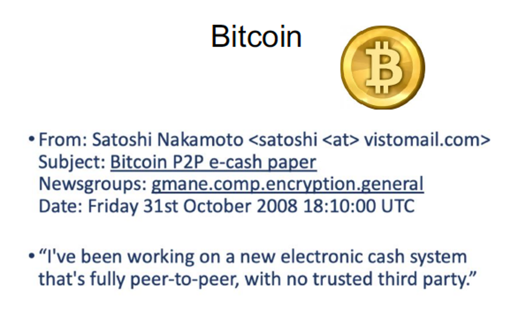
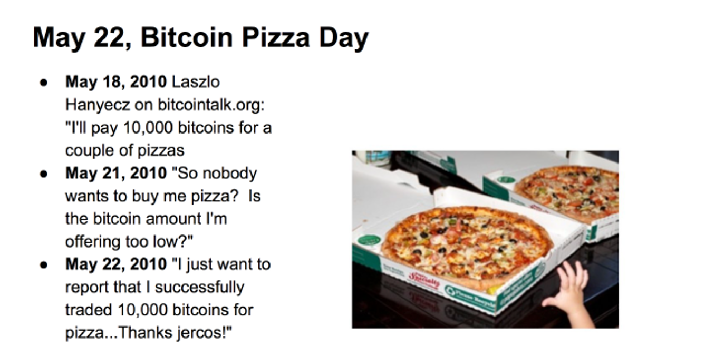
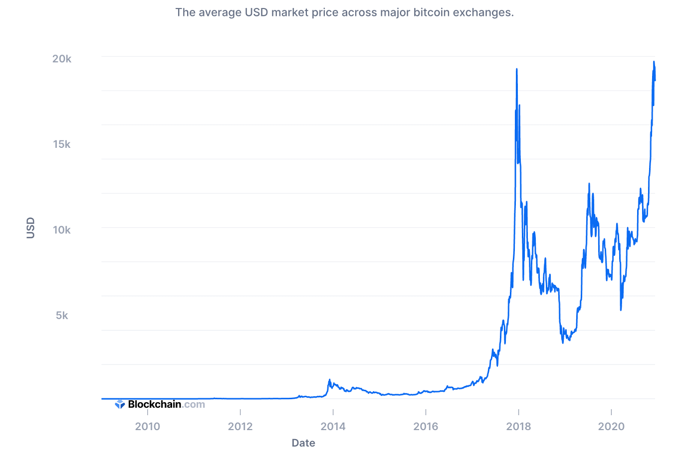
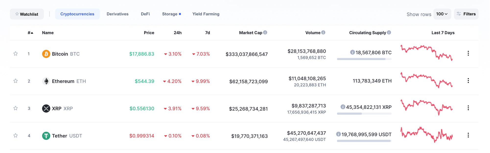
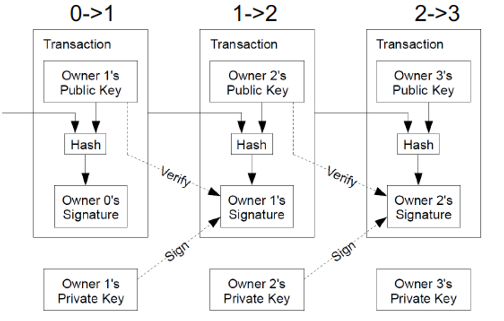
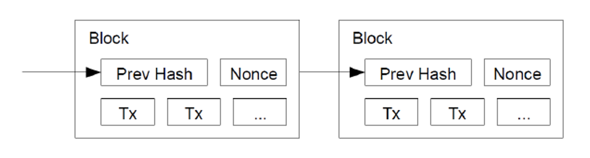
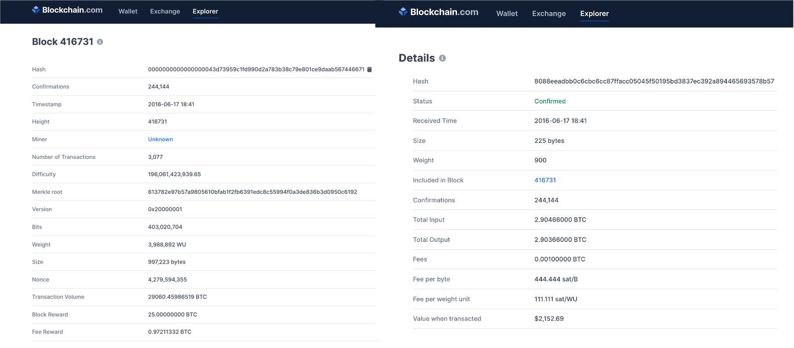
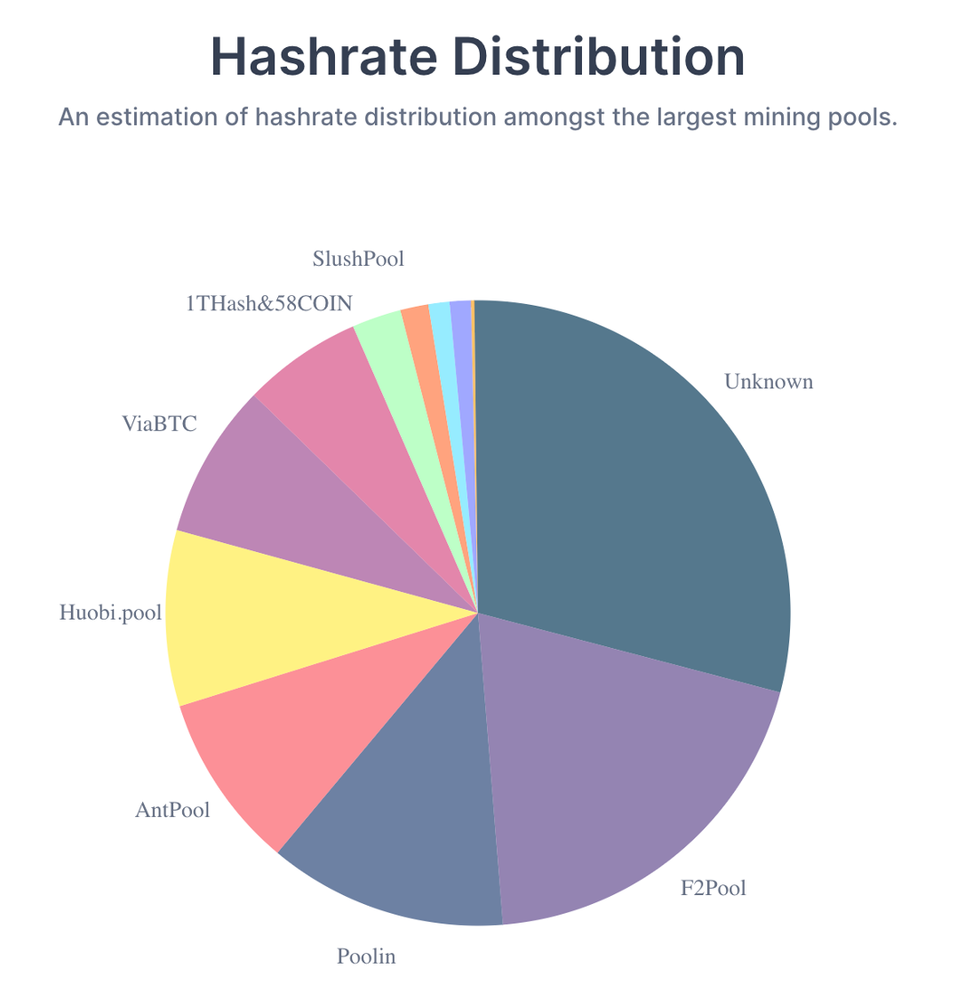

<!-- .slide: class="align-center" -->

<!-- .slide: data-state="no-toc-progress" --> <!-- don't show toc progress bar on this slide -->

# Digital Economy
<!-- .element: class="no-toc-progress" --> <!-- slide not in toc progress bar -->

## 11. Blockchain and Digital Currency

  

[Christoph Ihl][1] | 2020-12-11 | [Kühne Logistics University][2] | Hamburg

 <!-- .element: class="logo" -->

[1]: https://www.startupengineer.io/authors/ihl/
[2]: https://www.the-klu.org

----  ----

<!-- .slide: class="align-center" -->

# Role of Money

----

<!-- .slide: class="align-top" -->

## Why is money useful?

* avoid double coincidence of wants

----

<!-- .slide: class="align-top" -->

## Important Properties

* Divisible
* Storable
* Exchangeable
* Hard to fake
* Sustains its value

----

<!-- .slide: class="align-top" -->

## Gold Standard

* First gold coins minted around 610 BC. Why gold?
* Later: paper currency. Countries adopt “gold standard” in 1800s to build trust
* But pressure in wars (want to print money)
* Bretton Woods System 1946 (DM -> USD -> Gold)
	* ollapsed during Vietnam war
* Swiss Franc on gold standard until 2000

----

<!-- .slide: class="align-top" -->

## Fiat Currency

* “fiat” = “let it be done” (Latin)
* Value unrelated to any physical quantity
* Originated in 11th Century China
* Value relies on trust in the government or central bank that is responsible for keeping a supply of money in circulation
* Today mostly digital payments
	* requires trust in banks and service providers like PayPal

----  ----

<!-- .slide: class="align-center" -->

# Digital Currency

----

<!-- .slide: class="align-top" -->

## Why Digital Currencies?

* __Lower cost:__
	* transacting via computer code: money = bits
	* traditional digital payments have no marginal cost
	* despite transction fees that intermediaries charge
* __Resilience:__
	* fully decentralized
	* cannot be regulated stopped (send anywhere) - good or bad?
* __Privacy__ if well designed - good or bad?
* __Control of Money Supply:__
	* well-designed digital currency can limit, by design, the creation of new money

----

<!-- .slide: class="align-top" -->

## Potential Challenges

* __Bugs, security problems, or unintended behaviors:__
	* participants must trust that the technology
* __Money printing:__
	* counterfeiting must also be made as difficult
* __Double spending:__
	* spending money no more than once, e.g. by copying a digital coin
* __Theft:__
	* must be as difficult as breaking into physical bank

----  ----

<!-- .slide: class="align-center" -->

# Bitcoin

----

<!-- .slide: class="align-top" -->

## Bitcoin
<!-- .element: class="no-toc-progress" -->

* Invented in 2008

  

----

<!-- .slide: class="align-top" -->

## Bitcoin
<!-- .element: class="no-toc-progress" -->

* First purchase in 2010

  

----

<!-- .slide: class="align-top" -->

## Bitcoin Exchange Rate

* Most successful digital currency to date

  

----

<!-- .slide: class="align-top" -->

## Market Cap

* Caomparison with other cryptocurrencies

  

----

<!-- .slide: class="align-top" -->

## Bitcoin Properties

* Fiat currency
* Blockchain:
	* database that cryptographically links entries, i.e. Bitcoin transactions, in chains
* Distributed ledger ("accounting") system
* Total number of Bitcoins bounded, rate of new Bitcoin creation is controlled
	* Creating a new entry or block in distributed ledger system is costly to make, costly to change
	* Entries und thus coins can be copied, but ledger system allows everybody to check onwership und thus prevents double spending

----

<!-- .slide: class="align-top" -->

## Bitcoin Network

* Peer-to-Peer
* Workers (“miners”) are paid coins do the work to maintain the ledger
* Miners try to form blocks that contain transactions, suggest blocks
* If block valid, minder “gossip” the new block

----  ----

<!-- .slide: class="align-center" -->

# Cryptography & Blockchain

----

<!-- .slide: class="align-top" -->

## Cryptography

* Public-Key Infrastructure
	* public key `$ PK_A $`, secret key `$ SK_A $`
	* `$ sign(X)_{SK_A} $` 
		* need `$ SK_A $` to generate
		* anyone can use `$ PK_A $` to verify A signed

  

* Now, user A can give a "coin" X to user B
	* `$ sign([X, PK_B])_{SK_A} $` 
	* also check X was earlier signed over to A

----

<!-- .slide: class="align-top" -->

## Cryptography

* Hash Function
	* algorithm that takes as input a string of bits, and produces as output a hash value of some fixed size
	* "SHA-256" => hexadecimal number of 64 digits
	* Y=Hash(X)
	* only one way to get Y is to hash on X
	* cannot go from Y to X
	* one way: designed to make it computationally infeasible to find an input that hashes to a particular value
* `$ Hash([X, PK_B]) $` 
	* represents coin X bound together with user B
* Allows Proof of Work
	* find me a “nonce” such that `$ Hash([X, nonce]) $` has 19 leading zeros
	* "nonce" = "number only used once"
	* proof of work is "mining", what "miners" do (verify gold, rather than finding gold)

----

<!-- .slide: class="align-top" -->

## The Blockchain

* __Transaction__: A transfer of coins, recorded as an entry in the ledger.
* __Block__: A page in the ledger, containing records of transactions 
	* <= 1MB: 4200-8400 transactions
* __Blockchain__: The entire ledger. Puts an ordering on transactions.
* new blocks are created by __miners__.
* transactions not in the chain are unconfirmed

----

<!-- .slide: class="align-top" -->

## Transactions

----

<!-- .slide: class="align-top" -->

## Structure of the Blockchain

* As of Nov 2019, a valid block must have at least 19 leading 0s

 

----

<!-- .slide: class="align-top" -->

## Example

----

<!-- .slide: class="align-top" -->

## Concentraion of Mining Power

----  ----

<!-- .slide: class="align-center" -->

<!-- .slide: data-state="no-toc-progress" --> <!-- don't show toc progress bar on this slide -->

# *Thank You for Your attention!*
<!-- .element: class="no-toc-progress" -->

## *Let's keep in touch!*

  <ul class=network-icon aria-hidden=true>
    <li>
         <a href=https://www.startupengineer.io/authors/ihl/>
              <i class="fas fa-home big-icon" class="accent">: https://www.startupengineer.io/authors/ihl</i>
         </a>
    </li>
    <li>
         <a href=mailto:christoph.ihl@tuhh.de>
              <i class="fas fa-envelope big-icon" class="accent">: christoph.ihl@tuhh.de</i>
         </a>
    </li>
    <li>
        <a href=https://twitter.com/Ihluminate target=_blank rel=noopener>
              <i class="fab fa-twitter big-icon"class="accent">: @IHLuminate</i>
        </a>
    </li>
    <li>
        <a href=https://www.linkedin.com/in/christoph-ihl/ target=_blank rel=noopener>
              <i class="fab fa-linkedin big-icon" class="accent">: https://www.linkedin.com/in/christoph-ihl</i>
        </a>
    </li>
  </ul>

 <!-- .element: class="logo" -->

