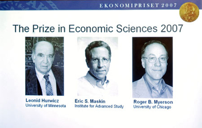
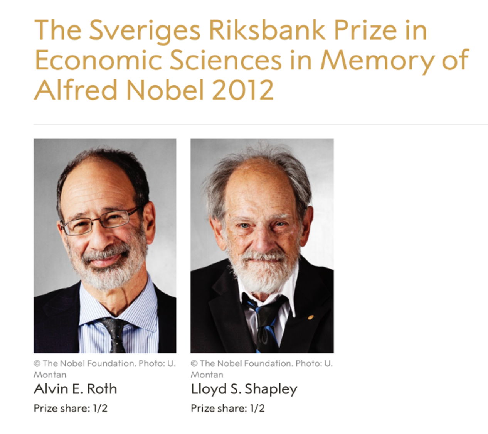
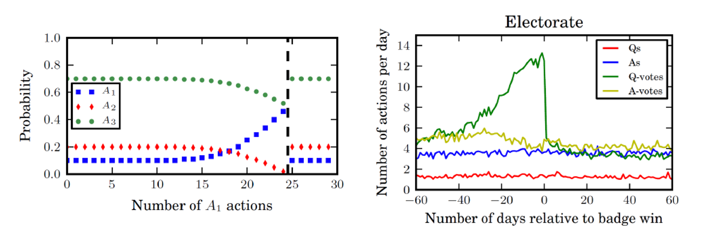
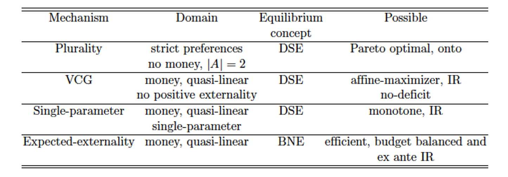
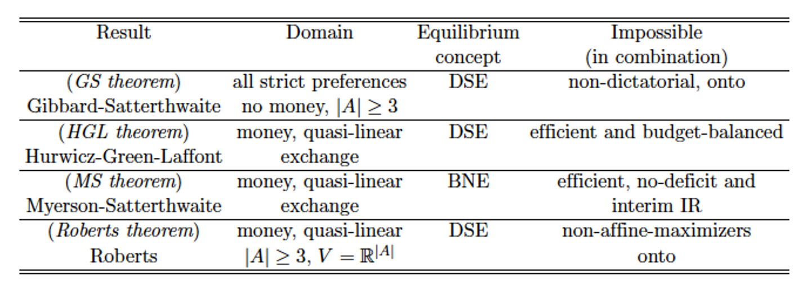
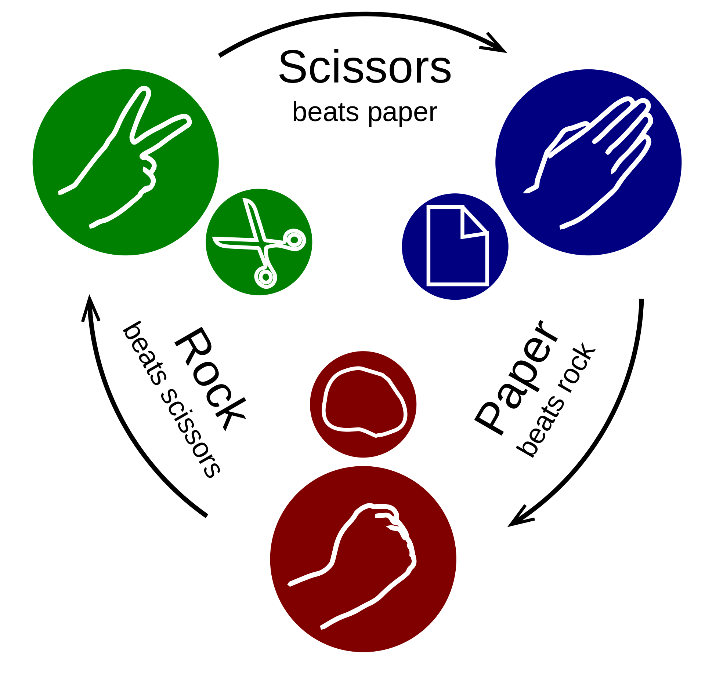

<!-- .slide: class="align-center" -->

<!-- .slide: data-state="no-toc-progress" --> <!-- don't show toc progress bar on this slide -->

# Digital Economy
<!-- .element: class="no-toc-progress" --> <!-- slide not in toc progress bar -->

## 6. Mechanism Design

  

[Christoph Ihl][1] | 2020-11-19 | [Kühne Logistics University][2] | Hamburg

 <!-- .element: class="logo" -->

[1]: https://www.startupengineer.io/authors/ihl/
[2]: https://www.the-klu.org

----  ----

<!-- .slide: class="align-center" -->

# Defining Mechanism Design

----

<!-- .slide: class="align-top" -->

## Nobel Prize: Auction Theory
<!-- .element: class="no-toc-progress" -->

 

----

<!-- .slide: class="align-top" -->

## Nobel Prize: Mechanism Design Theory

 

----

<!-- .slide: class="align-top" -->

## Problem Domains of Mechanism Design

* <mark>When do we have a mechanism design problem?</mark> 
  * agents with private preferences/ values not known to designers
  * designers want to make optimal decisions, choose best outcomes
  * agents are self-interested and may not reveal true preferences/ values 

* <mark> What does a mechanism do?</mark> 
  * rules of games under imperfect information
  * actions are ways to report values / preferences for (many) outcomes
  * ouctomes are selected based on these actions, i.e. mappings between reports and outcomes
  * sometimes: payments associated with outcomes to elicit preferences (truthfully)

* <mark> "Inverse game theory"</mark>
  * working backwards from a defined, desirable outcomes
  * endogenous, "designed" actions (instead of given actions)
  * to achieve the desirable outcome in equilibrium

----

<!-- .slide: class="align-top" -->

## Examples of Mechanism Design

* <mark> Examples for mechanism design:</mark> 
  * auctions
  * organ donor matching
  * meeting scheduling (e.g. with doctors)
  * booth allocation to firms in a job fair
  * voting / elections
  * split a cake between two kids
  * basketball: 24 seconds, no tie

----

<!-- .slide: class="align-top" -->

## Formal Notation for Mechanism Design

> * Agents: `$ N = \{ 1, ..., n \} $`
> * Alternatives: `$ A = \{ a, b, c, ... \} $`; e.g. meeting times, destinations of a trip, allocations of resources, etc.
> * Utility functions: `$ u_i \in U_i $` (utility domain of agent i)
> * Utility profiles: `$ u = ( u_1, ..., u_n ) \in U = U_1 \times ... \times U_n $`

 

> * <mark> Mechanisms __without__ payment: </mark> 
>   * Utility for alternative `$ a $`: `$ u_i(a) \in \mathbb{R} $`
>   * Strict preference orderings: `$ \succ_i \in P_{>} $` such that `$ a \succ_i b \iff u_i(a) > u_i(b) $`

 

> * <mark> Mechanisms __with__ payment: </mark> 
>   * (Quasi-linear) utility for alternative `$ a $`: `$ u_i(a, p_i) = v_i(a) - p_i $` 
>   * `$ v_i(a) $` is intensity of preference / maximum willingness-to-pay of agent i for alternative a
>   * Valuation function `$ v_i: A \rightarrow \mathbb{R} $`;  `$ v_i \in V_i $` (domain of valuation functions of agent i)
>   * Valuation profiles: `$ v = ( v_1, ..., v_n ) \in V = V_1 \times ... \times V_n $`

----

<!-- .slide: class="align-top" -->

## Example: Organ Donor Matching
<!-- .element: class="no-toc-progress" -->

* Goal: Maximizing Social Welfare
  * match as many patients as possible
  * reduce waiting time
  * consider health status
* Possible alternatives?
  * match depending on bloodtype
* Patient utility
  * not paying for dialysis
* Mechanism with/without money?
  * avoid organ trafficking

----

<!-- .slide: class="align-top" -->

## Example: Scheduling a Meeting.
<!-- .element: class="no-toc-progress" -->

| Agent | 9am   | 10am   | 11am   | 
|-------|-----|-----|-----|
| 1     | -$5 | $0  | $2  |
| 2     | $20  | $5 | $10  |
| 3     | $5  | $10  | $2 |

----  ----

<!-- .slide: class="align-center" -->

# Revelation Mechanisms and Strategies

----

<!-- .slide: class="align-top" -->

## Direct-revelation mechanisms

* <mark>Direct-revelation mechanisms (DRMs)</mark>:  
  * Agents send a single report that makes claim about their utility function:
    * Reported utility profile: `$ \hat{u} = ( \hat{u}_1, ..., \hat{u}_n ) \neq u $`
    * Reported valuation profile: `$ \hat{v} = ( \hat{v}_1, ..., \hat{v}_n ) \neq v $`

 

> * <mark>Definition (Direct-revelation Mechanism (no money))</mark>: In a direct-revelation mechanism (DRM) without money, each agent `$ i $` makes a report `$ \hat{u}_i $` about its utility function (perhaps `$ \hat{u}_i \neq u_i $`), and the mechanism is defined in terms of
>* an outcome rule `$ g : U \rightarrow A $`, where `$ g(\hat{u}) $` is the alternative selected for reported profile `$ \hat{u} $`.

 

> * <mark> Definition (Direct-revelation Mechanism (money))</mark>: In a direct-revelation mechanism (DRM) with money, each agent `$ i $` makes a report `$ \hat{v}_i $` about its valuation function `$ \hat{v}_i \neq v_i $`), and the mechanism is defined in terms of:
>* a choice rule `$ x : V \rightarrow A $`, where `$ x(\hat{v}) $` is the alternative selected for reports `$ \hat{v} $`; and
>* a payment rule `$ t : V \rightarrow \mathbb{R}^n $`, where `$ t(\hat{v}) $` for `$ i \in N$` is the payment made by agent `$ i $`.

----

<!-- .slide: class="align-top" -->

## Examples
<!-- .element: class="no-toc-progress" -->

* <mark>Example 1</mark>: 
  * Consider a meeting scheduling problem with three possible times, 9am, 10am, and 11am and three agents. The mechanism selects the time that is top-ranked by the most agents, breaking ties in favor of earlier times. This is the plurality rule.
  * Suppose the preferences are 11am `$ \succ_1 $` 10am `$ \succ_1 $` 9am, 9am `$ \succ_2 $` 11am `$ \succ_2 $` 10am, and 10am `$ \succ_3 $` 9am `$ \succ_3 $` 11am, for agents 1, 2 and 3 respectively. 
  * <!-- .element: class="fragment" -->  For truthful reports, all times would be tied and the selected time would be 9am by tie breaking. We see that agent 1 has a useful deviation, by reporting 10am as its top choice, with 10am selected as the outcome.

  

* <mark>Example 2</mark>: 
  * In a single-item auction with three agents, there are four alternatives: don't allocate, and assign the item to one of the three agents. For example, agent 1 may have valuation function: `$ v_1(a) = \begin{cases} 5 \text{ if assigned the item in alternative a} \\ 0 \text{ otherwise.} \end{cases} $`  
  * <!-- .element: class="fragment" -->  In the SPSB auction, the choice rule x assigns the item to the agent with the highest reported value for the item, and the payment rule t charges the second-highest reported value to the selected agent and 0 to the others.

----

<!-- .slide: class="align-top" -->

## Revelation Strategies

* In a DRM, strategy `$ s_i : U_i \rightarrow U_i $` defines the report that agent i will make for every utility function: `$ s_i(u_i) = \hat{u}_i $`

  

> * <mark> Definition (Dominant strategy equilibrium):</mark> Strategy profile `$ {s}^* = ({s}^*_1 , ... , {s}^*_n) $` is a dominant-strategy equilibrium (DSE) in a DRM if    
> `$ u_i( g( s_i^*(u_i), s_{-i}(u_{-i}) ) ) \geq u_i( g( \hat{u}_i, s_{-i}(u_{-i}))) $`    
> for all agents `$ i $`, all utility functions `$ u_i $`, all reports `$ \hat{u}_i $`, all strategies `$ s_{-i} = ( s_1 , ... , s_{i-1}, s_{i+1}, ... , s_n ) $` and all utility functions  `$ u_{-i} = (u_1 , ... , u_{i-1}, u_{i+1}, ... , u_n ) $` of others.

 

> * <mark> Definition (Strategy-proof):</mark> A mechanism is strategy-proof if it is a DRM and truthful reporting is a DSE.

----

<!-- .slide: class="align-top" -->

## Revelation Strategies
<!-- .element: class="no-toc-progress" -->

* Synonyms for strategy-proof mechanism, where truthful reporting is the best response for each agent whatever the strategies of others:
  * dominant-strategy incentive compatible (DSIC) mechanism
  * truthful mechanism
* Works also for BNE
* Analogous definitions of DSE and strategy-proofness for mechanisms with money, 
  * valuation reports in place of utility reports 
  * choice rule x and payment rule t in place of outcome rule g.

----

<!-- .slide: class="align-top" -->

## Examples
<!-- .element: class="no-toc-progress" -->

* <mark>Example 3</mark>: 
  * Meeting scheduling problem with two possible times: 9am and 10am, and 101 agents. We use the plurality rule, breaking ties in favor of earlier times. Agent 1's top choice is 9am. 

 

* Her report only matters if the others are split 50 : 50 on 9am and 10am. In this case, the time depends on agent 1's report, and truthful reporting is the best strategy. 
* A similar analysis holds when she prefers 10am, as well as for an even number of agents.
* We conclude from this example that the plurality rule is strategy-proof when there are only two possible alternatives.

 

----

<!-- .slide: class="align-top" -->

## Social Choice and Implementation 

>* <mark>Definition (Social choice function)</mark>: A social choice function (SCF) `$ f : U \rightarrow A $` is a function from utility profiles to alternatives that defines the desired outcome of the designer of a mechanism.

 

* design objective: desirable outcome that designer would select if the preferences of each participant were truthfully known.

 

> * <mark>Definition (Implementation)</mark>: A mechanism with outcome rule `$ g $` implements the SCF `$ f $` in dominant strategy when  
> `$ f(u_1, ... , u_n) = g( {s}^*_1(u_1) , ... , {s}^*_n(u_n) ) $`  
>   where `$ {s}^* $` is the DSE of the mechanism.

 

* desired outcome can only be achieved / implemented through the equilibrium of the game induced by a mechanism.

* analogous for mechanisms with payment: use v instead of u.

* Works also for BNE

----

<!-- .slide: class="align-top" -->

## Indirect mechanisms
<!-- .element: class="no-toc-progress" -->

* Indirect mechanisms (that are not DRMs), e.g.:
  * Query each agent about its preferences on subsets of alternatives before choosing an alternative.
  * Place agents into a "priority order" and ask each agent in turn which item it wants from what is left.
  * Ask agents to report "1" or "2" next to utility function, use outcome rule 1 or 2 depending on majority vote.
  * English auction.

----

<!-- .slide: class="align-top" -->

## Revelation Principle

> * <mark>Theorem (Revelation principle)</mark>: Any SCF f that can be implemented in a DSE of a (possibly indirect) mechanism can be implemented by a strategy-proof mechanism.

 

* Equivalently: 
  * If f cannot be implemented by strategy-proof mechanism, then f cannot be implemented (in DSE) by any mechanism.
* Focus on DRM with truthful reporting as DSE!

 

----

<!-- .slide: class="align-top" -->

## Revelation Principle: Example Reasoning
<!-- .element: class="no-toc-progress" -->

* Suppose: auction for 1 item, 2 agents with v_1 = 8 and v_2 = 5
* Requirements for SCF:
  * Agent with highest value should win the item
  * Winner should pay the value of the other agent, but at least $10
* Task: Show that SCF cannot be implemented (in DSE) by any mechanism.

 

 

* Suppose g is strategy-proof DRM that implements the DCF
* But then agent 1 has an incentive to misreport a value < 5
* Contradiction to g being a strategy-proof mechanism that implements SCF
* By the revelation principle: no mechanism that implements SCF in DSE exists

----

<!-- .slide: class="align-top" -->

## Desirable Properties of Mechanisms

* __Strategy-proofness__: report true values ist dominant strategy
* __Pareto optimal__: there is no other alternative that is weakly preferred by all agents and strictly preferred by one agent.
* __Fair__: the selected alternative maximizes the minimum value across agents, over all possible alternatives.
* __Efficient__: the selected alternative maximizes the total value of agents.
* __Revenue optimal__: the mechanism maximizes expected revenue across all possible mechanisms.
* __Individual rationality__: the utility to an agent from participating and making a truthful report is weakly greater than from not participating.
* __No-deficit__: the total payment by agents is weakly positive.
* __Budget balance__: the total payment by agents is exactly zero.

----  ----

<!-- .slide: class="align-center" -->

# Vickrey-Clarke-Groves (VCG) Mechanism

----

<!-- .slide: class="align-top" -->

## VCG Mechanism Definition

 

> <mark>Definition (VCG mechanism)</mark>: Given reported valuation profile `$ \hat{v} = ( \hat{v}_1, ..., \hat{v}_n ) $`, the VCG mechanism is defined by:
>* a choice rule `$ x(\hat{v}) \in arg\max\limits_{a \in A}( \sum\limits_{i \in N} \hat{v}_{i}(a) ) $`; and
>* a payment rule `$ t $`, such that:  
> `$ t_i(\hat{v}) = \sum\limits_{j \neq i} \hat{v}_{j}(a^{-i}) - \sum\limits_{j \neq i} \hat{v}_{j}(a^{*}) $`  
>for every agent i, with selected alternative `$ a^{*} = x(\hat{v}) $`, and `$ a^{-i} \in arg\max\limits_{a \in A^{-i}}( \sum\limits_{j \neq i} \hat{v}_{j}(a) ) $`.

----

<!-- .slide: class="align-top" -->

## VCG Mechanism Intuition

* agent i's payment is the difference in value to others between 
  * (1) the alternative that would be selected without considering i's report and
  * (2) the selected alternative
* the __negative externality__ imposed on the rest of the system because of agent i's preferences.
* applies to settings with money
* generalizion of SPSB auction
* strategy-proofness, efficiency and individual rationality, often no-deficit

----

<!-- .slide: class="align-top" -->

## Examples

* <mark>Example 5</mark>: 
  * Scheduling problem with introduction of payments. 
  * Agent preferences:

   

| Agent | 9am   | 10am   | 11am   | 
|-------|-----|-----|-----|
| 1     | -$5 | $0  | $2  |
| 2     | $20  | $5 | $10  |
| 3     | $5  | $10  | $2 |

   

* The alternative that maximizes the total value is 9am, providing total value $20 compared to $15 and $14 for 10am and 11am respectively. 
* Neither agents 1 nor 3 are pivotal, since 9am would be selected with or without the report from either agent. Their payments are zero. 
* For agent 2, payment is $10.

----

<!-- .slide: class="align-top" -->

## Examples
<!-- .element: class="no-toc-progress" -->

* <mark>Example 6</mark>: 
  * Job fair with three firms and three possible locations in the room: front (F), middle (M) and rear (R).
  * Firm preferences:

   

| Firm | F   | M   | R   | 
|-------|-----|-----|-----|
| 1     | $10 | $2  | $1  |
| 2     | $100  | $100 | $100  |
| 3     | $50  | $45  | $40 |

   

* The VCG mechanism selects alternative (1; F); (2;R) and (3;M), for total value $155.
* The payments are 150-145 = 5, 55-55 = 0 and 110-110 = 0, for firms 1, 2 and 3 respectively.

----

<!-- .slide: class="align-top" -->

## Properties of VCG

* __Strategy-proofness__: yes
* __Fair__: depends
* __Efficient__: yes
  * Allocation rule: maximizes value according to thruthful reports
* __Revenue optimal__: no
* __Individual rationality__: yes (see proof in book)
* __No-deficit__: only if no positive externality (adding one agent increases the payment to another)
* __Budget balance__: no
  * couldn't a positve budegt (net charge of all players) be redistributed?
  * no (Hurwicz Green Laffont Theorem): creates incentive to misreport to increase other agents' payments

----

<!-- .slide: class="align-top" -->

## Properties of VCG
<!-- .element: class="no-toc-progress" -->

##### __Strategy-proofness__

  * Fix other players’ strategies `$  \hat{v}_{-i} $`. Assume advantageous miss report `$  \hat{v}_{i} $` resulting in assignment `$ a^{\prime} $`.

   

> `$ v_i(a^{\prime}) - t_i( \hat{v}_{i}, \hat{v}_{-i}) > v_i(a^*) - t_i( v_i, \hat{v}_{-i}) $` 

> `$ v_i(a^{\prime}) - \sum\limits_{j \neq i} \hat{v}_{j}(a^{-i}) + \sum\limits_{j \neq i} \hat{v}_{j}(a^{\prime})  >  v_i(a^*) - \sum\limits_{j \neq i} \hat{v}_{j}(a^{-i}) - \sum\limits_{j \neq i} \hat{v}_{j}(a^{*})$`  

> `$ v_i(a^{\prime}) + \sum\limits_{j \neq i} \hat{v}_{j}(a^{\prime})  >  v_i(a^*) - \sum\limits_{j \neq i} \hat{v}_{j}(a^{*})$`  

   

 * a contradiction, since by definition VCG's choice rule is:
> `$ a^{*} \in arg\max\limits_{a \in A}( v_i(a) + \sum\limits_{j \neq i} \hat{v}_{j}(a) ) $` 

----

<!-- .slide: class="align-top" -->

## Properties of VCG
<!-- .element: class="no-toc-progress" -->

##### __Individual rationality__

   

* g individually rational if:

> `$ u_i( g (u_i, \hat{u}_{-1} )) \geq u_i( g (\hat{u}_{-1} )) $`   

   

* For domains with money:

> `$ v_i( x(v_i, \hat{v}_{-1} ) - t_i(v_i, \hat{v}_{-1}) ) \geq v_i( x(\hat{v}_{-1} ) ) $`   

   

* In VCG:

> `$ v_i(a^*) - t_i(v_i, \hat{v}_{-1}) = v_i(a^{*}) + \sum\limits_{j \neq i} \hat{v}_{j}(a^{-1}) + \sum\limits_{j \neq i} \hat{v}_{j}(a^{*}) \geq  $`  

> `$ v_i(a^{-1}) - \sum\limits_{j \neq i} \hat{v}_{j}(a^{-1}) + \sum\limits_{j \neq i} \hat{v}_{j}(a^{-1}) =  v_i(a^{-1}) $`  

----

<!-- .slide: class="align-top" -->

## Properties of VCG
<!-- .element: class="no-toc-progress" -->

* __No-deficit__: only if "no positive externality"
  * adding one agent i does not __increase__ the payment to another (by introducing a new alternative)

   

> * <mark>Definition (No positive externality)</mark>: There is no agent `$ i $`, no valuation profile `$ v_{-1} $` on the other agents, and no alternative `$ a \in A \setminus A^{-i} $`, for which       
> `$ \sum\limits_{j \neq i} v_j(a) > \max\limits_{a^{\prime} \in A^{-i}}( \sum\limits_{j \neq i} v_j(a^{\prime}) ) $` 

----

<!-- .slide: class="align-top" -->

## Examples
<!-- .element: class="no-toc-progress" -->

* <mark>Example 7</mark>: 

   

| Agent | Trade   | No Trade   | 
|-------|-----|-----|
| Seller    | -0.5 | 0  | 
| Buyer   | 0.8  | 0 | 

   

* Given truthful reports, the selected alternative is trade. 
* Without either agent, we have alternatives `$  A^{-1} = A^{-2} = \{\text{No Trade}\} $` .
* For the seller, the payment is `$ t_1(\hat{v}_{1}, \hat{v}_{2}) = \hat{v}_{2}(a)^{-1} - \hat{v}_{2}(a) = 0 - 0.8 = -0.8$`.
* For the buyer, the payment is `$ t_2(\hat{v}_{1}, \hat{v}_{2}) = \hat{v}_{2}(a)^{-2} - \hat{v}_{1}(a) = 0 - (-0.5) = 0.5$`.
* There is a deficit of 0.3.

----

<!-- .slide: class="align-top" -->

## Limits of VCG
<!-- .element: class="no-toc-progress" -->

##### VCG might not cover the costs:
* Build a new sports stadium if citizens' total values are larger than costs:
* 4 Agents: 3 ‘normal’ agents, 1 ‘cost’ agent 0
* 2 Alternatives A = {Build, No Build}
  * `$ v_i(Build) = v_b > 0 = v_i(No Build)$`
  * `$ v_0(Build) = -C < 0 = v_0(No Build)$`
   
* __Case 1__: `$ v_b > 0.5 * C$`
  * Payment for i: `$ t_i(v) = 0 $` for all i
   
* __Case 2__: `$ \frac{1}{3} * C < v_b < 0.5 * C $`
  * Payment for i: `$ t_i(v) = 0 - (-C + \sum\limits_{j \neq i} v_j ) = C - \sum\limits_{j \neq i} v_j = C - 2 * v_b $` for all i
  * Payment altogether: `$ 3 * t_i(v) = 3 * C - 3 * 2 * v_b = 3 * C - 6 * v_b < C $` for all i

----  ----

<!-- .slide: class="align-center" -->

# Bayesian Implementation

----

<!-- .slide: class="align-top" -->

## Bayes-Nash Equilibra and Incentive Compatibility

><mark>Definition (Bayes-Nash Equilibrium).</mark> In a DRM with money, strategy profile `$ s^* = ( s_1^* , ... , s_n^*)  $` is a Bayes-Nash equilibrium (BNE) if 
> `$ \mathop{\mathbb{E}}_{v_{-i}}[ v_i( x( s_i^*(v_i), s^*_{-i}(v_{-i}) ) ) - t( s_i^*(v_i), s^*_{-i}(v_{-i}) ) ] \geq \mathop{\mathbb{E}}_{v_{-i}}[ v_i( x( \hat{v}_{i}, s^*_{-i}(v_{-i}) ) ) - t( \hat{v}_{i}, s^*_{-i}(v_{-i}) ) ] $`   
> for all agents `$ i $`, all valuation functions `$ v_i $`, all reports `$ \hat{v}_{i} $`.

    

> <mark>Definition (Bayes-Nash incentive compatible).</mark> A mechanism is Bayes-Nash incentive compatible (BIC) if it is a DRM and truthful reporting is a BNE.

----

<!-- .slide: class="align-top" -->

## Expected Externality Mechanism

>Definition (Expected-externality mechanism). Given reported valuation profile `$ \hat{v} = ( \hat{v}_1, ..., \hat{v}_n ) $`, the expected-externality mechanism is defined by: 

>* a choice rule `$ x(\hat{v}) \in arg\max\limits_{a \in A}( \sum\limits_{i \in N} \hat{v}_{i}(a) ) $`; and
>* a payment rule `$ t $`, such that:  
> `$ t_i(\hat{v}) = \frac{1}{n-1} [ \sum\limits_{j \neq i} \text{Val}_{-j}(\hat{v}_{j}) ] - \text{Val}_{-i}(\hat{v}_{i})  $`  
>for every agent i.

 

* Choice rule is same as in VCG.
* `$ \text{Val}_{-k}(\hat{v}_{k}) = \mathop{\mathbb{E}}_{v_{-k}} [ \sum\limits_{j \neq k} v_j(x(\hat{v}_{k},v_{-k}))] $`: expected total value to all other agents agents `$ \neq k $` from the selected alternative, when agent `$ k $` reports `$ \hat{v}_{k} $` and others are truthful (i.e. does not depend on their reports).
* First term in payment rule: "averaged" expected total value to every other agent given each of their reports, but independent of agent i's report.
* EE mechanism is BIC, efficient, budget-balanced; also ex ante IR for a normalized domain and IID valuation functions.

----

<!-- .slide: class="align-top" -->

## Expected Externality Mechanism: Example
<!-- .element: class="no-toc-progress" -->

* A seller and a buyer have values `$ \omega_1 \sim U(-1,0) $`, `$ \omega_2 \sim U(0,1) $`, respectively for trade. The possible alternatives are `$ \{\text{trade, no trade}\} $`. The seller's value is `$ v_1(\text{trade}) = \omega_1 $`, and `$ v_1(\text{no trade}) = 0 $`. The buyer's value is `$ v_2(\text{trade}) = \omega_2 $`, and `$ v_2(\text{no trade}) = 0 $`.

 

* The expected-externality mechanism selects alternative `$ x( \hat{\omega_1}, \hat{\omega_2}) = \text{trade if } \hat{\omega_1} + \hat{\omega_2} \geq 0 $`, and `$ \text{no trade} $` otherwise. The buyer's payment is

 

>`$ t_2(\hat{\omega}) = \text{Val}_{-1}( \hat{\omega_1}) - \text{Val}_{-2}( \hat{\omega_2}) = \mathop{\mathbb{E}}_{\omega_2}[v_2(x(\hat{\omega_1},\omega_2))] - \mathop{\mathbb{E}}_{\omega_1}[v_1(x( \omega_1,\hat{\omega_2}))]  $`,

 

  i.e the buyer's expected value from trade when the seller's value is `$ \hat{\omega_1} $`, minus the seller's expected value from trade when the buyer's value is `$ \hat{\omega_2} $`. 

 

* Analogously, the seller's payment is `$ t_1(\hat{\omega}) = \text{Val}_{-2}( \hat{\omega_2}) - \text{Val}_{-1}( \hat{\omega_1}) = - t_2(\hat{\omega}) $`. This gives budget balance.

 

* Concretely, suppose the reports are `$ \hat{\omega_1} = -0.4 $` and `$ \hat{\omega_1} = 0.8 $`. 

Hence, trade occurs, and the payment is
`$ t_2(\hat{\omega}) = Pr(\omega_2 > 0.4) * \mathop{\mathbb{E}}[\omega_2 | \omega_2 \geq 0.4 )] - Pr(\omega_1 > -0.8) * \mathop{\mathbb{E}}[\omega_1 | \omega_1 \geq -0.8 )] = (0.6)(0.7) - ((0.8)(-0.4)) = 0.74 = - t_1(\hat{\omega})$`

----  ----

<!-- .slide: class="align-center" -->

# Impossibility Results

----

<!-- .slide: class="align-top" -->

## Some Definitions

* __Strict preferences__: no indifferences.
* __Onto (surjective)__: Given a function f that maps from X to Y: for every element y in Y, there is at least one element in x in X.
* __No positive externality__: Adding an agent does not add an overall better alternative for existing agents.
* __Exchange domain__: We have buyers and sellers.
* __Affine maximizer__: Generalization of efficiency (weighting the different agents differently).
* __Dictatorial__: Some fixed agent gets to “dictate” the outcome with his report.
* __Interim IR__: IR, where you know your own value, but only a distribution of the other agents’ values.
* __Ex ante IR__: IR, but before you know your own value (only a distribution).

----

<!-- .slide: class="align-top" -->

## Possibility Results

 

----

<!-- .slide: class="align-top" -->

## Impossibility Results

 

----

<!-- .slide: class="align-top" -->

## Impossibility Results: Example
<!-- .element: class="no-toc-progress" -->

* Consider politcal candidates A, B, and C
* Is there a strategy-proof DRM that selects one of the candidates?
  * Yes! E.g., one agent picks the candidate
* Is there a strategy-proof mechanism that is also onto and non-dictatorial?
  * No! Gibbard-SaOerthwaite (GS) theorem
* What if there are only two candidates A and B?
  * Then Plurality is onto, non-dictatorial and strategy-proof

----  ----

<!-- .slide: class="align-center" -->

# Excercises
<!-- .element: class="no-toc-progress" -->

----

<!-- .slide: class="align-top" -->

## G-E1: Simultaneous-Move Games
<!-- .element: class="no-toc-progress" -->

<mark>Exercise:</mark>  
Two prisoners who committed a crime are each interrogated in separate rooms. If they cooperate and tell a common story they can not be fully believe, but at least none will get accused of the entire crime, so they each get 4 years. If one of them defects, then he/she can go home and the other one will get 10 years for committing the crime alone. If both defect, then they get accused and they get a sentence of 8 years each.

  

<mark>Questions:</mark>  
a)  Write this game formally, as a simultaneous move game. Find its normal form representation.  
b)  Find the Nash equilibria and Pareto optima for this game.  
c)  Draw the best response graph.  

----

<!-- .slide: class="align-top" -->

## G-E2: Mixed Nash Equilibria
<!-- .element: class="no-toc-progress" -->

<mark>Exercise:</mark>  
Alice and Bob would like to spend time together. If they both go to a football match, then Bob gets a utility of 3 while Alice gets utility of 2. If they both go to the opera, then Alice gets a utility of 3, while Bob gets only 2. If Bob goes to the match while Alice goes to the opera, both get a utility of 1. Vice versa, both get 0. Assume that they need to act simultaneously.

  

<mark>Questions:</mark>  
a)  Write this game formally, as a simultaneous move game. Find its normal form representation.  
b)  Find the Nash equilibria and Pareto optima for this game.  
c)  Draw the best response graph.  

----

<!-- .slide: class="align-top" -->

## G-E3: Games with Multiple Actions
<!-- .element: class="no-toc-progress" -->

<mark>Exercise:</mark>  

  

<mark>Questions:</mark>  
a)  Write this game formally, as a simultaneous move game. Find its normal form representation.  
b)  Show that it is a zero-sum game.   
c)  Find the Nash equilibria for this game.  

----

<!-- .slide: class="align-top" -->

## G-E4 (optional): Repeated (Prisoners' Dilemma) Games
<!-- .element: class="no-toc-progress" -->

<mark>Exercise:</mark>  
Play the prisoners’ dilemma game multiple times. Assume that the players discount their payoff (or utility) from future rounds by `$ \delta^n $`; where `$ \delta $` can be interpreted has probability of stopping the game because of impatience, or the lower value that players assign to payoffs obtainable further in the future; and `$ n $` is the number of rounds played in the future.

  

<mark>Questions:</mark>  
a)  If the game is repeated `$ m $` finite times, show that *Grim Trigger* strategy is not an NE for any `$ \delta $`.  

(The Grim Trigger strategy implies that players cooperate until the other player defects for the first time. Then the player defects in all following rounds.)<!-- .element: class="small" -->

b)  Prove that it is an NE for some `$ \delta $` in the infinitely repeated game. For which δ?  
c)  Is the *Tit-for-Tat* strategy a NE in the finite and infinite case?  

(The Tit-for-Tat strategy implies that players always play what the other one has played in the previous round.)<!-- .element: class="small" -->

----

<!-- .slide: class="align-top" -->

## A-E1: Find BNE in FPSB Auction
<!-- .element: class="no-toc-progress" -->

* An auction with two players.  
* Their values are distributed uniformely: `$ v_i \sim U[1,3] $`
.  
* Player 2 plays the following strategy: `$ s_2(v_2) := \frac{v_2+1}{2} $` 
* How should player 1 respond optimally? 
* Is this a BNE?

----

<!-- .slide: class="align-top" -->

## A-E2: Calculate SPSB Auction Revenue I
<!-- .element: class="no-toc-progress" -->

* Only one bidder, value $10 with probability 50% and $22 otherwise.
* Which reserve price maximizes expected revenue?

----

<!-- .slide: class="align-top" -->

## A-E3: Calculate SPSB Auction Revenue II
<!-- .element: class="no-toc-progress" -->

* Given IPV environment, the value of two bidders come from two different distributions:
  * Bidder 1 has value $2 with probability 30% and $5 otherwise
  * Bidder 2 has value $3 with probability 40% and $4 otherwise.
* What is the Expected revenue for the auctioneer?
* Can one increase expected revenue by a reserve price? How high should it be?

----

<!-- .slide: class="align-top" -->

## A-E4 (optional): Revenue Comparison
<!-- .element: class="no-toc-progress" -->

(1) Suppose there is one bidder, with value `$ v_i \sim U[0,1]  $`. What is the optimal take-it-or-leave-it price `$ r $` to offer to this bidder in order to maximize expected revenue?  
(2) Now suppose there are two bidders, with values uniformly distributed on `$ U[0,1]  $` Consider a SPSB auction with reserve price `$ r = 0.5 $`. What is the expected revenue?  
(3) Compare this with the expected revenue in the SPSB auction without a reserve. What do you find?  
(4) Relate your observations about the SPSB auction plus reserve and the SPSB auction to the revenue equivalence theorem.  

----

<!-- .slide: class="align-top" -->

## A-E5: eBay Auction Design
<!-- .element: class="no-toc-progress" -->

* Consider an eBay auction with a starting price of $5 and secret reserve of $12.50.
* Suppose the minimal bid increment is $0.50 when the price is between $5 and $24.99, and $1 when the price is higher than $25.
* Suppose there are four bidders, and that the following bids are placed (in this sequence): 
  * bidder 1 $7.51; bidder 2 $10.20; bidder 1 $21.50; bidder 3 $25.21; bidder 1 $28.75; bidder 4 $28.99; auction closes.
* Report the new state of the auction after each bid:
  * the provisional winner, or "reserve not met"
  * the new price `$ p_t $`
  * the new ask `$ p_{ask,t} $`
* Who wins when the auction closes, and what does this bidder pay?

----

<!-- .slide: class="align-top" -->

## M-E1: VCG in Public Projects
<!-- .element: class="no-toc-progress" -->

* <mark>Excersice</mark>: 
  * Public Project: Where should we locate the hospital?
  * Three locations: A, B, C
  * Outcome and payments using VCG?
  * Agent preferences:

    

| Agent | A   | B   | C   | 
|-------|-----|-----|-----|
| 1     | $140 | $90  | $20  |
| 2     | $40  | $200 | $30  |
| 3     | $80  | $10  | $190 |

----

<!-- .slide: class="align-top" -->

## M-E2: VCG for Tandem Biking
<!-- .element: class="no-toc-progress" -->

    

| Agent | Tandem Biking  | No Biking   |
|-------|-----|-----|
| 1     | 10 | 0  | 
| 2     | -5  | 0 | 

* Which alternative is selected by VCG?
* What are the payments of agents? (Consider which alternatives are avaiable if either agent is not there.)
* Is the budget for the mechanism balanced? Why or why not?

----

<!-- .slide: class="align-top" -->

## M-E3: VCG for Skis and Poles
<!-- .element: class="no-toc-progress" -->

    

| Agent | Skis  | Poles   | Skis + Poles  | 
|-------|-----|-----|-----|
| 1     | $0 | $0  | $100  |
| 2     | $40  | $0 | $40  |
| 3     | $0  | $40  | $40 |

* Which alternative is selected by VCG?
* What are the payments of agents? 
* Suppose agent 2 and agent 3 collude and they report the values below instead. What happens?
* Do you see any problems here?

  

| Agent | Skis  | Poles   | Skis + Poles  | 
|-------|-----|-----|-----|
| 1     | $0 | $0  | $100  |
| 2     | $100  | $0 | $100  |
| 3     | $0  | $100  | $100 |

----

<!-- .slide: class="align-top" -->

## M-E4: Expected Externality Mechanism for Exchange
<!-- .element: class="no-toc-progress" -->

* A seller and a buyer have values `$ \omega_1 \sim U(-1,0) $`, `$ \omega_2 \sim U(0,1) $`, respectively for trade. The possible alternatives are `$ \{\text{trade, no trade}\} $`. The seller's value is `$ v_1(\text{trade}) = \omega_1 $`, and `$ v_1(\text{no trade}) = 0 $`. The buyer's value is `$ v_2(\text{trade}) = \omega_2 $`, and `$ v_2(\text{no trade}) = 0 $`.
* Assuming an expected Externality Mechanism, what happens under the following two scenarios?  
  1) The agents' reports are `$ \hat{\omega_1} = -0.4 $` and `$ \hat{\omega_2} = 0.3 $`.   
  2) The agents' reports are `$ \hat{\omega_1} = -0.7 $` and `$ \hat{\omega_2} = 0.6 $`. 

----  ----

<!-- .slide: class="align-center" -->

<!-- .slide: data-state="no-toc-progress" --> <!-- don't show toc progress bar on this slide -->

# *Thank You for Your attention!*
<!-- .element: class="no-toc-progress" -->

## *Let's keep in touch!*

  <ul class=network-icon aria-hidden=true>
    <li>
         <a href=https://www.startupengineer.io/authors/ihl/>
              <i class="fas fa-home big-icon" class="accent">: https://www.startupengineer.io/authors/ihl</i>
         </a>
    </li>
    <li>
         <a href=mailto:christoph.ihl@tuhh.de>
              <i class="fas fa-envelope big-icon" class="accent">: christoph.ihl@tuhh.de</i>
         </a>
    </li>
    <li>
        <a href=https://twitter.com/Ihluminate target=_blank rel=noopener>
              <i class="fab fa-twitter big-icon"class="accent">: @IHLuminate</i>
        </a>
    </li>
    <li>
        <a href=https://www.linkedin.com/in/christoph-ihl/ target=_blank rel=noopener>
              <i class="fab fa-linkedin big-icon" class="accent">: https://www.linkedin.com/in/christoph-ihl</i>
        </a>
    </li>
  </ul>

 <!-- .element: class="logo" -->

