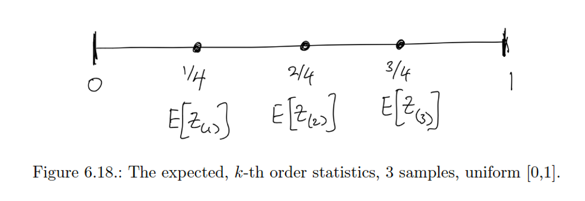
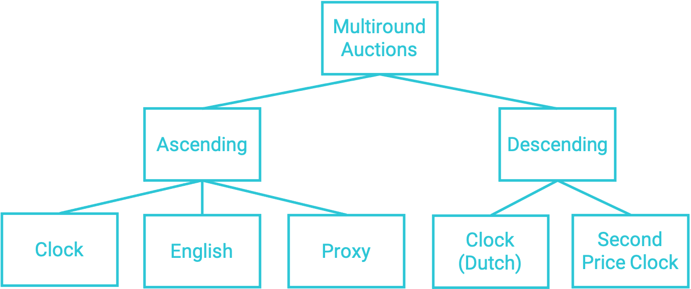
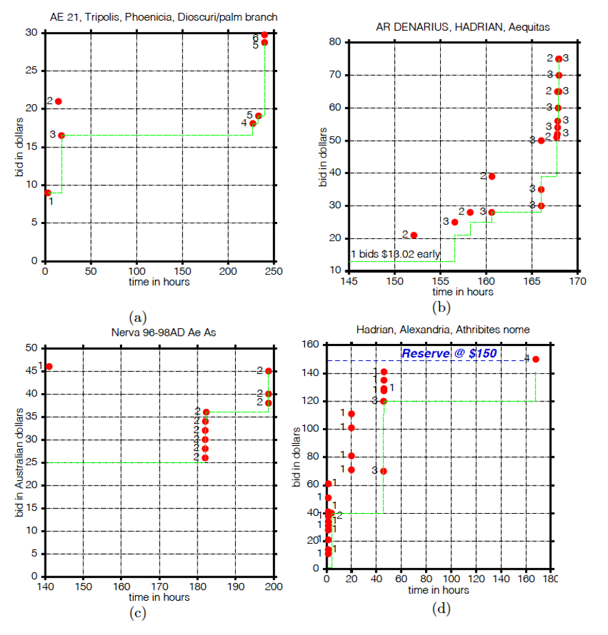
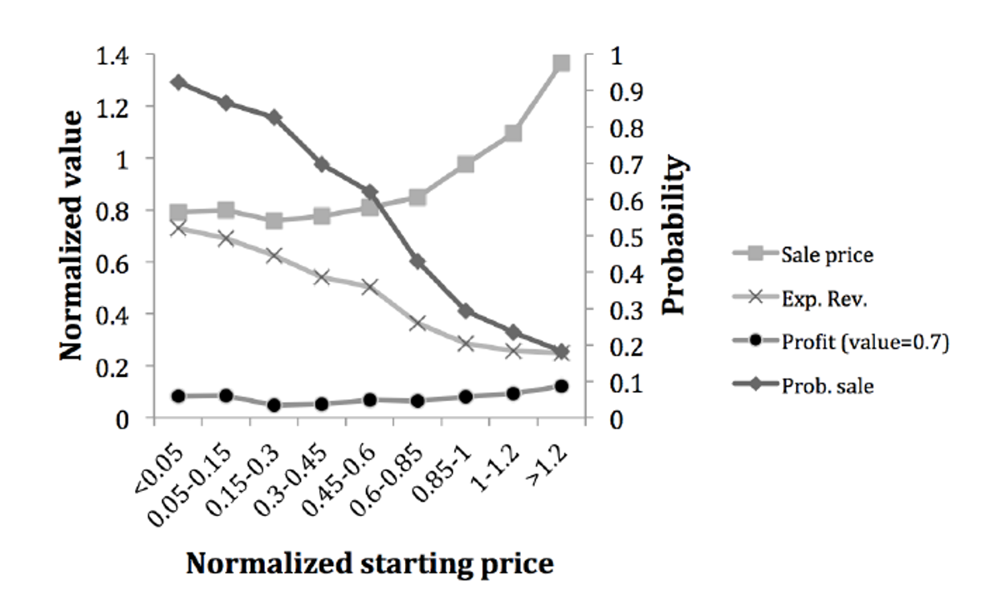
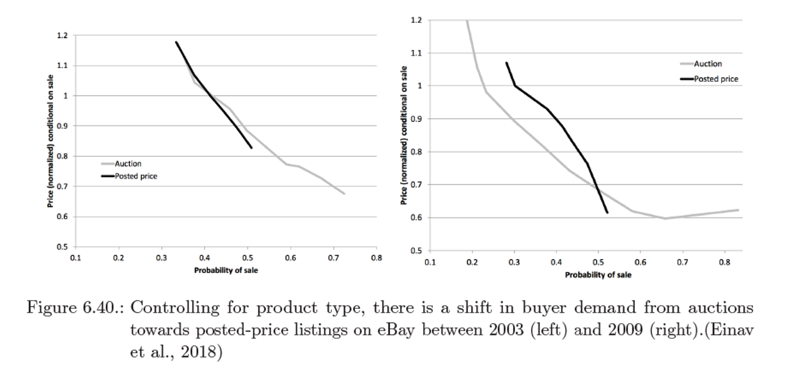
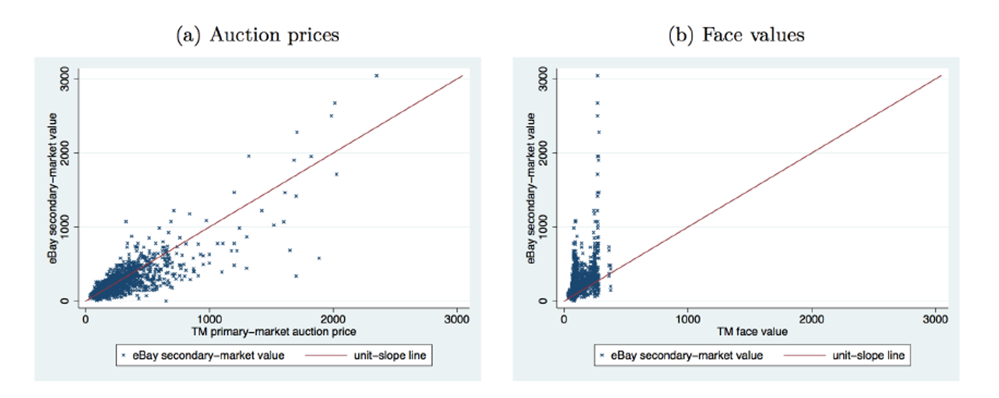

<!-- .slide: class="align-center" -->

<!-- .slide: data-state="no-toc-progress" --> <!-- don't show toc progress bar on this slide -->

# Digital Economy
<!-- .element: class="no-toc-progress" --> <!-- slide not in toc progress bar -->

## 5. Auctions continued

  

[Christoph Ihl][1] | 2020-11-17 | [Kühne Logistics University][2] | Hamburg

 <!-- .element: class="logo" -->

[1]: https://www.startupengineer.io/authors/ihl/
[2]: https://www.the-klu.org

----  ----

<!-- .slide: class="align-center" -->

## Quick Recap

* Quasi linear utility assumption
* IPV assumption
* 2nd price ( Vickrey ) Auction: DSE
* 1st price Auction: BNE

Today:
* 1st price Auction: BNE
* Revenue Equivalence
* Revenue maximizing reserve prices
* Multiround Auctions
* eBay
* optional: Mechanism Design

----  ----

<!-- .slide: class="align-center" -->

# Bayes-Nash Equilibria

----

<!-- .slide: class="align-top" -->

## Bayes-Nash Equilibrium

>Definition (Bayes-Nash Equilibrium). Strategy profile `$ s^* = ( s_1^* , ... , s_n^*)  $` is a Bayes-Nash equilibrium (BNE) in a sealed-bid auction if, for all bidders `$ i $`,   
> `$ \mathop{\mathbb{E}}_{v_{-i}}(u_i( s_i^*(v_i), s_{-i}(v_{-i})) \geq \mathop{\mathbb{E}}_{v_{-i}}(u_i( b_i, s_{-i}(v_{-i}))) $`   
> for all `$ v_i $`, all `$ b_i $`.

----

<!-- .slide: class="align-top" -->

## Equilibrium of First Price Auctions

> Theorem: For bidders with IID values, uniform on [0, 1], the BNE in the FPSB has strategy
> `$ s^*(v_i) = (\frac{n-1}{n}) \cdot v_i $`.   
> The FPSB is efficient in this equilibrium.

----

<!-- .slide: class="align-top" -->

## Equilibrium of First Price Auctions (more general)
<!-- .element: class="no-toc-progress" -->

> Theorem: For bidders with IID values, uniform on [a, b], the BNE in the FPSB has strategy
> `$ s^*(v_i) = (\frac{n-1}{n}) \cdot v_i + \frac{a}{n}$`.   
> The FPSB is efficient in this equilibrium.

----

<!-- .slide: class="align-top" -->

## A-E1: Find BNE in FPSB Auction
<!-- .element: class="no-toc-progress" -->

* An auction with two players.  
* Their values are distributed uniformely: 
.  
* Player 2 plays the following strategy: `$ s_2(v_2) := \frac{v_2+1}{2} $` 
* How should player 1 respond optimally? 
* Is this a BNE?

----  ----

<!-- .slide: class="align-center" -->

# Auction Revenue

----

<!-- .slide: class="align-top" -->

## Revenue Maximization

* Auction designer has certain goals:
  * Design auction so that bidders’ strategies can be predicted
  * Derive values from observed bids (by inverting `$ s^* $`) 
* Efficiency
* Revenue maximization
  * Revenue will be determined by the equilibrium

----

<!-- .slide: class="align-top" -->

## Revenue Order Statistics

> Draw `$ n \text{ independent samples from a uniform distribution } G = U(0,1)$` denoted by `$ \{ Z_1, ... , Z_n \} $`.
  
> First-order statistic (maximum value := `$ Z_1 $` 
> k-th-order statistic (k-th highest value) := `$ Z_k $` 
>   
> `$ \mathop{\mathbb{E}}[Z_{(k)} | n \text{ samples IID} \sim U(0,1) ] = (\frac{n-(k-1)}{n+1}) $`.   

 

----

<!-- .slide: class="align-top" -->

## Comparing Auction Revenue

* Example: compare ...
  * SPSB: equilibrium is DSE with truthful bids `$ s^*(v_i) = b_i = v_i $`.
  * FPSB: equilibrium is BNE with `$ s^*(v_i) = (\frac{n-1}{n}) \cdot v_i $`.
  * assuming uniform IID values 

  

> `$ \mathop{\mathbb{E}[ \text{ SPSB revenue } ] = \mathbb{E}}[ \text{ 2nd highest value } ] = (\frac{n-1)}{n+1}) $`   

  

> `$ \mathop{\mathbb{E}[ \text{ FPSB revenue } ] = \mathbb{E}}[ \text{ highest value } ] = (\frac{n-1)}{n}) \cdot (\frac{n}{n + 1}) = (\frac{n-1)}{n+1})$`

----

<!-- .slide: class="align-top" -->

## Revenue Equivalence

>Theorem (Revenue equivalence). Any two normalized auctions that have the same interim allocation, for every bidder, and every value of the bidder, have the same expected revenue in equilibrium.

 
 

* normalized auction: 
	* bidders who have bid of zero have value zero
* in words:
	* if there is an auction outcome that is efficient but does not maximize revenue, then there is no other efficient auction (outcome) that maximizes revenue
* "All pay" auctions (i.e. __all__ bidders pay their bid e.g. in lobbying) have the same BNE as FPSB auctions
	* SPSB, FPSB and "All Pay" are all revenue equivalent 

----

<!-- .slide: class="align-top" -->

## Revenue Maximization Actions

* Auction designers can still do something:

 
 

* bidding fee: fixed vs. relative to your bid
* hidden dummy bidder
* hidden reserve price
* open reserve price
* => decreases efficiency

----

<!-- .slide: class="align-top" -->

## A-E2: Calculate SPSB Auction Revenue I
<!-- .element: class="no-toc-progress" -->

* Only one bidder, value $10 with probability 50% and $22 otherwise.
* Which reserve price maximizes expected revenue?

----

<!-- .slide: class="align-top" -->

## A-E3: Calculate SPSB Auction Revenue II
<!-- .element: class="no-toc-progress" -->

* Given IPV environment, the value of two bidders come from two different distributions:
  * Bidder 1 has value $2 with probability 30% and $5 otherwise
  * Bidder 2 has value $3 with probability 40% and $4 otherwise.
* What is the Expected revenue for the auctioneer?
* Can one increase expected revenue by a reserve price? How high should it be?

----

<!-- .slide: class="align-top" -->

## A-E4 (optional): Revenue Comparison
<!-- .element: class="no-toc-progress" -->

(1) Suppose there is one bidder, with value `$ v_i \sim U[0,1]  $`. What is the optimal take-itor- leave-it price `$ r $` to offer to this bidder in order to maximize expected revenue?
(2) Now suppose there are two bidders, with values uniformly distributed on `$ U[0,1]  $` Consider a SPSB auction with reserve price `$ r = 0.5 $`. What is the expected revenue?
(3) Compare this with the expected revenue in the SPSB auction without a reserve. What do you find?
(4) Relate your observations about the SPSB auction plus reserve and the SPSB auction to the revenue equivalence theorem.

----  ----

<!-- .slide: class="align-center" -->

# Multiround Auctions and eBay

----

<!-- .slide: class="align-top" -->

## Multiround Auctions

 

* Strategic Equivalence: 
  * two auctions have a strategy profile each such that the outcomes (allocations and payments) are the same for all value profiles.
  * SPSB <-> Ascending clock
  * SPSB <-> Second price descending clock
  * FPSB <-> Descending clock (Dutch)

----

<!-- .slide: class="align-top" -->

## eBay's Auction Design

* Californian / Proxy Auction
  * Proxy agents bid on behalf of bidders in ascending clock auction up tp a given limit until auction closes at fixed time in the future

 

> Starting price: `$ r > 0 $` 
> Current price: `$ p_t = min(b_t^{(2)} + \epsilon, b_t^{(1)}) $` 

 

 

* When auction closes, item is sold to leading bidder at price `$ p_t $`.
* Bids can be placed at any time, but must be at least the ask price  `$ p_{ask,t} $` (initialized at `$ r > 0 $`):

 

> Ask Price: `$ p_{ask,t} = p_t + \epsilon $`

 

 

* Optional:
  * Secret reserve price: `$ r_s > r $` 
  * Buy-it-now price (BIN): `$ BIN \geq 1.1 \cdot r $`

----

<!-- .slide: class="align-top" -->

## eBay Bidding Dynamics
<!-- .element: class="no-toc-progress" -->

----

<!-- .slide: class="align-top" -->

## eBay's Auction Design: why?
<!-- .element: class="no-toc-progress" -->

* __Simplicity__:
  * "enter your maximum, then sit back and watch!"
* __Transparency__: 
  * Bidders can see the bid activity of others: legitimacy
* __Simultaneous auctions__:
  * explore other auctions for similar items
* __Information aggregation__:
  * refine own beliefs about item value (in a non-private/ common value model)
* __Bidder engagement__:
  * fun
  * "endowment effect"
  * bidding wars, leading to higher revenue

----

<!-- .slide: class="align-top" -->

## eBay': Hard vs. Soft Closing Rules
<!-- .element: class="no-toc-progress" -->

 

 

* Pro: get attention at prime time
* Con: less inference about common value

* Bid sniping: bid at very last second

----

<!-- .slide: class="align-top" -->

## eBay: Learning from Seller Experiments
<!-- .element: class="no-toc-progress" -->

* Sellers' design choices:
  * what starting price.
  * whether to use a secret reserve and how to set it.
  * whether to use a BIN price and how to set it.
  * length of an auction and the day and time at which it will start (and thus close).

 

----

<!-- .slide: class="align-top" -->

## eBay: Auctions vs. Posted-price Listings
<!-- .element: class="no-toc-progress" -->

 

----

<!-- .slide: class="align-top" -->

## eBay: Auctions vs. Posted-price Listings for Concert Tickets
<!-- .element: class="no-toc-progress" -->

 

----

<!-- .slide: class="align-top" -->

## A-E5: eBay Auction Design

* Consider an eBay auction with a starting price of $5 and secret reserve of $12.50.
* Suppose the minimal bid increment is $0.50 when the price is between $5 and $24.99, and $1 when the price is higher than $25.
* Suppose there are four bidders, and that the following bids are placed (in this sequence): 
  * bidder 1 $7.51; bidder 2 $10.20; bidder 1 $21.50; bidder 3 $25.21; bidder 1 $28.75; bidder 4 $28.99; auction closes.
* Report the new state of the auction after each bid:
  * the provisional winner, or "reserve not met"
  * the new price `$ p_t $`
  * the new ask `$ p_{ask,t} $`
* Who wins when the auction closes, and what does this bidder pay?

----  ----

<!-- .slide: class="align-center" -->

# Mechanims Design

----

<!-- .slide: class="align-top" -->

## Nobel Prize: Auction Theory
<!-- .element: class="no-toc-progress" -->

 

----

<!-- .slide: class="align-top" -->

## Nobel Prize: Mechanism Design Theory
<!-- .element: class="no-toc-progress" -->

 

----

<!-- .slide: class="align-top" -->

## Problem Domains of Mechanism Design

* When do we have a mechanism design problem?
  * agents with private preferences/ values not known to designers
  * designers want to make optimal decisions, choose best outcomes
  * agents are self-interested and may not reveal true preferences/ values 

* What does a mechanism do?
  * eliciting preferences / values; i.e. the way it is reported
  * determine / choose outcomes among many; i.e. mapping between reports and outcomes
  * sometimes: determine payments to elicit preferences

* "Inverse game theory"
  * endogenous inputs (instead of given inputs / actions)
  * choice of outcomes affect inputs and incentives 

----

<!-- .slide: class="align-top" -->

## Problem Domains of Mechanism Design
<!-- .element: class="no-toc-progress" -->

* Examples for rules of a game:
  * meeting scheduling
  * doctors appointment
  * booth allocation to firms in a job fair
  * kidney / organ exchange
  * voting / elections
  * SBSB
  * split a cake between two kids
  * basketball: 24 seconds, no tie

----  ----

<!-- .slide: class="align-center" -->

# GT Excercises
<!-- .element: class="no-toc-progress" -->

----

<!-- .slide: class="align-top" -->

## G-E1: Simultaneous-Move Games
<!-- .element: class="no-toc-progress" -->

<mark>Exercise:</mark>  
Two prisoners who committed a crime are each interrogated in separate rooms. If they cooperate and tell a common story they can not be fully believe, but at least none will get accused of the entire crime, so they each get 4 years. If one of them defects, then he/she can go home and the other one will get 10 years for committing the crime alone. If both defect, then they get accused and they get a sentence of 8 years each.

  

<mark>Questions:</mark>  
a)  Write this game formally, as a simultaneous move game. Find its normal form representation.  
b)  Find the Nash equilibria and Pareto optima for this game.  
c)  Draw the best response graph.  

----

<!-- .slide: class="align-top" -->

## G-E2: Mixed Nash Equilibria
<!-- .element: class="no-toc-progress" -->

<mark>Exercise:</mark>  
Alice and Bob would like to spend time together. If they both go to a football match, then Bob gets a utility of 3 while Alice gets utility of 1. If they both go to the opera, then Alice gets a utility of 3, while Bob gets only 1. If Bob goes to the match while Alice goes to the opera, both get a utility of 1. Vice versa, both get 0. Assume that they need to act simultaneously.

  

<mark>Questions:</mark>  
a)  Write this game formally, as a simultaneous move game. Find its normal form representation.  
b)  Find the Nash equilibria and Pareto optima for this game.  
c)  Draw the best response graph.  

----

<!-- .slide: class="align-top" -->

## G-E3: Games with Multiple Actions
<!-- .element: class="no-toc-progress" -->

<mark>Exercise:</mark>  

  

<mark>Questions:</mark>  
a)  Write this game formally, as a simultaneous move game. Find its normal form representation.  
b)  Show that it is a zero-sum game.   
c)  Find the Nash equilibria for this game.  

----

<!-- .slide: class="align-top" -->

## G-E4 (optional): Repeated (Prisoners' Dilemma) Games
<!-- .element: class="no-toc-progress" -->

<mark>Exercise:</mark>  
Play the prisoners’ dilemma game multiple times. Assume that the players discount their payoff (or utility) from future rounds by `$ \delta^n $`; where `$ \delta $` can be interpreted has probability of stopping the game because of impatience, or the lower value that players assign to payoffs obtainable further in the future; and `$ n $` is the number of rounds played in the future.

  

<mark>Questions:</mark>  
a)  If the game is repeated `$ m $` finite times, show that *Grim Trigger* strategy is not an NE for any `$ \delta $`.  

(The Grim Trigger strategy implies that players cooperate until the other player defects for the first time. Then the player defects in all following rounds.)<!-- .element: class="small" -->

b)  Prove that it is an NE for some `$ \delta $` in the infinitely repeated game. For which δ?  
c)  Is the *Tit-for-Tat* strategy a NE in the finite and infinite case?  

(The Tit-for-Tat strategy implies that players always play what the other one has played in the previous round.)<!-- .element: class="small" -->

----  ----

<!-- .slide: class="align-center" -->

<!-- .slide: data-state="no-toc-progress" --> <!-- don't show toc progress bar on this slide -->

# *Thank You for Your attention!*
<!-- .element: class="no-toc-progress" -->

## *Let's keep in touch!*

  <ul class=network-icon aria-hidden=true>
    <li>
         <a href=https://www.startupengineer.io/authors/ihl/>
              <i class="fas fa-home big-icon" class="accent">: https://www.startupengineer.io/authors/ihl</i>
         </a>
    </li>
    <li>
         <a href=mailto:christoph.ihl@tuhh.de>
              <i class="fas fa-envelope big-icon" class="accent">: christoph.ihl@tuhh.de</i>
         </a>
    </li>
    <li>
        <a href=https://twitter.com/Ihluminate target=_blank rel=noopener>
              <i class="fab fa-twitter big-icon"class="accent">: @IHLuminate</i>
        </a>
    </li>
    <li>
        <a href=https://www.linkedin.com/in/christoph-ihl/ target=_blank rel=noopener>
              <i class="fab fa-linkedin big-icon" class="accent">: https://www.linkedin.com/in/christoph-ihl</i>
        </a>
    </li>
  </ul>

 <!-- .element: class="logo" -->

