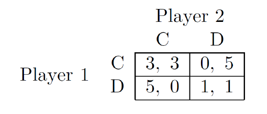
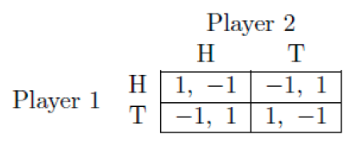

<!-- .slide: class="align-center" -->

<!-- .slide: data-state="no-toc-progress" --> <!-- don't show toc progress bar on this slide -->

# Digital Economy
<!-- .element: class="no-toc-progress" --> <!-- slide not in toc progress bar -->

## 2. Game Theory

  

[Christoph Ihl][1] | 2020-11-06 | [Kühne Logistics University][2] | Hamburg

 <!-- .element: class="logo" -->

[1]: https://www.startupengineer.io/authors/ihl/
[2]: https://www.the-klu.org

----  ----

<!-- .slide: class="align-center" -->

# 3. Game Theory: Part 1

----

<!-- .slide: class="align-top" -->

## Simultaneous Move Games
#### Prisioner's Dilemma Game

  

* Story? Outcomes? 
* Preferences? Utilities? 
* Actions? Action Profiles?

----

<!-- .slide: class="align-top" -->

## Simultaneous Move Games
<!-- .element: class="no-toc-progress" -->

> Definition (Simultaneous-move games). A simultaneous-move game, `$ (N, A, u) $`, has:
> * `$ N = \{ 1, ..., n \} $` agents, indexed by `$ i $`.
> * Each agent plays action `$ a_i \in A_i $`, where `$ A = A_1 \times ... \times A_n $`. The action profile is `$ a = (a_1, ... , a_n) \in A $`.
> * `$ u = (u_1, ... , u_n) $`, where `$ u_i : A \rightarrow \mathbb{R} $` is a utility function (or payoff function) for agent `$ i $`, and assigns a utility (or payoff) to every action profile `$ a \in A $`.

----

<!-- .slide: class="align-top" -->

## Dominant Strategies

* What should the prisoner do in the PD game?
* Dominant Strategy Equilibrium (DSE)

  

  

> Definition (Dominant-strategy equilibrium). Action profile `$ {a}^* = ({a_1}^*, ... , {a_n}^*) $` is a dominant strategy equilibrium of a simultaneous-move game `$ (N, A, u) $` if, and only if, we have
> `$ u_i({a_i}^*, a_{-i}) \geq u_i(j, a_{-i}) $`,   
> for all `$ a_{-i} \in A_{-i} $`, all `$ j \in A_{i} $`, and all agents `$ i $`.

----

<!-- .slide: class="align-top" -->

## Comprehension Question
<!-- .element: class="no-toc-progress" -->

*In the __Prisoner's Dilemma Game__, assume that the other player has
moved first. If you want to maximize your payoff, would it be helpful to
know what your opponent played?*
    
* Yes, I would play different actions for each of my opponent's move.
* No, I would play the same action no matter what my opponent
played.
* Whether that information is helpful depends on what his/her first
move was.
* None of the above answers is correct.

----

<!-- .slide: class="align-top" -->

## Pareto Optimality

 

* Let’s split a cake between 2 players
* Possible splits (outcomes): `$ (x\%, y\%)) $` such that `$ x + y = 100 $`
* Which of these splits are Pareto optimal?

----

<!-- .slide: class="align-top" -->

## Pareto Optimality: Actions
<!-- .element: class="no-toc-progress" -->

> Definition (Pareto dominated). An action profile `$ a \in A $` is Pareto dominated by action profile `$ a^{\prime} \in A $` if, and only if, `$ u_i( a^{\prime} ) \geq u_i(a) $` for all agents all agents `$ i \in N $`, and `$ u_i( a^{\prime} ) > u_i(a) $` for some agent `$ i \in N $`.

 

> Definition (Pareto optimality). An action profile `$ a \in A $` is Pareto optimal if, and only if, there is no action profile `$ a^{\prime} \in A $` that Pareto dominates `$ a $`.

   

* Games we consider:
  * Action profile uniquely determines the outcome of the game!

----

<!-- .slide: class="align-top" -->

## Pareto Optimality in the PD Game
<!-- .element: class="no-toc-progress" -->

   

1. What are the "Pareto dominated action profiles"?
2. What are the "Pareto optimal outcomes"?
3. What outcomes maximize social welfare = sum of
4. What is the "Dilemma" of the "Prisoner’s Dilemma Game"?

----

<!-- .slide: class="align-top" -->

## Comprehension Question
<!-- .element: class="no-toc-progress" -->

*The action profile of a dominant
strategy equilibrium of a simultaneous
move game is Pareto optimal.*
    
* This is true for all simultaneous move games.
* This is false for all simultaneous move games.
* This is true only for zero sum games. 
* This is true for some simultaneous move games.

----

<!-- .slide: class="align-top" -->

## The Dilemma in the Prisioner's Dilemma
<!-- .element: class="no-toc-progress" -->

  

* Does communication help?
* Would it help one player if he knew what the other’s action is?

----

<!-- .slide: class="align-top" -->

## Split or Steal (TV Show)
<!-- .element: class="no-toc-progress" -->

<iframe height="100%" width="100%" 
src="https://youtube.com/embed/TKaYRH6E36U">
</iframe>

----

<!-- .slide: class="align-top" -->

## Pure-Strategy Nash Equilibrium

> Definition (Nash equilibrium). Action profile `$ {a}^* = ({a}^*_1 , ... , {a}^*_n) $` is a Nash equilibrium of a simultaneous-move game `$ (N, A, u) $` if, and only if, we have  
> `$ u_i({a_i}^*, {a}^*_{-i}) \geq u_i(j, {a}^*_{-i} ) $`,   
> for all actions `$ j \in A_{i} $`, and all agents `$ i $`, where `$ {a}^*_{-i} = ({a}^*_1, ... , {a}^*_{i-1}, {a}^*_{i+1}, ... {a}^*_n) $`.

  

----

<!-- .slide: class="align-top" -->

## Mixed Nash Equilibrium

##### Matching Pennies Game

  

> Definition (Mixed strategy). A mixed strategy `$ s_i : A \rightarrow [0,1] $` for agent `$ i $`, with `$ s_i \in \triangle(A_i) $`, assigns a probability `$ s_{ij} > 0 $` to each action `$ j \in A_{i} $`, with the sum `$ \sum_{j \in A_i} s_{ij} = 1 $`.

  

> Definition (Mixed-strategy Nash equilibrium). A strategy profile `$ {s}^* = ({s}^*_1 , ... , {s}^*_n) $` is a mixed-strategy Nash equilibrium in game `$ (N, A, u) $` if, and only if, we have  
> `$ u_i({s_i}^*, {s}^*_{-i}) \geq u_i(s_i, {s}^*_{-i} ) $`,  
> for all mixed strategies `$ s_i $` of player `$ i $`, and for all agents `$ i $`.

----

<!-- .slide: class="align-top" -->

## Mixed Nash Equilibrium
<!-- .element: class="no-toc-progress" -->

> Definition (Support). The support of mixed strategy `$ s_i $` is the set of actions played with strictly-positive probability,  
> `$ \sigma(s_i) = \{ j : s_{ij} >0, j \in A_i \} \subseteq A_i $`.      
> Let `$ u_i(j, s_{-i}) $` denote the expected utility for action `$ j $`, given that the others play `$ s_{-i} $`.

  

> Theorem. A strategy profile `$ {s}^* $` is a mixed-strategy Nash equilibrium `$ {s}^* $` if and only if we have
> `$ u_i(j, {s}^*_{-i}) \geq u_i(j^{\prime}, {s}^*_{-i} ) $`,      
> for all `$ j \in \sigma({s}^*_i) $`, all `$ j^{\prime} \in A_i $`, and all agents `$ i $`.

----

<!-- .slide: class="align-top" -->

## Existence of Mixed Nash Equilibria
<!-- .element: class="no-toc-progress" -->

> Theorem (Existence of mixed-strategy Nash equilibrium). Every finite simultaneous move game `$ (N, A, u) $` has at least one mixed-strategy Nash equilibrium.

  

* Finding an MSNE = computationally hard (PPAD-complete; 2009-2018)

----

<!-- .slide: class="align-top" -->

## Summary and Outlook
<!-- .element: class="no-toc-progress" -->

#### Core Takeaway

These are all different:
* Pareto Optimum (PO)
* Dominant strategy Equilibrium (DSE)
* Pure strategy Nash Equilibrium (PSNE)
* Mixed strategy Nash Equilibrium (MSNE)

#### Upcoming
* Best response analysis
* Computing MSNE
* Problems of Game Theory
* P2P File Sharing

----  ----

<!-- .slide: class="align-center" -->

<!-- .slide: data-state="no-toc-progress" --> <!-- don't show toc progress bar on this slide -->

# *Thank You for Your attention!*
<!-- .element: class="no-toc-progress" -->

## *Let's keep in touch!*

  <ul class=network-icon aria-hidden=true>
    <li>
         <a href=https://www.startupengineer.io/authors/ihl/>
              <i class="fas fa-home big-icon" class="accent">: https://www.startupengineer.io/authors/ihl</i>
         </a>
    </li>
    <li>
         <a href=mailto:christoph.ihl@tuhh.de>
              <i class="fas fa-envelope big-icon" class="accent">: christoph.ihl@tuhh.de</i>
         </a>
    </li>
    <li>
        <a href=https://twitter.com/Ihluminate target=_blank rel=noopener>
              <i class="fab fa-twitter big-icon"class="accent">: @IHLuminate</i>
        </a>
    </li>
    <li>
        <a href=https://www.linkedin.com/in/christoph-ihl/ target=_blank rel=noopener>
              <i class="fab fa-linkedin big-icon" class="accent">: https://www.linkedin.com/in/christoph-ihl</i>
        </a>
    </li>
  </ul>

 <!-- .element: class="logo" -->

